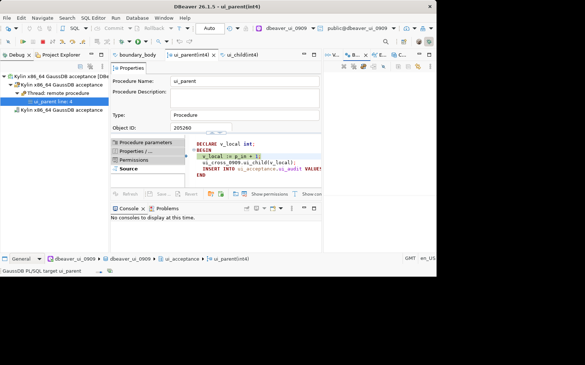
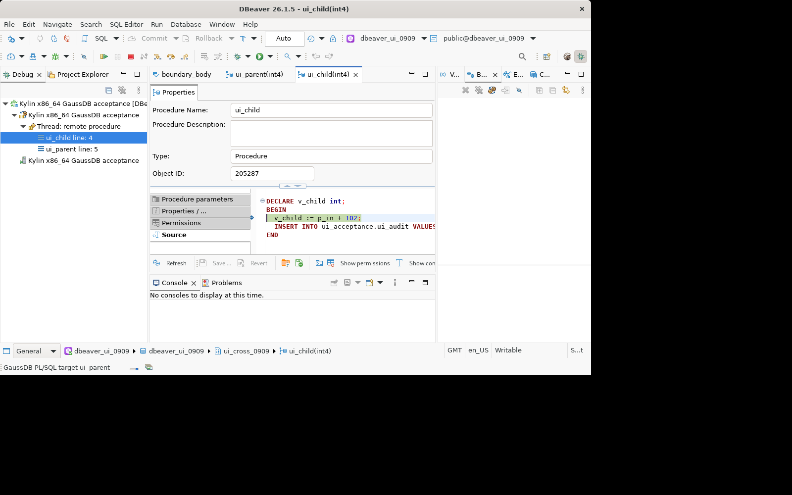
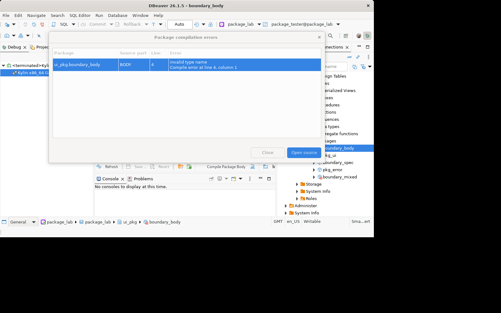

# GaussDB 适配版 DBeaver：图形界面使用说明书

日期：2026-09-22。适用于数据库开发、测试及运维人员。本文可直接在代码仓库在线阅读，无需下载 HTML 文件。

适用版本：DBeaver 26.1.5 GaussDB 适配版（2026-09-21 r2），软件源码提交 `6e10696f3aa10acbef7b3cf7700f153dda5c908e`。文档更新不改变软件包版本；适用条件和验证范围见第 14 节。

发布页（完整地址）：https://github.com/jarrenL/dbeaver/releases/tag/gaussdb-2615-preview-20260921-r2

**重要：PL/SQL 调试、包管理测 O/Oracle 兼容库；M 模式只测连接、对象浏览、SQL 和表数据操作。不要在 M 库找 PL/SQL 调试入口。** 包测试要求服务端确实支持 Package；当前依据的是支持包的集中式 507 环境。客户端不能使不支持包的服务器突然支持包。

中文界面仍有部分英文标签，以下同时列出英文名称。截图取自 26.1.5 Linux 客户端的真实演示环境，展示窗口和操作位置；图中的数据库、对象名、参数及行号可能与本文示例不同，以文字步骤和实际对象为准。截图不包含业务数据或连接密码。

## 阅读导航

建议按以下顺序使用：第 1 节找到调试入口 → 第 2～4 节完成环境和示例准备 → 第 5～9 节使用调试功能 → 第 10 节使用包管理。第 12 节用于排查入口缺失和启动问题。T01～T15 是可重复执行的功能检查编号。

## 1. 找不到调试入口？先按这条最短路径操作

1. 顶部菜单 **帮助（Help）→ Show Product Configuration...**，打开产品配置向导。
2. 点“下一步（Next）”，进入功能选择页，勾选 **Procedure debugger**，继续并完成向导。此功能默认关闭；勾选它不是安装其他插件。
3. 如提示重启，保存工作后重启。关闭窗口后后台可能仍运行十几秒，等进程退出再启动，避免工作区锁冲突。
4. 左侧 **数据库导航器（Database Navigator）** 展开正确的 **GaussDB 连接 → 数据库（如显示）→ 模式/Schemas → 目标 schema → 存储过程/Procedures**。
5. **双击一个具体存储过程**，打开对象编辑器，切到“源码/Source”页，并点击源码正文，让这个编辑器获得焦点。不要只选中“存储过程”文件夹，也不要只打开一张普通 SQL 脚本标签。
6. 顶部 **数据库（Database）→ 数据库调试...**，或使用工具栏“数据库调试”图标旁的小三角，打开调试配置。图标主按钮可能运行上次的配置，要编辑配置请使用下拉菜单中的配置入口。
7. 第一次在配置窗口中选择 **Database Debug/数据库调试** 类型，点击左上角“新建配置”图标。按第 5 节选择连接、GaussDB routine、Routine 和输入参数，再点击 **Debug/调试**。

补充入口：导航树中右键具体过程，若出现 **Debug As/调试方式 → 数据库调试**，也可进入。不同菜单布局可能不显示该快捷入口，以“打开过程对象编辑器 → 数据库菜单”为主路径。

如果第 1 步菜单不好找，按 **Ctrl+3**，搜索 `Show Product Configuration`；如果第 6 步仍无入口，先看第 12 节，不要反复更换驱动或安装 PostgreSQL 调试器。

## 2. 开始之前：安装、语言和服务端条件

### 2.1 客户端安装在哪里

DBeaver 安装在用户登录使用的麒麟图形桌面云里，连接远端 GaussDB 服务器；不要求安装到数据库服务器上。客户端不需要 Docker，也不需要 gdb。

- 麒麟 x86_64：下载 Linux tar.gz，解压，进入 `dbeaver` 目录，双击 `dbeaver`，或终端执行 `./dbeaver`。
- Windows x86_64：使用 setup.exe 或解压 ZIP，运行 `dbeaver.exe`。本版 Windows 包尚无实机 GUI 验收。
- 当前发布的这两个包不适用于 ARM64 客户端。`uname -m` 为 `aarch64` 时，不能运行 Linux x86_64 包。
- 包里自带 Java，不需要将系统 Java 替换掉；JDBC 驱动需客户或供应商提供。

### 2.2 切换中文

在首选项中搜索 `Language`，选择中文，应用并完整重启。若不生效，退出并等进程消失后，在程序目录执行 `./dbeaver -nl zh`。

长期指定中文：在 `dbeaver.ini` 的 `-vmargs` **之前**添加两行 `-nl` 和 `zh`。它们各占一行；不要重复添加多个语言参数。启动参数优先于界面保存的语言设置。

遇到 `Can't lock workspace` 时，取消本次启动，等待旧进程退出；不要忽略锁，不要在进程运行时删除 `.lock` 或工作区。不要使用 `sh dbeaver`/`bash dbeaver` 启动二进制程序。

### 2.3 请 DBA 提供这些信息

服务器地址、端口、数据库名、账号、兼容模式、数据库完整版本、JDBC jar，以及可用于测试的独立库/schema。

调试账号须满足目标版本的调试角色和执行权限要求（包括 `gs_role_pldebugger` 等）；目标库须提供匹配签名的 `DBE_PLDEBUGGER` API。请 DBA 按版本授权，不以授予超级用户替代排查。测试期间不要修改服务端系统表或关闭认证。

所有演示必须在专用测试库执行。带有业务提交、自治事务、发通知、外部接口调用的过程，不适合拿来做回滚演示。

## 3. 新建连接及基础功能测试（T01、T02）

### T01：连接与模式确认

1. 点击 **数据库 → 新建数据库连接**，搜索 `GaussDB`。
2. O 模式优先选择 **GaussDB Native**。不要用 Generic 或 PostgreSQL 条目代替，否则不会得到 GaussDB 专用调试面板。
3. 在驱动设置的“库/Libraries”页，添加供应商提供的匹配 JDBC jar；驱动类、URL 协议必须匹配：Native 对应 `com.huawei.gaussdb.jdbc.Driver` 和 `jdbc:gaussdb:`。不要把 `org.postgresql.Driver` 的 jar 强塞进 Native 配置。
4. 输入实际服务器地址、端口、数据库、账号和密码，点击“测试连接”，成功后“完成”。分布式连接 DBA 提供的 CN/服务入口，不用 DN 连接冒充完整集群连接。
5. 右键该连接 → **SQL 编辑器 → 新建 SQL 脚本**。确认编辑器顶部绑定的是这个连接和目标数据库，逐条执行：

```sql
SELECT version();
SELECT current_database(), current_user;
SELECT name, setting FROM pg_settings WHERE name = 'sql_compatibility';
```

预期：连接成功，版本、用户、库名正确，记录实际模式。O 模式名称在不同版本可能呈现为 O/A/ORA；不凭连接名字中的“Oracle”判断。

### T02：M 模式基础能力

另建连接指向 DBA 提供的 M 库，使用匹配的 GaussDB M 驱动配置。不要更改原 O 库。

1. 展开 schema、表、字段；双击测试表，查看“属性”和“数据”。
2. 在独立测试 schema 中创建普通表，插入、查询、修改、删除一条测试记录。逐条执行，并明确提交事务。
3. 在“数据”页刷新，确认结果与 SQL 查询一致；也可在数据网格改值并点击“保存”，检查实际数据。
4. 断开后重连，复查对象与数据。

预期：基础开发工作流可用。M 库 PL/SQL 调试和包功能应受限，此限制不是未完成的调试用例。不要把不可用项填写为“调试通过”。

## 4. 准备一个可重复调试的最小例子（T03）

以下例子沿用已经用于本地 GUI 验证的父/子过程逻辑。**只在新建的、专用 O 模式验收库执行。** 如库中已有 `ui_acceptance` 或同名对象，停止，换新的测试库；不要覆盖别人对象。

1. 打开该 O 库的新 SQL 脚本。
2. 先分别执行以下两条 DDL。任何一条失败就停止，不要继续覆盖过程：

```sql
CREATE SCHEMA ui_acceptance;
CREATE TABLE ui_acceptance.ui_audit(value integer);
```

3. 再粘贴以下两段过程定义，通过 **SQL 编辑器 → 执行 SQL 脚本** 执行完整脚本。Linux/Windows 默认常用快捷键是 Alt+X；以菜单显示为准。不要只选中 BEGIN 中的几行执行。`/` 独占一行，作为块结束分隔，不单独发送给数据库。

```sql
CREATE OR REPLACE PROCEDURE ui_acceptance.ui_child(p_in int)
AS
DECLARE v_child int;
BEGIN
  v_child := p_in + 2;
  INSERT INTO ui_acceptance.ui_audit VALUES(v_child);
END;
/

CREATE OR REPLACE PROCEDURE ui_acceptance.ui_parent(p_in int)
AS
DECLARE v_local int;
BEGIN
  v_local := p_in + 1;
  ui_acceptance.ui_child(v_local);
  INSERT INTO ui_acceptance.ui_audit VALUES(v_local);
END;
/
```

4. 如果 SQL 编辑器处于手动提交模式，提交准备阶段的事务。右键导航树的连接/schema →“刷新”，展开 `ui_acceptance → 存储过程`，应看到 `ui_parent` 和 `ui_child`。
5. 双击两个对象，分别打开它们的源码页，后续断点在这些对象源码页设置。

预期：对象创建成功且可从导航树打开。不要以“普通 SQL 编辑器里能看到过程文本”代替对象实际存在。

## 5. 新建调试配置并启动（T04）

先完成第 1 节启用功能的步骤，并激活 `ui_parent` 对象源码页。

1. 打开“数据库调试”配置窗口；选择 Database Debug 类型，新建配置，名字填写 `验收-ui_parent-10`。
2. 在连接/数据源下拉框中选刚才的 O 模式 GaussDB 连接。不要误选 M 库或另一个同名连接。
3. 在调试类型中选 **GaussDB routine**。
4. 点击 **Routine** 选择框右侧下拉按钮，在对象选择窗口展开 `ui_acceptance → 存储过程`，选择 `ui_parent` 并确认。
5. 下方 **Input parameters** 参数表显示 `p_in`。双击 **Value** 单元格，填 `10`，再点其他单元格让输入保存。
6. “输入方式”使用 **输入值**；`10` 是数值文本，不加引号。要传数据库空值时选择 **SQL NULL**，不能用输入字符串 `NULL` 代替。使用默认值仅用于服务端确实有默认值的连续末尾参数，本例不选。
7. 点“应用/Apply”（如显示），再点 **Debug/调试**。若提示打开调试透视图，确认。
8. 等待调试处于暂停状态、源码当前执行行高亮，再操作单步或变量。启动失败时保留完整错误，不反复点 Debug 创建更多会话。

预期：启动的是指定库、指定 schema 的父过程，输入值为 10。当前行通常表示下一条将要执行的语句，所以赋值执行前变量可以为空，不能误判为变量读取失败。

重复启动：通过调试图标下拉选择 `验收-ui_parent-10`。修改参数或连接时重新打开配置，不能假设当前 SQL 编辑器的连接会自动修改已有调试配置。



图 1：左侧 Debug 树显示暂停栈帧；中间 Source 页显示过程源码，箭头及高亮标识当前执行位置。顶部 Database 对应“数据库”菜单。图示为跨 schema 演示过程，调用对象与第 4 节最小示例不同。

## 6. 打开调试所需的四个窗口

在 **窗口（Window）→ 显示视图（Show View）→ 其他（Other）** 中搜索或展开 Debug 类别，打开：

| 窗口名称 | 用途 |
| --- | --- |
| Debug / 调试 | 展开会话、线程、栈帧，查看父子调用关系；工具栏进行步进/继续/终止 |
| Breakpoints / 断点 | 集中查看断点，勾选启用、取消勾选禁用、删除 |
| Variables / 变量 | 当前选中栈帧的变量名和值；可修改的变量允许改值 |
| Expressions / 表达式 | 添加监视变量；本实现支持变量名，不是任意 SQL 或算术表达式求值器 |

若窗格为空，先在 Debug 树中选中一个**暂停中的栈帧**，不要只选最外层连接/进程。不同语言包可能仍显示英文视图名称。

## 7. 断点及五个执行控制动作（T05、T06）

### T05：断点设置、禁用、启用、删除

1. 在 `ui_parent` 对象源码中，找到 `ui_acceptance.ui_child(v_local);` 这一行。
2. 双击该行最左侧的灰色标尺区域（不是正文），应出现断点标记；或右键标尺 →“切换断点”。不要在注释、空行、CREATE 头上测试断点。
3. 在 `ui_child` 的 `INSERT INTO ...` 行也设置断点。Breakpoints 窗格应列出相应对象及行号。
4. 启动或重新运行父过程，点击“继续”，验证停在启用的断点行。
5. 在 Breakpoints 中取消子过程断点的复选框，再运行一次：该断点不应导致停住。不能用 F7 的单步暂停证明禁用失败。
6. 再勾选该断点，下一次运行应重新命中。重复“取消勾选→勾选”两轮，不应出现 invalid break point index/already enabled。
7. 选中某个断点，右键 Remove/删除，或在源码同一标尺处再次双击；窗格条目消失。重新添加、再运行，应仍可命中。

每轮结束选择回滚，避免累积测试数据。只操作本例断点，不用“删除所有断点”清除其他工作配置。升级旧工作区后无法命中的旧断点，删除该测试断点并在正确数据库对象上重建。

### T06：执行控制

先用工具栏按钮测试功能，再独立测试快捷键。鼠标悬停图标可见动作名称；不要只凭图标形状猜测。

| 功能 | 点击/按键 | 本例怎么测 | 应看到什么 |
| --- | --- | --- | --- |
| 单步进入 | Step Into，F7 | 父过程停在调用 `ui_child` 的行时执行 | 进入子过程源码，调用栈新增子帧 |
| 单步跳过 | Step Over，F8 | 另一次运行停在父过程调用行时执行 | 执行子调用后回到父过程下一行，不按单步进入展开子过程；启用的子断点仍可能截停，测跳过时先禁用子断点 |
| 单步退出 | Step Return，Shift+F7 | 已在子过程暂停时执行 | 返回父过程；若途中有启用断点，可能先命中它 |
| 继续 | Resume，F9 | 暂停时执行 | 运行到下一个断点或结束并进入事务收尾 |
| 终止 | Terminate，F10 | 单独一轮暂停时执行 | 会话终止，之后可重新调试；独立查库确认未产生本轮未提交数据 |

桌面云、Fn 功能键、输入法可能拦截 F7/F8/F9/F10。按钮有效而快捷键无效时，分别记录；不能把按钮通过写成快捷键通过。快捷键测试时让调试窗口获得焦点。

## 8. 变量查看、修改、监视和调用栈（T07～T09）

### T07：查看与修改变量

1. 父过程执行完 `v_local := p_in + 1;`，停在调用子过程行时，选中父栈帧。
2. Variables 中应能看到 `p_in=10`、`v_local=11`。在赋值执行前看不到 11 属正常现象。
3. 右键 `v_local` → **Change Value/更改值**（或在可编辑的值单元格双击），输入 `20` 并确认。
4. 检查变量读回为 20，再 F7 进入子过程，子过程输入值应为 20；执行子过程赋值后 `v_child` 应为 22。
5. 本轮结束选择回滚。另开无改值的一轮测试后续标准数据，不把改值轮和标准轮混算。

负向测试：将整数变量输入非法文本，应提示失败，不得伪造为修改成功。常量、非当前可写帧等受保护对象可能拒绝修改，不承诺所有变量都能修改。

### T08：添加监视变量

1. 父过程暂停且父帧选中时，打开 Expressions。
2. 在窗口空白处右键 → **Add Watch Expression/添加监视表达式**，输入 `v_local`，确认。
3. 步进赋值后观察值变化；改成 20 后再次确认监视值。
4. 在子帧添加 `v_child`，查看该帧变量。切帧后不在作用域的变量可能不可用，这是作用域变化，不应显示其他帧的陈旧值。
5. 右键该监视项 → Remove/删除，验证移除。

本实现测试的是 `v_local` 这种变量名；不承诺 `v_local + 1`、任意函数调用或 SELECT 表达式。

### T09：调用栈及双击源码导航

1. F7 进入子过程后，在 Debug 树展开会话/线程，应看到 `ui_child` 和 `ui_parent` 的栈帧。
2. 双击父帧，应切到父过程源码及调用位置；双击子帧，应切回子过程当前执行行。
3. 检查对象 schema、名称、行高亮，不只检查标签页打开了。
4. 可使用仓库的 `cross-schema-gaussdb.sql` 在另一个专用测试库扩展跨 schema 同名对象测试，先完整阅读脚本，不在共享业务 schema 上直接执行。

行号以服务端返回的源码和编辑器实际显示为准，不硬套手册代码块的排版行号。



图 2：左侧同时显示 ui_child 和 ui_parent 栈帧，双击对应帧切换源码。图中子过程的计算常量为跨 schema 演示值，不应用来判断第 4 节示例的 11/13 结果。

## 9. 调试完成提交或回滚（T10、T11）

**不能只看到弹窗就判定事务测试通过。必须用另一条独立连接查数据。** 新建第二个同库连接，命名为“验收查数”，用自动提交查询，避免旧事务快照影响结果。

基线查询：

```sql
SELECT value, COUNT(*) AS n
FROM ui_acceptance.ui_audit
GROUP BY value ORDER BY value;
```

### T10：正常完成后提交

1. 记录基线。使用参数 10、没有改变量的一轮，F9 执行完全部代码；如遇断点就继续，直到过程完成。
2. 出现“调试对象已执行完毕。提交还是回滚本次数据库变更？”时点击 **提交/Commit**。
3. 在“验收查数”连接重新执行查询。
4. 预期：相对基线，值 11 和 13 各多一条，合计多 2 条。表中显示排序后的 11、13，不等于真实插入顺序。

### T11：正常完成后回滚、终止

1. 重新记录基线，再运行同样过程，结束时点击 **回滚/Rollback**。
2. 用查数连接查询，预期与本轮基线完全一致。
3. 单独一轮在暂停中按 F10，终止后独立查库，再重新启动调试，确认数据和会话均正常。

如果提交/回滚提示失败或结果未知，保留错误，请 DBA 配合独立查证；不要自动重试提交。过程内已主动提交的事务、自治事务及外部副作用不保证能由最终回滚撤销。

## 10. Package 创建、编译、错误定位、批量删除（T12～T15）

### T12：准备并创建有效包

前提：支持 Package 的 O 模式专用测试库；`ui_pkg` schema 和以下包名均不存在。先单独执行 `CREATE SCHEMA ui_pkg;`，成功后再执行下面完整脚本。

```sql
CREATE PACKAGE ui_pkg.manual_pkg AS
  FUNCTION value_of RETURN INTEGER;
END manual_pkg;
/
CREATE PACKAGE BODY ui_pkg.manual_pkg AS
  FUNCTION value_of RETURN INTEGER AS
  BEGIN
    RETURN 42;
  END value_of;
END manual_pkg;
/
SELECT ui_pkg.manual_pkg.value_of();
```

预期返回 42。手动事务模式下提交准备阶段事务，刷新导航树：**连接 → 目标库 → schema `ui_pkg` → 包/Packages → manual_pkg**。

双击包对象，检查 **声明** 和 **主体** 两个标签。声明相当于接口，主体包含实现。

### T13：编译全部、声明、主体

1. 在导航树中右键 **manual_pkg 包对象**，不是右键 Packages 文件夹。
2. 分别执行 **编译包**、**编译包声明**、**编译包主体**。每次等后台编译结束再做下一次。
3. 对应数据库动作是 `ALTER PACKAGE ... COMPILE`、`COMPILE SPECIFICATION`、`COMPILE BODY`，不是编译 Java，也不是重新打客户端包。
4. 如果源码页有未保存修改，先 Ctrl+S 并确认保存 SQL，再编译；出现“Save package”说明应先处理未保存内容。
5. 刷新包，重新执行函数查询，预期仍返回 42；无错误诊断不一定弹出专门的成功对话框。

批量编译：按住 Ctrl 选择本轮多个测试包，右键“编译包”。如果中途失败/取消，要记录已处理数量；不能把剩余未执行对象记为成功。

### T14：错误列表及源码定位

1. 只操作 `manual_pkg` 的测试主体。将 `RETURN 42;` 改为 `RETURN manual_missing_symbol;`，保存。也可在 SQL 编辑器执行完整 `CREATE OR REPLACE PACKAGE BODY` 测试定义，保留全部结束分号。
2. 保存可能马上报错；先保留错误。某些服务端会拒绝并保留旧主体，这种情况下后续编译旧主体成功不能算错误定位通过。
3. 在导航树右键该包 →“编译包主体”。当服务端保存了无效主体并提供诊断时，应出现 **包编译错误** 窗口，包含包、源码部分、行号、错误信息。
4. 双击诊断行，或选中后点 **打开源码**，应打开“主体”并定位错误行，而不是“声明”或另一个包。核对错误符号确实位于该行。
5. 将错误改回 `RETURN 42;`，保存并重新编译，刷新后再查函数，应恢复 42，旧诊断不应继续冒充当前错误。

如果服务端不保留无效包，或不提供 `DBE_PLDEVELOPER.GS_ERRORS` 诊断信息，记录为该环境无法完成此场景，请 DBA 提供支持的环境和错误示例。不能宣称错误行定位已经通过，也不要为造错误修改系统表。



图 3：Package、Source part、Line、Error 分别对应“包、源码部分、行号、错误”；选中错误后点击右下角 Open source（打开源码），或双击错误行。此截图使用 boundary_body 类型错误示例，实际错误内容由服务器返回。

### T15：批量删除及取消

1. 在 SQL 编辑器另建仅有声明的第二个测试包：

```sql
CREATE PACKAGE ui_pkg.manual_pkg_second AS
  FUNCTION value_of RETURN INTEGER;
END manual_pkg_second;
/
```

2. 提交并刷新 Packages。按住 Ctrl 同时选择 `manual_pkg`、`manual_pkg_second`。
3. 右键 **删除/Delete**（或 Delete 键），检查确认框只有这两个测试包。第一次点“取消”，刷新确认二者仍在。
4. 第二次重复删除并确认；如显示 SQL 预览，核对只包含这两个包，不选择级联删除业务依赖。
5. 刷新导航树，并由另一连接确认目标 schema 中两个测试包均已不存在。不能只凭当前树节点消失判断成功。

删除无法靠“撤销文本编辑”恢复，只能依靠保存的 DDL 在测试库重建。不要选中整个 schema 或连接执行删除。

## 11. 复杂语法扩展与测试收尾

复杂包脚本：`test/org.jkiss.dbeaver.ext.gaussdb.debug.test/integration/swtbot/complex-package-boundaries.sql`（可从发布页源码压缩包取得）。

只在专用 O 库、`ui_pkg` 下对应包名尚不存在时执行，选择“执行 SQL 脚本”。脚本覆盖嵌套局部函数、IF/ELSE、FOR 循环、初始化块、带 END/分号/斜杠的字符串和注释、带分号的引号对象名以及除法。

预期第一组查询为 `6`、`END; it's / text`、`3`，第二组为 `7`。脚本含异常处理结构，但正常返回成功不代表实际异常分支已被触发。参见 `ICBC_COMPLEX_SYNTAX_ACCEPTANCE_20260921.md`。

收尾：保存截图与测试结果；结束调试并处理事务；清除本轮断点和监视；仅删除确认属于自己的测试包、过程和表。不要执行 `DROP SCHEMA ... CASCADE` 清理可能共享的 schema。保留 DDL 以便复测。

## 12. 常见问题：先按现象定位

| 现象 | 先检查什么 | 不要做什么 |
| --- | --- | --- |
| 顶部没有数据库调试 | Help → Show Product Configuration → Procedure debugger；打开具体过程对象源码并激活 | 不要把普通 SQL 脚本当作调试对象 |
| 功能已开仍无入口 | 当前连接是否 GaussDB、是否 O 库、过程语言是否可调试；产品功能是否限制数据库开发权限 | 不要在 M 库强开 PL 调试 |
| 配置无 GaussDB routine | 选中的数据源类型和四个 GaussDB 插件是否齐全 | 不要安装 PG 调试器代替 GaussDB 协议 |
| 找不到 Procedure debugger 配置向导 | Ctrl+3 搜索 Show Product Configuration；核对实际运行的是 r2 产品 | 不要把缺失菜单直接归因于服务端权限 |
| Debug 按钮灰色 | 是否选好连接、Routine、必填参数；点开参数编辑框后有没有离开单元格保存；窗口警告是什么 | 不要连续点主工具栏启动上次配置 |
| 启动报权限/API 错误 | 记录完整错误和 SQLSTATE，DBA 检查角色、API 签名、目标语言及权限 | 不要默认改成超级用户或关闭认证 |
| 看不到变量/堆栈 | 是否实际暂停；Debug 树中是否选中栈帧；变量是否尚未赋值 | 不要把运行中的空窗格当作读取失败 |
| F7 等不生效 | 先试对应按钮，再查桌面云键盘映射、Fn 和窗口焦点 | 不要把按钮成功记为快捷键通过 |
| 没有 Packages/编译菜单 | 服务端包能力、模式、权限；是否右键具体包；刷新后重看 | 不要把分布式环境不支持包当成已验收 |
| 编译提示 Save package | 该包是否有未保存源码标签 | 不要编译旧服务器源码却拿新编辑内容对照 |
| 关闭后再开提示工作区锁 | 等进程退出；本次现场反馈约十几秒 | 不要忽略锁、删除活跃工作区或重复启动 |
| 中文设置不生效 | 完整重启；检查启动参数是否覆盖；`./dbeaver -nl zh` 验证资源 | 不要用强制中文成功推断配置保存已经正常 |

插件检查路径：**帮助 → 关于 DBeaver → 安装详细信息/Installation Details → 插件/Plug-ins**，搜索以下四项：

```text
org.jkiss.dbeaver.ext.gaussdb
org.jkiss.dbeaver.ext.gaussdb.ui
org.jkiss.dbeaver.ext.gaussdb.debug.core
org.jkiss.dbeaver.ext.gaussdb.debug.ui
```

## 13. 每个场景怎么记录结果

按 T01～T15 逐项填写，切勿直接把本手册的“预期”复制为“实际”。

```text
用例编号/测试人/日期：
客户端版本、发布标记、OS、CPU 架构：
GaussDB 完整版本、兼容模式、集中式/分布式：
JDBC 驱动版本：
实际点击步骤、参数、测试对象全名：
预期结果：
实际窗口结果与独立连接查数结果：
结论：PASS / FAIL / BLOCKED（环境不满足）/ NOT RUN
截图、错误原文、SQLSTATE、发生时间：
是否清理测试对象/会话：
```

截图至少保留：调试配置、断点暂停、变量改值、Expressions、父子调用栈、提交/回滚结果、包三种编译菜单、错误定位、批量删除确认。分享前遮盖密码、真实服务器地址和业务 SQL。

## 14. 已验证与待现场验收的边界

本地 Linux GUI + GaussDB 507 已有断点重复启停、首次跨 schema 导航、事务回滚和复杂包脚本等专项证据；不能据此宣称客户所有业务 SQL、桌面云键盘转发、金融版 503/505 或 Windows 全部通过。

本说明书用于指导使用和现场功能检查，不替代客户目标环境的验收报告。原生 gs_dump/gs_restore 不属于原始七项，也不随本包内置；如需使用，应另按平台准备匹配的原生工具。

核对依据：GaussDB/debug.ui 菜单注册、产品配置向导、参数面板、包编译命令与中文资源，以及 `ICBC_LINUX_FIX_PROGRESS_20260921.md`、`ICBC_COMPLEX_SYNTAX_ACCEPTANCE_20260921.md`。历史跨平台指南中的旧包地址、旧分支说明不作为本版本依据。
