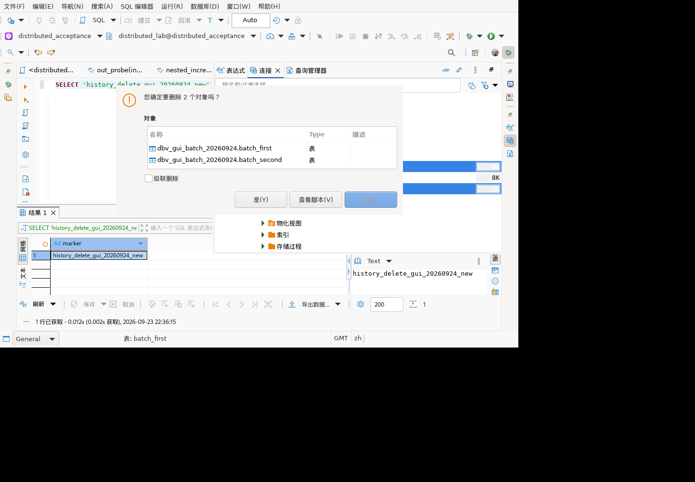
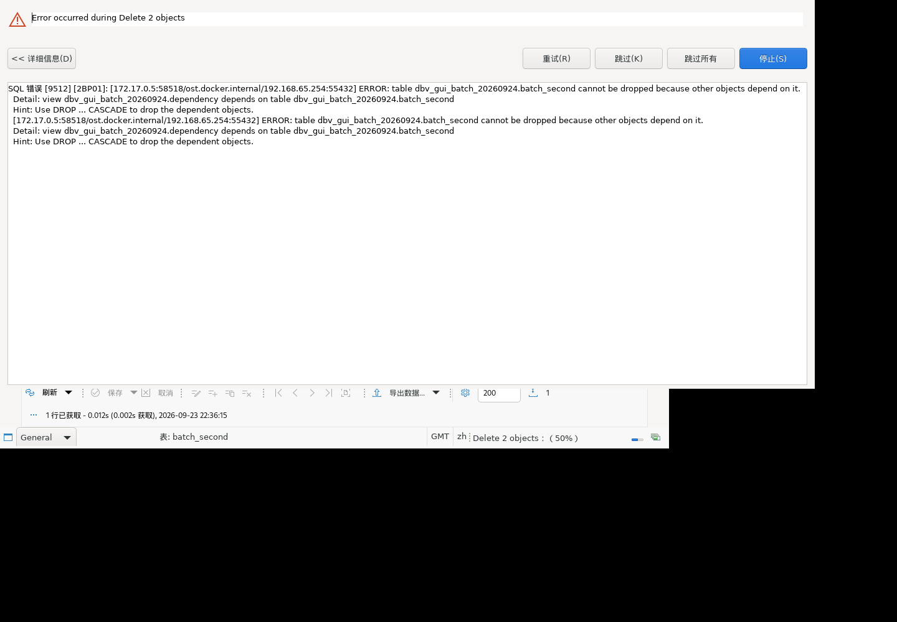

# Linux 多选删除界面验收

对应清单3.2、9.6：多选、确认取消、实际删除范围。环境为现有麒麟V10 x86_64隔离客户端，连接507分布式；不是最新全量安装包验收。

## 操作与结果

1. 独立确认测试schema不存在后，创建专用 `dbv_gui_batch_20260924`，三张表batch_first、batch_second、batch_keep分别保存11、22、33，所有者为测试账号。
2. 客户端打开连接→数据库→distributed_acceptance→模式，F5刷新，等待异步加载后进入测试schema→表，显示三张表（908）。
3. 多选batch_first与batch_second，右键“删除”。确认框明确显示“删除2个对象”，列表只含这两张表（912）；级联删除未勾选。
4. 点击取消（913）。独立gsql查询三表值仍为11、22、33。
5. 再次多选并打开删除确认框（914），点击“是”（915）。独立查询pg_class只返回batch_keep，其值为33。界面后台操作完成后树中也仅剩batch_keep（916）。
6. 验证后只清理本轮创建的剩余表和空schema，不使用宽泛级联清理。

## 边界与诊断

通过的是取消无变更、两个无依赖表的批量删除成功、未选对象保持不变；不证明依赖失败时GUI原子回滚，也不替代包/视图等全部对象种类验收。

初次快捷键未弹确认框，没有计为通过。一次测试驱动调用复用了刷新后的旧widget索引而失败；重新dump并选择新索引后通过右键入口执行。该失败未产生数据库删除，不是客户端异常。

这是实际桌面界面操作加独立数据库结果证据，未增加JUnit方法计数。

## 依赖失败后停止：原子性未通过

重新创建同名隔离夹具，并增加依赖batch_second的视图dependency。刷新树后多选batch_first、batch_second，未勾选级联删除，确认执行（921–922）。客户端出现Execution Error，详情包含2BP01及依赖视图名称，并提供重试、跳过、跳过所有、停止（924）。点击停止（925）。

独立查询结果：batch_first已不存在；batch_second仍为22，batch_keep仍为33，dependency仍存在。因此停止后不会回滚已经完成的第一项。错误展示及停止入口已观察到，但整批失败原子回滚没有实现，不能使用之前JDBC手工事务通过结果替代此结论。

源码对应：NavigatorObjectsDeleter为对象分别建立ObjectSaver任务，TasksJob逐项执行并询问错误处理；并未在全部对象外包裹共同事务。本场景是在现有Auto连接配置下验证，不外推手工事务、其他驱动或编辑器保存路径。下一步需要独立评估同连接批量原子执行及跨连接选择的边界，不能承诺停止就能撤销。

取证后按依赖顺序精准删除本轮测试视图、两张剩余表和空schema。未触及其他对象。
