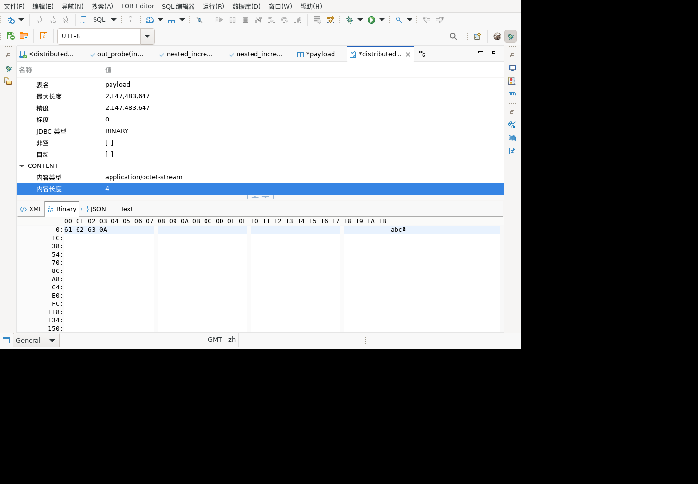
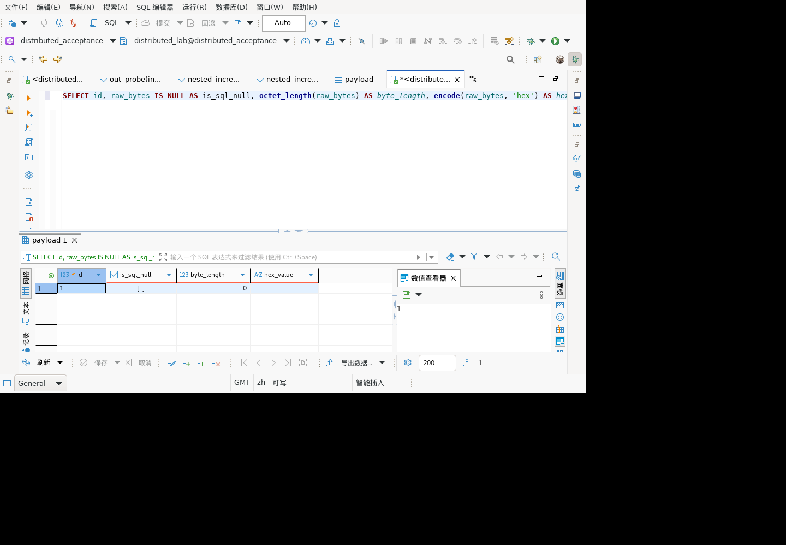
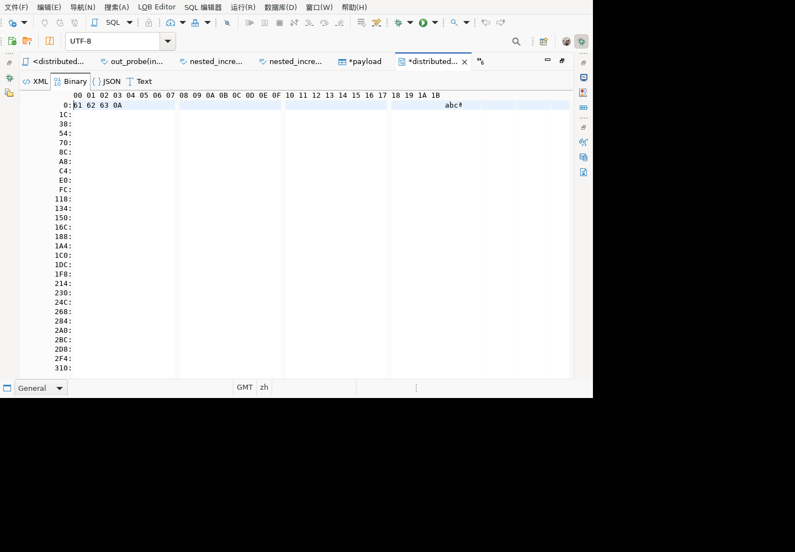
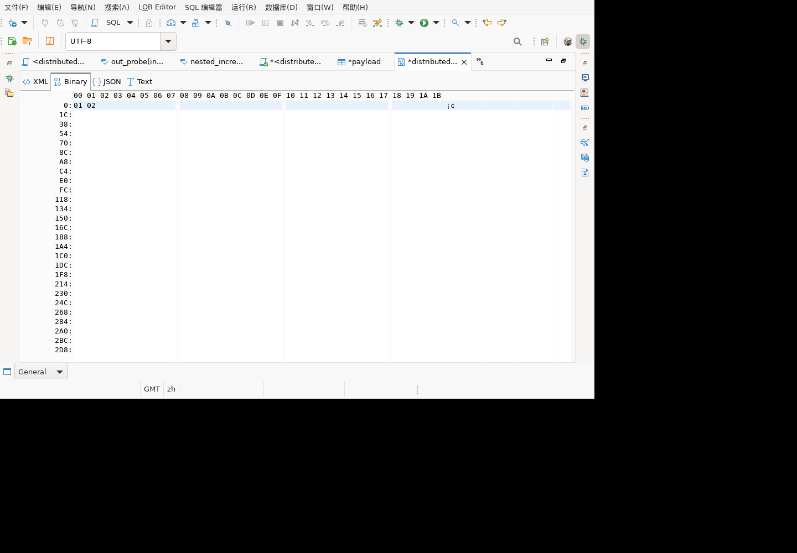

# 二进制文件导入 GUI 补验记录（部分场景通过）

日期：2026-09-28。关联历史清单 9.8 表格编辑、11.1 二进制类型及空 bytea 写入。

## 后续进展（优先于下方早期状态）

### 属性长度与空文件保存：Linux GUI 验证通过

恢复容器访问后，在停止独立副本并确认进程身份后安装 data 补丁，重新以 tester 启动；原验收副本未替换。运行副本 data 插件 SHA-256 与下文 `90a50b...119953` 完整校验值一致。当前结果仍是历史产品加两个已编译 UI 插件的独立副本，不代表最新源码全量安装包。

实际操作和结果：

1. 在 `payload.raw_bytes` 的 LOB 编辑器，从系统文件选择器导入四字节 `abc` 加换行。等待内容刷新完成，`refresh-queue/20.cmd.result` 确认内容长度为 4，Binary 页显示 `61 62 63 0A`。
2. 再导入零字节文件，等待刷新完成；`25.cmd.result` 确认长度为 0，两个可见的十六进制/字符内容控件均为空。对真实快照进行断言通过，不以输入动作返回 OK 代替状态验证。
3. 通过菜单“保存”关闭 LOB 编辑页（26），再点击表格“保存变更”（27），表格未保存星号消失，本次未出现早期的 08003 错误。
4. 新建独立 SQL 编辑页，执行以下只读查询（29），返回一行：id=1、is_sql_null=false、byte_length=0、hex_value为空。这里是客户端重新执行的服务端查询，不是读取表格编辑缓存；未断言它使用独立物理 JDBC 连接。

随后切换该查询结果为“文本”展示（31），读取的实际可见 StyledText 包含 `1|false|0|空字符串`（带列对齐空格），人工核对与截图一致；不是仅依据空白单元格推断 NULL 状态。后续复制31快照到宿主并运行自动断言时 Docker API 权限拒绝，自动断言未执行，不能计为自动校验通过。20/25快照的长度和内容自动断言已实际通过。

```sql
SELECT id, raw_bytes IS NULL AS is_sql_null,
       octet_length(raw_bytes) AS byte_length,
       encode(raw_bytes, 'hex') AS hex_value
FROM dbv_bytea_gui_20260924.payload WHERE id = 1;
```





19/24快照位于异步刷新完成前，仍含先前属性值；只使用稳定的20/25快照作为通过证据。21命令因测试脚本使用空格而不是制表符分隔失败，没有执行界面操作；修正后的22命令成功，不计为产品缺陷。

本轮确认“文件导入内容刷新、属性长度更新、空文件经GUI保存为非NULL零长度值”通过。未保存修改取消、文件读取失败、编辑中切换、关闭后刷新、重新连接/重启读取及最新完整产品回归仍待验证，无新增 JUnit 执行计数。下方早期失败和待部署记录保留为历史过程，以本节结论为准。

### 属性长度刷新补丁：编译通过，GUI 尚待部署

确认属性树使用 `ColumnInfoPanel` 创建时收集的 `PropertyCollector`，`ContentValueManager.contributeProperties` 写入当时的内容长度。后续导入更新内容，但 `ContentEditor.fireContentChanged` 原先仅发送 dirty 通知，没有重新收集这些值。

新增 `ColumnInfoPanel.refreshProperties`，复用已有 PropertyTreeViewer 并从当前控制器重新收集属性；未创建属性树或已释放控件时不访问它。`ContentEditor.fireContentChanged` 在 UI 线程刷新信息面板，并在 finally 保留 dirty 通知，避免属性收集异常吞掉原来的状态通知。对没有属性树的面板，布局操作也不再无条件调用空 viewer。

两类显式 Java21 目标编译通过，最终日志 `/tmp/content-info-final-compile-20260928.log`，输出 `/tmp/content-info-compile-FdNuEa`。待验证 data 插件 `/tmp/content-info-ui-20260928.jar` 的 SHA-256 为 `90a50b977b44b7f63e8c082d9c5b5b4f41e02f1190e21b6a57303f78b0119953`。

停止独立验收进程的请求被 Docker API 权限拒绝，随后只读复查确认原进程18377及独立副本19641均仍在运行；未把新 data 插件覆盖到运行副本。没有新增行为测试通过结果。下一步先安全停止独立副本，安装并核对插件，再启动验证属性长度0→4→0和内容区同步变化。原验收副本仍不得覆盖。这里的 PID 只记录当时状态，后续操作必须重新确认进程身份。

### 独立 Linux 副本的内容区刷新已验证

建立 `/opt/hex-refresh-gui-20260928` 独立产品和工作区副本，保留原 `/opt/history-gui-20260923` 进程及现场。仅替换新副本中的 hex 插件类，补丁 JAR SHA-256 为 `129228a41f4c8a1cd87ed252edfe12f5be84a40474539a69561ff6e65093359f`，与本地一致；不是最新全量产品构建。

启动中修正过 JVM 参数位置及运行账号：使用原验收账号 tester、DISPLAY=:99、`--launcher.appendVmargs -vmargs -Dgaussdb.swtbot.queue=.../refresh-queue`；错误启动的新进程已停止，原进程未停止。首次复制补丁失败时检查仍为旧文件，重试后才确认安装完成。

从 payload 表选中 raw_bytes，点击“编辑单元格”，在独立 LOB 编辑器通过实际系统文件选择器导入文件：

| 操作 | 观测与结果 |
| --- | --- |
| 空内容导入 4 字节文件 abc 加换行 | Binary 页显示 `61 62 63 0A`，字符区显示对应内容；通过 |
| 再导入零字节文件 | Binary 数据区与字符区都变空，不再显示前一文件；通过 |
| 属性树内容长度 | 导入 4 字节后仍为 0；发现独立刷新遗漏，未通过 |




证据队列为新副本 `refresh-queue/08.cmd.result`（稳定非空状态）及 `11.cmd.result`（稳定空状态）。对实际快照的可见 458/461 StyledText 分别断言非空字节与空内容通过。控件编号只适用于这次快照，不应跨运行复用。较早的07/10快照捕获在异步刷新前，不能拿来替代稳定状态或直接判失败。

目前新副本仍保留导入后未保存状态，本轮没有点击 LOB/表格保存。数据库最终值、NULL与空字节区分、重新查询结果、属性长度刷新、取消未保存修改及文件读取错误GUI仍待验证。此次仅确认内容区刷新，不宣称整个 bytea GUI 场景闭环；无新增JUnit计数。

### 生产加载方法组件回归

新增独立测试仓 `fixtures/java/BinaryEditorContentReloadTest.java`，通过 `node scripts/run-hex-content-focused.mjs` 运行。显式编译当前 `BinaryEditor` 和 `BinaryContent`，真实临时文件、模拟编辑器输入和 HexManager，通过反射调用生产私有加载方法，不调用数据库或启动 SWT 窗口。

4/4 通过，0 跳过、失败或中止：

- 检查二进制编辑器实现 `IRefreshablePart`。
- 分别以 0、2、65,537 字节文件替换先前 3 字节输入，每次安装不同 BinaryContent；逐字节核对加载结果和源文件未变。
- 上述三个参数场景中，切换到目录导致读文件失败时返回 false，不调用 manager 安装空或半成品内容；恢复有效文件后可再次加载。

捕获的 BinaryContent 在 finally 释放。错误日志包含预期注入的目录读取异常，不能据此判整组失败；JUnit 结果为 4 项通过，进程退出 0。日志 `/tmp/hex-content-test-20260928.log`。

测试不验证 `refreshPart` 的 UI 调度、已释放 manager 分支、屏幕内容/属性长度刷新，亦不验证旧 manager 内容的实际释放或数据库保存。独立脚本尚未纳入正式 Tycho 验收门控；没有把这 4 项累加到共享705项回归。GUI验收副本仍未部署本次修复。

再次获得容器访问后确认 `2103.cmd.done/result` 存在且动作返回 OK，但 LOB 页仍有未保存标记、仍显示旧字节，不能视为保存完成。使用当前观测到的菜单“保存”（2104）后 LOB 页关闭，payload 表编辑页保留未提交标记；随后点击表格保存（2105），出现 `08003: This connection has been closed`，仍有未保存标记。没有重复执行旧队列命令，也未确认数据库发生写入。下一步先核实工作区未保存状态和连接，再安排重连/重试及独立值查询。

已修改 `BinaryEditor` 实现 `IRefreshablePart`：内容刷新在 UI 线程重新加载当前输入文件，空文件也替换旧缓冲；未初始化/已释放 manager 返回 IGNORED，读文件失败返回 CANCELED，不返回虚假的 REFRESHED。原初始化和资源刷新路径继续使用同一个加载方法。

最初完成 Java 21 目标编译检查（运行 JDK 25，使用现有依赖），日志 `/tmp/hex-refresh-compile-20260928.log`，退出 0；之后完成上方加载方法组件测试。**尚未安装到运行中的验收副本，也没有通过刷新入口线程行为或 GUI 回归**。需要验证空/非空文件切换、读取失败保留旧视图、关闭后刷新，以及导入前存在未保存二进制编辑的行为；编译和组件通过不计为完整功能验收。

## 已观察事实

在既有麒麟 Linux x86_64 验收容器的运行中客户端执行，不重启或替换其工作区。客户端是历史验收副本，不是最新源码完整打包结果。

1. 新的控件快照确认当前为 `distributed_acceptance.payload.raw_bytes` 独立 LOB 编辑器，Binary 页显示 `01 02`，内容长度为 2。
2. 点击当前观测到的 `Load from File` 工具按钮，实际打开系统文件选择器。文件选择器截图及 `stat` 均确认 `/tmp/gui-empty-bytea.bin` 为零字节。
3. 在原生文件选择器通过路径输入选定该文件。选择器关闭后，新快照与屏幕仍显示 `01 02`，内容长度仍显示 2，编辑页出现未保存标记。



此观察不能证明数据库已被写入错误值：界面可能没有刷新，而底层值已变化。数据库最终值必须独立查询并重新读取界面后确认。

## 源码线索

- `ContentEditorContributor.FileImportAction` 调用 `ContentEditorInput.loadFromExternalFile`，更新控制器并标记编辑器已修改。
- `ContentEditorInput.refreshContentParts` 只刷新实现 `IRefreshablePart` 的页。
- `ContentPagePart` 包装器也只向实现该接口的已激活内部页转发，否则返回 IGNORED。
- `BinaryEditorPart` 继承的 `BinaryEditor` 当前没有实现 `IRefreshablePart`；二进制内容读取仅在初始化及工作区资源变更等路径触发。

上述代码与旧显示现象一致，需补文件切换/零长度/失效文件的刷新回归，并验证不覆盖用户未保存修改。尚未通过运行时调用跟踪完成根因确认，本记录不宣称修复完成。

## 未完成步骤与续验注意

已向验收队列提交 `20260928-2103.cmd`，内容为对当前二进制控件发送 Ctrl+S 后 dump。随后 Docker API 再次权限拒绝，无法取得该命令的 `.cmd.result`。不得假定保存成功、失败或重复提交。恢复访问后先检查该命令状态和最新界面；对测试 schema `dbv_bytea_gui_20260924` 的 payload 表核对 id=1 的 NULL 状态、长度及内容，确认实际变更，再决定后续动作。

前置快照队列：`20260928-2100`（初始）、`2101`（打开选择器）、`2102`（导入后）。队列位置：验收容器 `/opt/history-gui-20260923/queue`。文件选择通过已有、已检查的原生 X11 输入脚本执行，不修改数据模型。

本轮未新增 JUnit 执行数，不把动作返回 OK、出现未保存标记或窗口关闭当作空 bytea 写入通过。最终数据库值、取消/保存效果、重新打开后显示及最新产品包均待核验。
