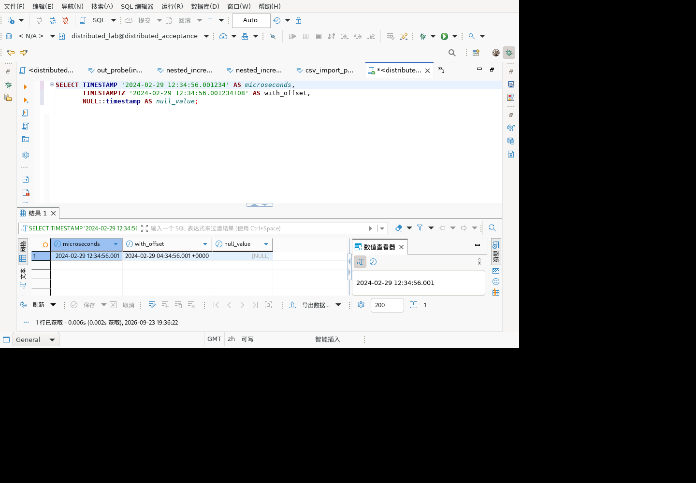
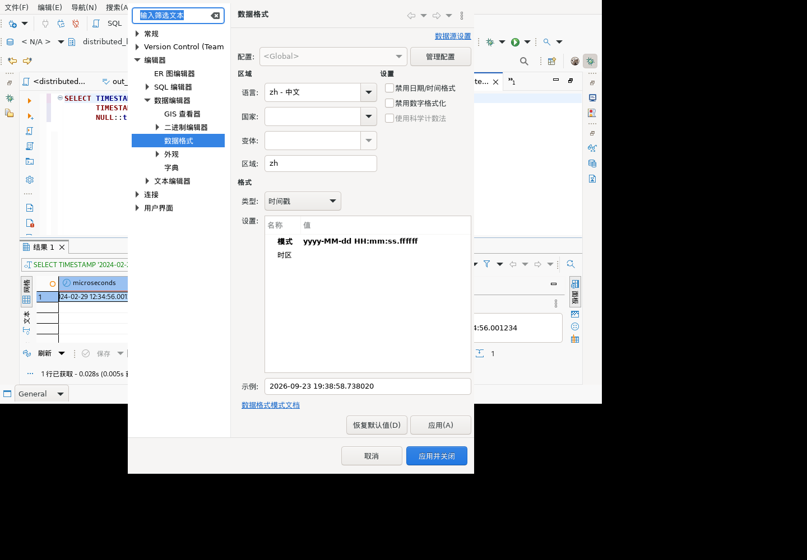
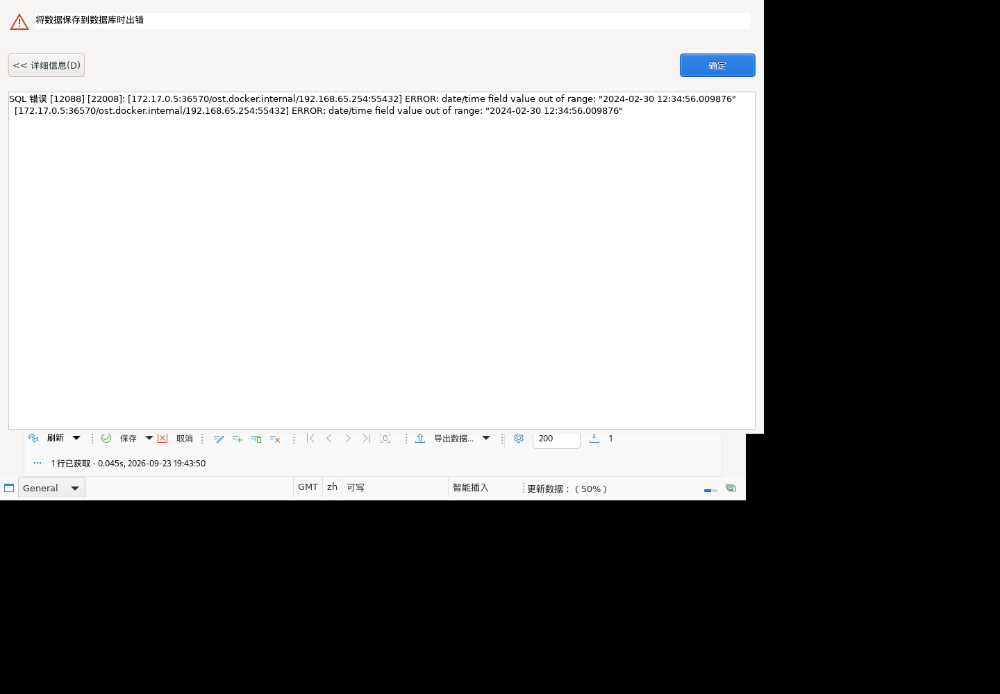
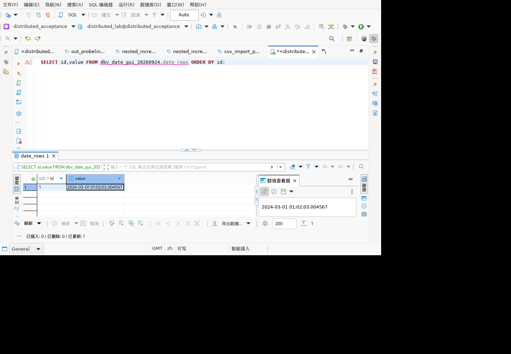

# 麒麟客户端日期精度显示验收

## 环境与安装核对

隔离麒麟 V10 高级服务器版 x86_64 GUI，DBeaver 26.1.5，连接现有 GaussDB 507 分布式测试库，普通数据库账号。GUI 运行于 ARM 宿主的模拟环境，不等同客户桌面云硬件性能验收。

通过文件菜单退出并确认，等待原 Java 进程结束后更新模型插件。登记版本 `org.jkiss.dbeaver.model 2.0.45.202609231933`，宿主与容器 SHA-256 均为 `3e5d86711f522791af15b9c814c247586f0261d328bc671ef830fe84f8ed7f1d`。保留旧插件与 bundles.info 备份，其余插件未全量升级；正常重启进入编辑器。

## 真实操作与结果

执行只读 SQL，无需建立或清理数据库对象：

```sql
SELECT TIMESTAMP '2024-02-29 12:34:56.001234' AS microseconds,
       TIMESTAMPTZ '2024-02-29 12:34:56.001234+08' AS with_offset,
       NULL::timestamp AS null_value;
```

1. 默认普通时间戳模式 `yyyy-MM-dd HH:mm:ss.SSS`：网格及数值查看器显示 `.001`，NULL 显示 `[NULL]`。带时区列显示 `04:34:56.001 +0000`，与输入 +08 的时间点相符。默认三位显示不能据此判定数据库精度丢失。
2. 打开“首选项 → 编辑器 → 数据编辑器 → 数据格式”，类型选“时间戳”，双击“模式”，将格式改为 `yyyy-MM-dd HH:mm:ss.ffffff`，提交单元格编辑。
3. 重新执行查询，普通时间戳网格显示六位 `.001234`，右侧数值查看器完整显示 `2024-02-29 12:34:56.001234`。带时区列有独立格式，本轮未修改。
4. 再次打开首选项并选时间戳，模式仍为六个 f，示例也显示六位；随后取消关闭首选项。保留隔离工作区的六位设置供后续测试使用。

自动化操作编号 684–704。操作 699 使用已失效控件编号失败，未作为成功证据；后续以重新打开首选项读回以及实际网格结果证明配置已生效，而非仅根据点击返回值判断。

### 默认显示



### 六位精度显示


### 再次打开设置



## 未覆盖

本轮 GUI 证据覆盖真实查询、格式设置生效、重新打开对话框读回及 NULL 显示。不覆盖数据修改保存、非法输入错误提示、重启后设置持久化或所有最新插件组成的完整发布包。未增加 JUnit 数量，亦不将 GUI 操作数量计作历史独立用例数。

## 后续补验：网格编辑、服务端拒绝与重试（705–736）

本节补齐上节所列“数据修改保存”和“非法输入错误提示”的部分实际链路，不覆盖所有数据类型。

建立专用 schema `dbv_date_gui_20260924`、普通账号拥有的带主键表 `date_rows(id integer PRIMARY KEY,value timestamp)`，插入初值 `2024-02-29 12:34:56.001234`。使用实际结果网格编辑并点击保存，独立 gsql 会话通过 `to_char(value,'YYYY-MM-DD HH24:MI:SS.US')` 查询，而不是仅观察网格文本。

| 操作 | GUI 观察 | 独立数据库核对 |
|---|---|---|
| 改为 `.009876` 并保存 | 可编辑文本框；保存完成 | `2024-02-29 12:34:56.009876` |
| 改为 `2024-02-30 12:34:56.009876` 并保存 | “数据错误”窗口，SQLSTATE 22008，服务端日期越界 | 保持上一合法值，无自动调整 |
| 关闭错误框，改为 `2024-03-01 01:02:03.004567` 重试 | 保存成功，保存按钮恢复禁用，网格及查看器一致 | `2024-03-01 01:02:03.004567` |

**层级区别：**非法输入本轮由服务端拒绝，不能声称所有网格编辑均经过 DateTimeDataFormatter 的客户端预校验。客户端显示服务端错误、旧值保护及修改后重试已验证；客户端统一提前校验仍待核实。

测试初期外部新建表未被当前元数据缓存识别，网格提示“没有相应的表格列”，文本框 `editable=false`；仅重新连接未解决。通过数据库导航对连接执行“刷新”，重新查询后识别主键，文本框变为 `editable=true`。此现象与处理步骤记录为缓存边界，不以只读控件当作日期校验成功。键盘焦点误落在 SQL 编辑器的动作未计成功；实际单元格通过已观察的截图坐标定位后，继续读取 SWT 编辑控件状态。





结束后精确删除专用表和 schema（不使用 CASCADE），目录查询计数为 0；编辑器恢复只读 `SELECT 1` 测试文本。未修改其他数据库对象。重启后设置持久化、时间戳偏移值写回以及完整发布包仍待验证。
