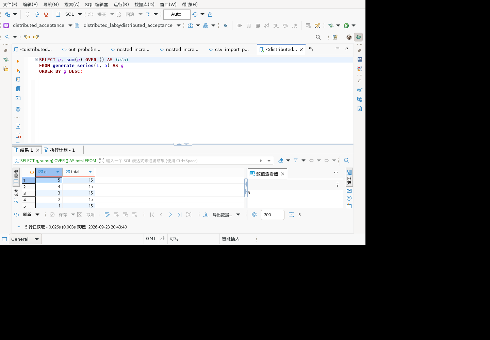
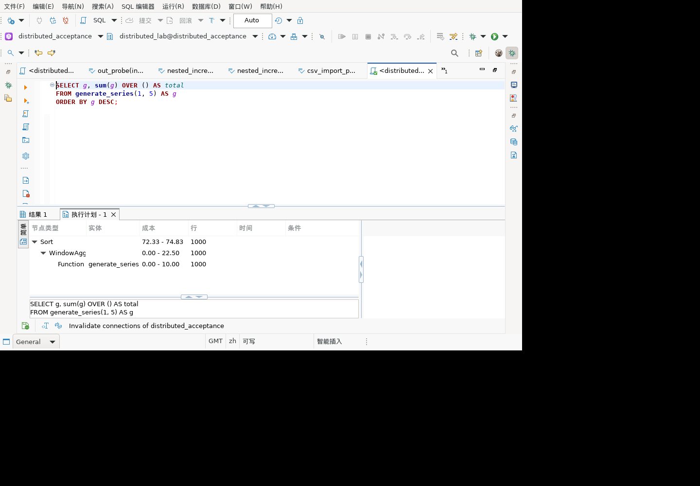
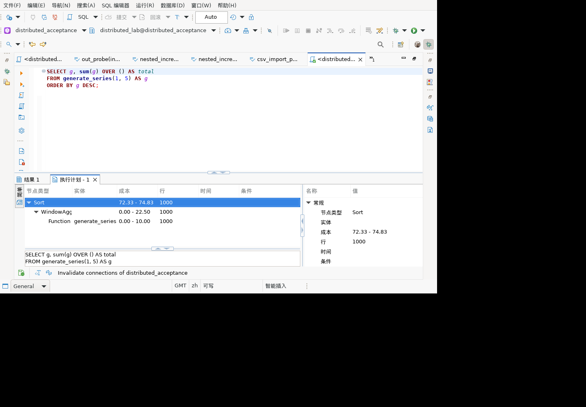
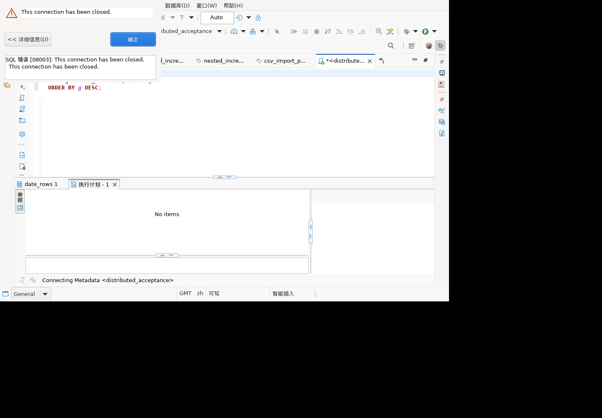
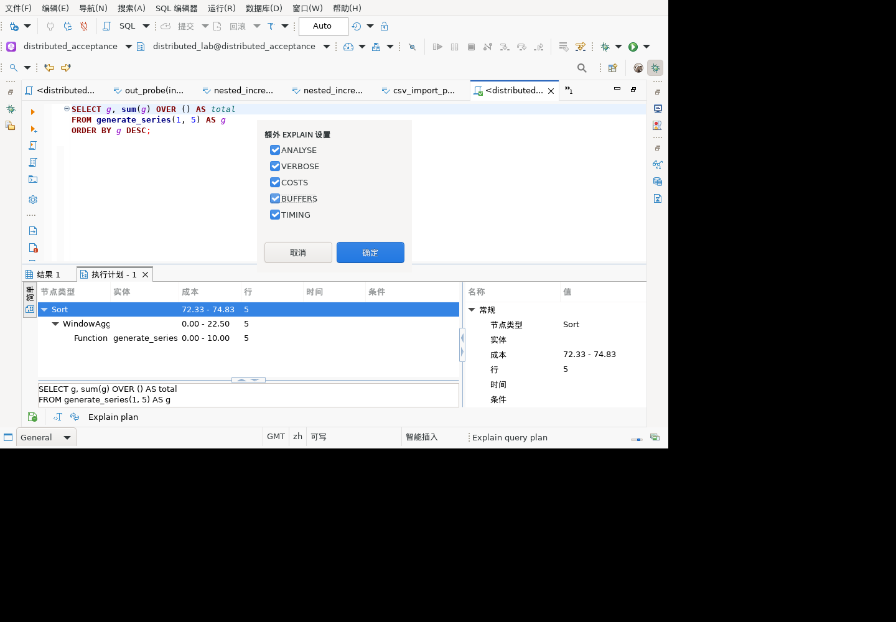
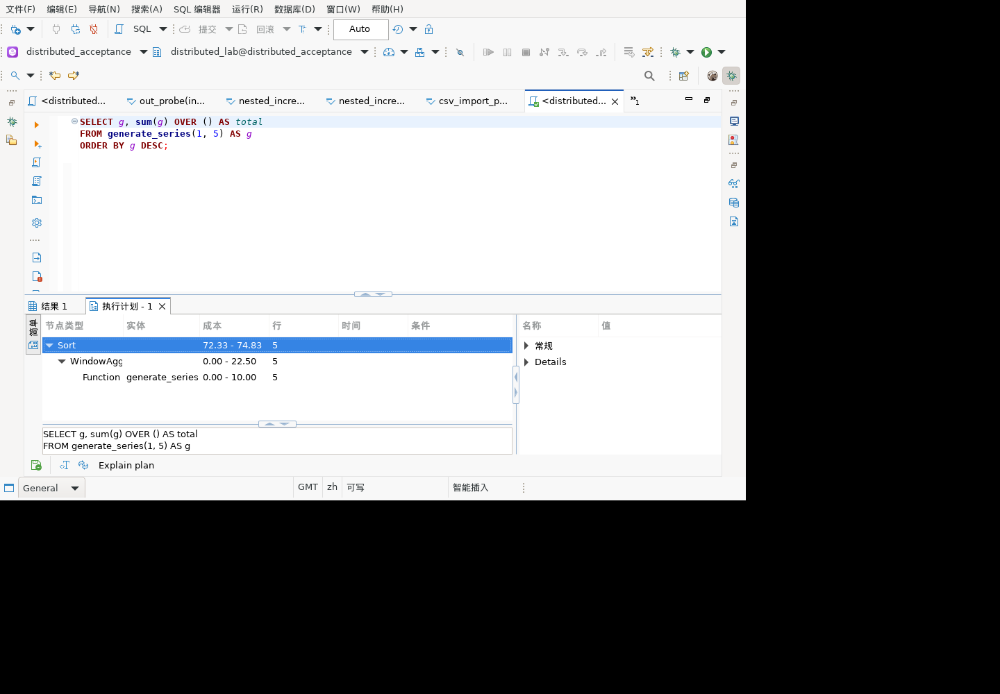
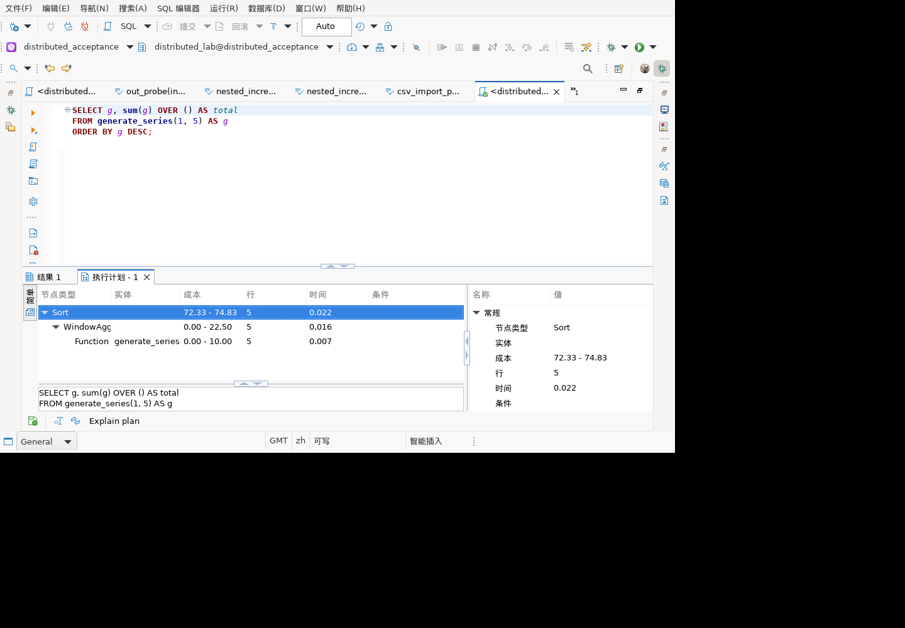
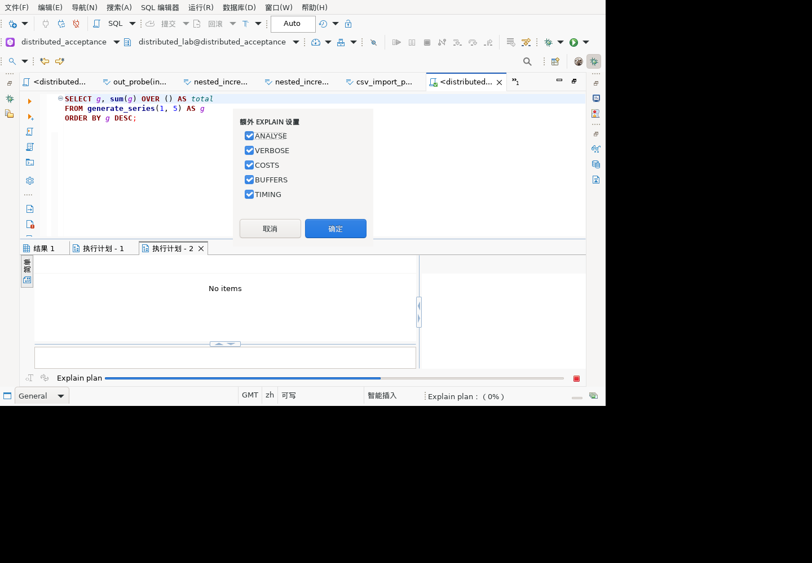
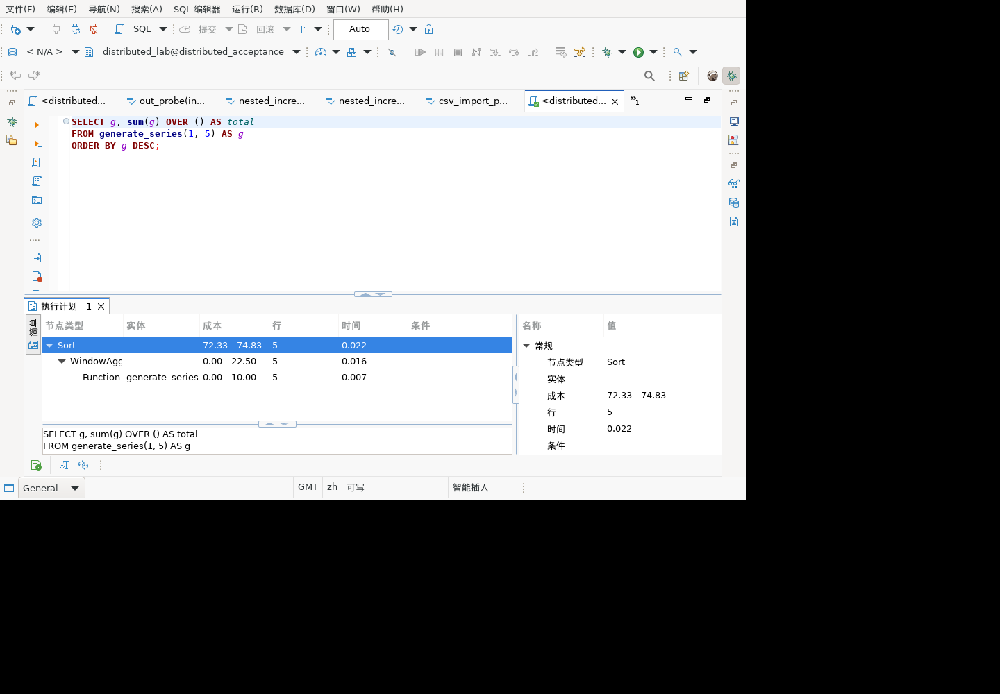

# 麒麟客户端执行计划界面验证

## 环境和范围

麒麟 V10 x86_64 容器中的真实 SWT 客户端，通过图形界面连接 GaussDB 507 分布式实例，使用普通账号。宿主为 ARM，Linux x86_64 为模拟执行，不等同客户桌面云性能验收。

使用既有隔离安装 `/opt/history-gui-20260923`，model 插件为 `2.0.45.202609231933`；并非包含全部最新源码修改的新安装包。本轮未改生产代码、不增加 JUnit 数量。

## 查询

```sql
SELECT g, sum(g) OVER () AS total
FROM generate_series(1, 5) AS g
ORDER BY g DESC;
```

全程只读，无建表或数据变更。首轮未启用 ANALYSE，后续增补见下文。

## 操作与结果

1. SQL 编辑器输入查询，选择“SQL 编辑器 → 解释执行计划”，出现“PostgreSQL 执行计划配置”，确认默认选项。
2. 初次执行报 `08003: This connection has been closed`。菜单重连后仍失败；此时未判定计划功能通过。
3. 打开连接树，明确断开目标连接，再双击该连接建立连接。执行原查询，结果为 `g=5,4,3,2,1`，每行 `total=15`，执行日志成功且行数为5。
4. 再次解释同一查询，计划树显示 `Sort → WindowAgg → Function Scan`；函数实体为 `generate_series`。
5. 选择 Sort 节点，属性显示节点类型、成本 `72.33–74.83`、Plan-Rows `1000`、Plan-Width `4`、Sort-Key `g DESC`。WindowAgg 成本 `0.00–22.50`、Function Scan `0.00–10.00`。
6. 通过独立 gsql 会话执行相同 EXPLAIN，节点、成本、估计行数和排序键与界面一致。估计1000行来自服务端，不是实际查询5行被客户端误计。







## 异常和证据边界

- SWTBot 队列737–763。初始失败截图见下；未分析最初会话失效原因，也未将菜单重连无效的原因归咎于服务器或客户端实现。
- 自动化一次误开新连接向导，已取消且未创建连接；一次使用过期控件编号失败，重新抓取控件后恢复。这两步不是产品通过证据。
- 所有截图已人工式视觉核对，树和属性另有控件文本证据。
- 仍未覆盖 ANALYSE 实际耗时/行数、JOIN/分布式 Stream/分区等全部节点、保存/加载计划、目标金融版本和最新全量包。
- 当前界面中配置标题仍标为 PostgreSQL，且部分属性和状态文字为英文。这是展示边界，不宣称全面汉化完成。



## ANALYSE 及附加字段验证

后续队列764–784，继续使用同一只读 SELECT，无数据写入：

1. 打开解释配置，选择 ANALYSE，先以 TIMING 关闭执行。树中三个节点的行数均从估计1000变为实际5。重新选择 Sort 后，属性显示 `Actual-Rows=5`、`Actual-Loops=1`，仍保留 `Plan-Rows=1000`，排序方法 quicksort、内存25；耗时为空。
2. 再打开配置，实际鼠标点击标签，截图确认 ANALYSE/VERBOSE/COSTS/BUFFERS/TIMING 五项全选，执行同一查询。
3. 树中 Sort、WindowAgg、Function Scan 的时间分别显示0.022、0.016、0.007；Sort 属性中 Actual-Startup-Time 和 Actual-Total-Time 均0.022，Actual-Rows=5、Actual-Loops=1。
4. VERBOSE 输出列为 `g`、`sum(g) OVER ()`；Sort-Key 为 `g.g DESC`。BUFFERS 的 shared/local/temp 读写字段均出现，本查询为0，IO-Read-Time/IO-Write-Time 为0.000。只验证字段呈现，不代表已验证非零磁盘I/O统计。

这些时间为单次计划观测值，未建立性能基准。重新生成计划后属性面板需重新选择节点才能看到新属性；本轮按重新选择后的值核验。







自动化中的 check 命令只适用于树节点，误用于按钮的失败不算产品失败；初期点击与截图状态不一致、一次黑屏截图均未作通过依据，最终以明确选中截图和返回的实际统计字段确认。查看来源按钮本轮未获得源码视图证据，不列为通过。

此追加覆盖了该只读查询的 ANALYSE、TIMING 开关以及 VERBOSE/BUFFERS字段。更多节点、非零I/O、最新全量包仍未验；保存加载增补见下文。ANALYSE 会实际执行 SQL，不能直接用于未隔离的数据修改语句。

## 保存、加载计划与重执行缺陷修复

队列785–805，采用相同只读查询：

1. 点击计划工具栏“Save plan”，通过文件选择器保存 `/tmp/Untitled.dbplan`。文件5943字节，JSON版本1，包含原查询、三层节点和实际统计字段。
2. 修复前，从“SQL 编辑器 → 加载执行计划”选择文件后，出现新的 EXPLAIN 配置框。代码在反序列化后调用 `refresh()`，因此会重新规划，启用 ANALYSE 时会再次执行文件中的SQL。此次取消配置框，未再次执行。
3. 修复 `ExplainPlanViewer.loadQueryPlan()`：读取后调用 `visualizePlan(lastPlan)` 展示文件数据，不调用重新执行逻辑。用户主动点击刷新仍是单独的重新规划操作。
4. 回归编译和测试 `run-3ekl4d`：1493项，1469通过、24跳过、0失败/错误。未增加JUnit计数；本次新增的是GUI回归场景。构建跳过格式/Checkstyle检查，不视为这些检查通过。
5. 正常退出隔离客户端并安装 SQL编辑器插件 `1.0.185.202609232058`，本机和容器 SHA-256 一致：`0cc9f4b0c2844def5e5506cf7954b7c783ed9f912b7ca308d033503849b53a05`。其余插件未整体升级，不代表新全量发行包验收。
6. 重启后重新选择加载文件，直接呈现 Sort → WindowAgg → Function Scan；无 EXPLAIN 配置框。三节点行数均5，时间仍0.022/0.016/0.007，与保存文件一致。选择 Sort 后，属性保留 Plan-Rows=1000、Actual-Rows=5、Actual-Loops=1、Actual-Total-Time=0.022、Sort-Method=quicksort。
7. 测试仓脚本 `scripts/verify-gui-plan-load.mjs` 对比保存JSON与加载后控件记录，通过；对修复前出现EXPLAIN配置框的记录执行同一核验，正确拒绝。截图另作视觉检查。





自动化重启后一次误点“解释”而非“加载”，已取消，其配置框不算修复后失败；最终核验使用实际加载操作。未覆盖损坏文件、其他驱动格式、所有节点类型，也未进行网络流量级无SQL审计。
