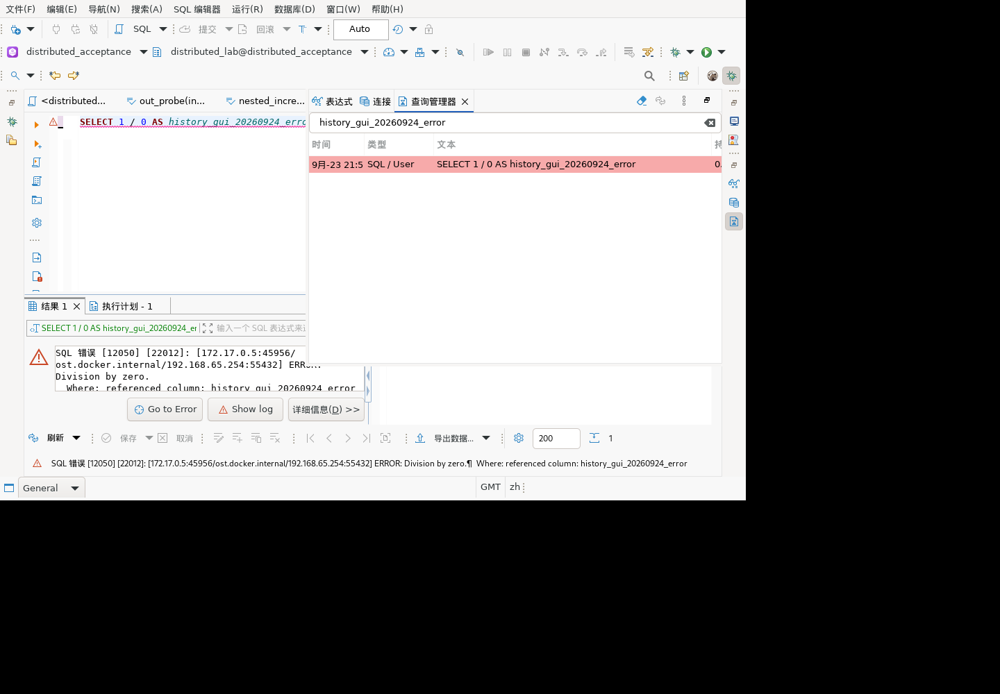
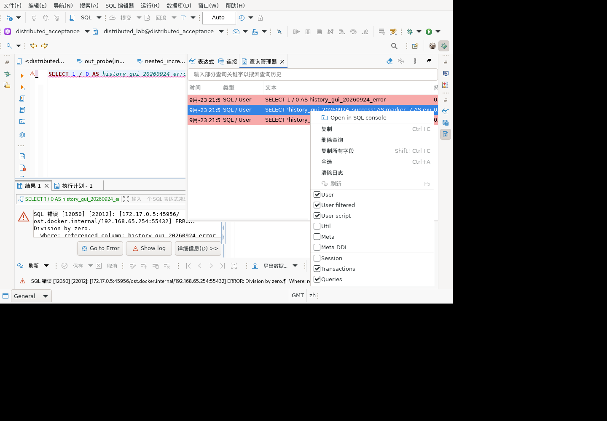
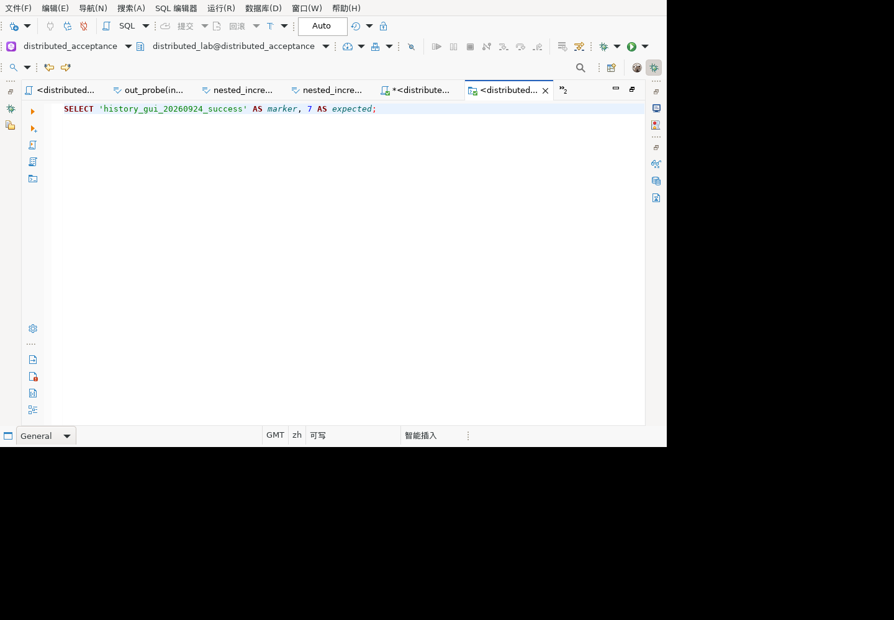
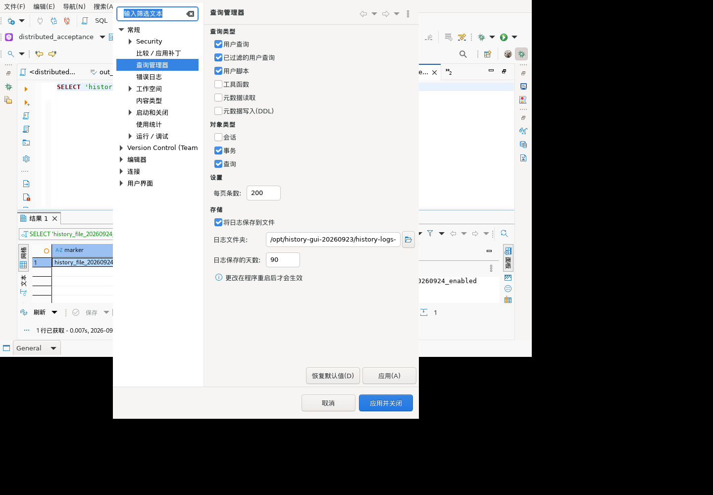
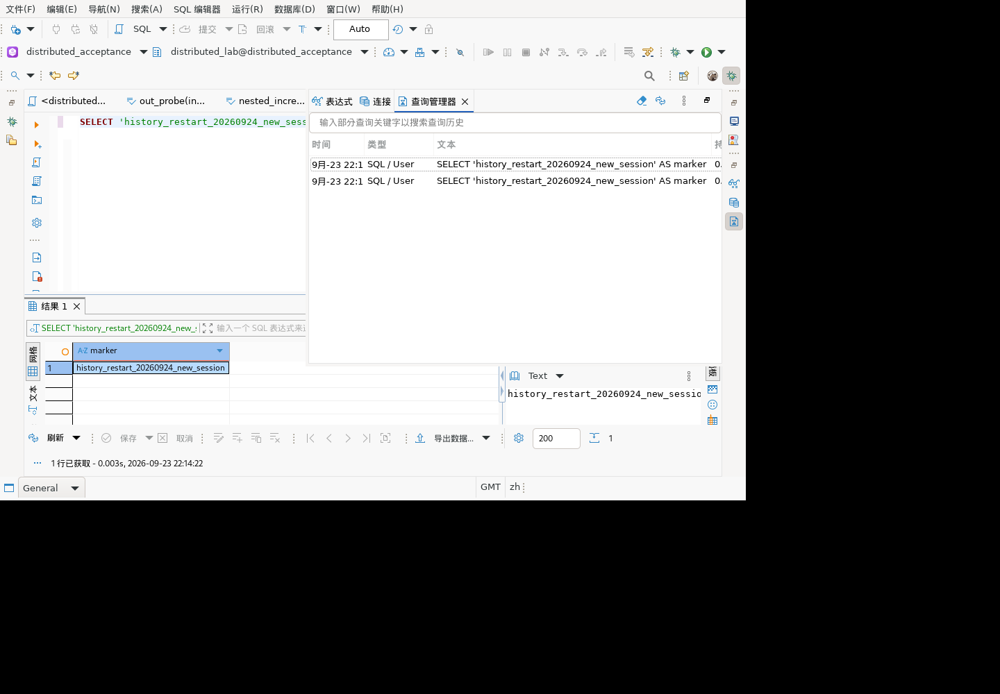

# 查询历史 GUI 验证

对应历史清单3.11（SQL历史）、9.7（终端执行记录）。环境为隔离的麒麟V10 x86_64 Linux GUI容器，通过真实DBeaver 26.1.5连接GaussDB 507分布式测试库。本轮不使用mock替代界面或数据库。

## 操作及结果

| 场景 | 操作 | 实际结果 |
|---|---|---|
| 成功查询记录 | SQL编辑器执行`SELECT 'history_gui_20260924_success' AS marker, 7 AS expected`，打开查询管理器并刷新 | 查询面板显示预期marker；历史表记录原SQL、SQL/User类型、1行、成功、耗时、连接及脚本名称 |
| 失败查询记录 | 执行`SELECT 1 / 0 AS history_gui_20260924_error`，重新打开查询管理器 | 历史记录保留原SQL和Division by zero错误；实际截图显示SQLSTATE 22012；不是成功状态 |
| 按关键词过滤 | 在查询管理器过滤框输入`history_gui_20260924_error`并回车，等待刷新 | 仅1条对应除零记录；成功查询记录被过滤 |
| 清空过滤 | 清空过滤框并回车，等待刷新 | 恢复与过滤前相同的3条记录，不只是输入框清空 |

第三条记录是成功标记查询此前遇到的连接被管理员终止错误，随后有成功执行记录。这里仅验证两条结果分别保留，未独立观察连接恢复过程，不据此宣称故障恢复验收通过。

截图来自实际客户端，SQL及数据为专用测试内容。容器采用GMT，界面时间显示9月23日；文档日期采用项目本地日期9月24日，不将不同时间显示误作新的独立执行轮次。

## 自动核验及证据

SWTBot队列806–819：807执行成功查询、808观察结果、810刷新历史、811执行除零、813记录三行、814–816应用过滤、817–819清空并等待恢复。输入框更新及`OK`不代表通过，最终以异步刷新后的表格内容为准。

测试仓库`scripts/verify-gui-query-history.mjs`仅提取查询管理器过滤框后面的表格，避免拿SQL编辑器的日志面板误作证据。对813、816、819快照断言成功/错误状态、过滤后精确1行、恢复后内容一致。输出：`successAndFailureVisible=true, filteredRows=1, restoredRows=3, filterRestorationVerified=true`。以未过滤快照冒充过滤结果的负向校验被拒绝。

## 尚未由本轮证明

- 双击历史记录后未观察到重新打开或重放SQL（820–821），不计通过。
- 未验证固定/取消固定、清理、跨重启历史保留、容量限制或完整配置持久化。
- 本轮沿用隔离GUI安装：SQL编辑器1.0.185.202609232058；其他插件并非最新全量产物，不宣称最新安装包全面验收。
- 不修改业务表，不执行清除日志。保留专用工作空间中的测试历史用于复核。

## 追加：正确入口打开与显式重放（822–830）

代码和实际菜单确认：`QueryLogViewer.createContextMenu`提供 **Open in SQL console**。双击不是此入口，前轮未观察到双击效果不应归因为功能失效。

操作路径：查询管理器中选中成功记录 → 鼠标右键 → **Open in SQL console**。实际打开名为QueryManager的SQL控制台，数据源仍为distributed_acceptance，正文为原SQL并补齐分号。此时查询管理器仍为原3条记录，与打开前逐条一致；没有新增执行记录。

随后在该控制台显式按Ctrl+Enter：返回预期marker，查询管理器新增一条成功/1行记录，来源为`SQLEditor <QueryManager>`；此前3条记录保持原样。没有执行任何DML/DDL。

`verify-gui-query-history.mjs`增加打开前后记录相等、控制台正文/名称、重放后仅新增1条成功记录且来源正确的断言，827/830快照通过。以827未执行快照替换830时因3条而非4条被拒绝，证明不能用打开动作冒充重放通过。

本轮补齐“右键打开历史SQL→显式执行→新增历史”链路，不包含跨重启持久化、固定/取消固定、删除历史。环境版本仍沿用上一节说明，非最新全量包验收。

## 追加：日志文件开关（831–844）

路径：窗口→首选项→常规→查询管理器→存储。初始“保存到文件”关闭，目录输入不可用。通过界面启用，指定隔离安装下`history-logs-20260924`目录并应用关闭；重新进入该页，目录值保持且可编辑。

不重启客户端，执行`SELECT 'history_file_20260924_enabled' AS marker`，真实生成205字节的`dbeaver_sql_20260923.log`并包含该标记。随后恢复原目录与关闭状态，再执行不同的`history_file_20260924_disabled`标记；界面正常返回此值，专用日志SHA-256前后一致，专用日志和默认当日日志均不包含关闭后的标记。

专用文件哈希：`3acd0d69e2b15f9fd25aa4b7f5e23ab66889cd04ec0489bd2f6d3e9d805e396d`。仅记录文件元数据和测试标记是否存在，不将完整查询日志作为发布附件。

界面旧提示称重启后生效，但`QMLogFileWriter.preferenceChange`监听设置变更并重新初始化文件，实际测试亦即时生效。已将英文/简体中文提示修正为应用设置后生效；检查两处资源键唯一且内容正确，`git diff --check`通过。截图是修复前证据，新文案尚未重新打包进行GUI复测；其他语言未调整。

本轮验证的是日志文件输出及关闭，不是查询管理器从文件恢复历史。未重启客户端，因此跨重启持久化/恢复仍未通过；保留专用测试日志以便后续复核。

## 追加：真实重启后的边界（845–860）

先通过“保存全部”保存测试脚本，并将SQL控制台保存为新脚本；正常菜单退出并确认，旧进程10824/10830消失后，才在同一工作空间启动新进程11449/11455。没有删除锁文件或强杀进程。

重启后脚本标签恢复，专用日志文件仍为相同SHA-256。查询管理器的过滤框为空，历史表为空，刷新按钮不可用；随后关闭每日提示窗口并执行新标记查询，视图显示本次会话的两条成功执行，旧标记记录未出现。两条新记录来自两次显式执行，不是重复恢复的数据。

源码`QMMCollectorImpl.pastEvents`初始为空内存列表，`QMRegistryImpl`的默认查询路径读取该列表；`QMLogFileWriter`的文件输出不等同于从文件回装此列表。实际GUI观察与这一默认实现一致。

结论分开记录：日志文件跨重启保留、脚本恢复、新会话历史记录正常；**界面跨重启恢复旧查询历史未通过**。本轮重启时文件日志开关已按前轮清理恢复为关闭，不能外推为所有存储配置的恢复结果。未将此能力缺口标为不适用或验收通过。

测试仓库`verify-history-restart-observation.mjs`验证852空历史与859新会话记录，输出明确为`oldHistoryRestored=false, persistenceAcceptance=not_passed`；脚本通过表示观察已复核，不表示持久化需求通过。
