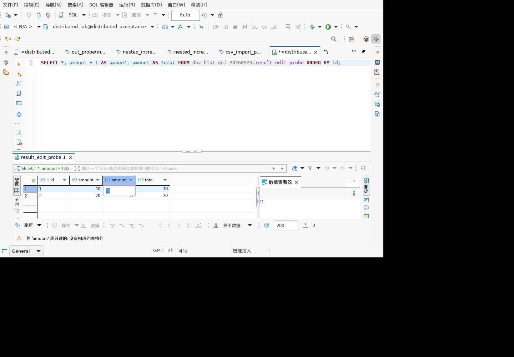
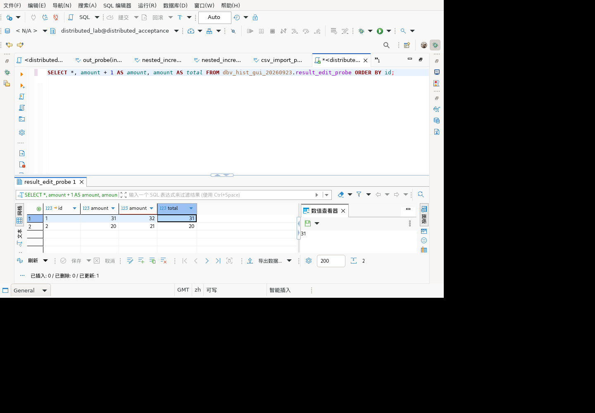

# 结果集编辑门控测试

## Linux界面混合查询写回验收

在隔离Linux x86_64客户端和507分布式ORA测试库上，通过普通账号distributed_lab完成真实界面操作。模型包升级为2.0.45.202609231613，SHA256为`772751fcd8d6f77e1f86572cf7f1118d62b9ec491d807294393727499b7df505`，与本次构建一致；旧包及bundles.info备份保留。该平台为本机容器中的Linux GUI，不等同客户桌面云实机。

专用表result_edit_probe包含主键id和amount，初值(1,10)、(2,20)。普通账号执行：

```sql
SELECT *, amount + 1 AS amount, amount AS total
FROM dbv_hist_gui_20260923.result_edit_probe ORDER BY id;
```

操作及证据（界面记录539–552）：

1. 实际鼠标双击第三列计算值11：内嵌编辑框和数值查看器均editable=false，状态栏提示“列 'amount' 是只读的: 没有相应的表格列”，保存禁用。不是仅靠键盘输入无反应推断只读。
2. 实际鼠标双击第四列total值10：内嵌编辑框及查看器editable=true，形成正向对照。
3. 输入31并点击结果集保存：完成后显示“已更新:1”，保存按钮禁用，结果为第一行amount=31、计算列=32、total=31；第二行20/21/20不变。
4. 独立gsql连接查询原表，结果精确为1|31、2|20，证明更新了原始amount而不是名为total的列或其他行。
5. 编辑器恢复SELECT 1，删除本轮专用表，无业务表变更。





这项通过覆盖真实驱动→生产属性绑定→结果集编辑→保存→独立数据检查；不代表全部CTE、多个通配中间表达式、无唯一键、插入/删除、错误回滚或客户目标版本已验收。JUnit仍为1160/1136通过/24跳过，GUI结果单独记录，不增加JUnit数量。

## 通配展开后别名还原

新增8项：无通配/通配前后的amount AS total、限定通配后别名、两个通配之前/之后的明确表达式、两个通配之后的别名，以及末尾多项投影。结果列总数和被验列序号显式给出，使用真实GaussDBDialect处理标识符。

run-K8w75a有4项失败：通配之后的别名按total而非amount查找。原因是列名还原仍保留“必须在第一个通配之前”的旧限制，未使用已完成的结果序号映射。修复后对已映射的普通列按原始列名还原；未知区间不会虚构普通列。

run-CeOSu4：1160项、1136通过、24跳过、0失败/错误，本类37项全部通过。报告 [别名回归](test-results-20260924-wildcard-alias.json)。临时grantee已删除。该证据为生产方法加模拟目录，不是GUI写回；两个通配之间的表达式仍是未闭环边界，前后明确投影通过不代表中间区域通过。

## 通配列与表达式混合绑定修复

新增8项生产绑定测试：普通amount列、无通配的算术表达式、表达式在通配前/后、尾部普通列、纯通配，以及accounts.*限定通配前后的表达式。真实SQL解析、真实绑定流程，模拟目录返回accounts实体；验证只有物理投影发起amount表列查找。

旧代码 run-NpsCr5 首批4项中2项失败：`SELECT amount + 1 AS amount, * FROM accounts` 和 `SELECT *, amount + 1 AS amount FROM accounts` 均错误查找同名表列。原逻辑只要整个查询有通配就放开查找，且直接拿结果序号索引未展开的投影列表。该证据证明错误的查找路径，并不等于已观察到用户数据被写坏。

修复 `DBExecUtils`：根据结果列总数映射通配前后明确投影；单个通配的展开区间映射到通配项本身；只有普通列、实际通配或未确定的通配区间沿用表列查找，明确表达式不因其他投影有通配而放开。测试同时使用完整结果列数量模型（单通配展开为两列）及普通列正向对照。

最终 run-7nHq9P：1152项、1128通过、24跳过、0失败/错误，本类29项全部通过。脱敏报告见 [混合通配回归](test-results-20260924-wildcard-binding.json)，临时grantee已清理。

限制：多个通配之间无法仅从总列数分配各自展开宽度，保留未知区间的原行为，未宣称该歧义解决。真实驱动元数据、界面编辑与写回尚需验证；本批不证明所有表达式结果都只读。GUI模型仍需更新后验收此修复。

## 属性绑定补充

新增8项调用完整 `DBExecUtils.bindAttributes` 流程：常量、算术、星号字符串、CASE、CTE直接列/别名列、简单派生查询和UNION派生查询。使用真实 SQLQuery 解析及 DBDAttributeBindingMeta 状态读写，仅模拟会话和驱动元数据；不提供物理来源。断言不生成实体列、不生成行标识、存在拒绝原因、编辑判断为只读。该类现21项全部通过。

首次 run-b8woAn 因测试引用了当前版本不存在的 `VoidProgressMonitor.INSTANCE` 编译失败，改为构造实例后完整重跑 run-rvX52y：1144总数、1120通过、24跳过、0失败/错误。报告 [属性绑定回归](test-results-20260924-attribute-binding.json)。临时授权角色已删除，无生产代码修改。

范围限制：这8项只证明无物理来源时的模型绑定链路，未覆盖驱动提供真实表来源、混合通配列与计算列、真实界面单元格修改或SQL写回；这些仍需继续验证。

## 基础门控

对应历史清单 9.8（表数据编辑）、9.9（结果集展示），补充生产 `DBExecUtils` 的编辑能力与拒绝原因判断。共 13 项，调用实际方法，依赖对象使用 Mockito；不属于 GUI 或真实 UPDATE 写回验收。

| 场景 | 断言 |
|---|---|
| 缺少元数据、驱动只读 | 列不可编辑且存在解释 |
| 缺少行标识、带自定义拒绝原因 | 禁止编辑，保留上游提供的原因 |
| 来源实体不支持数据修改、未声明 UPDATE 能力 | 禁止编辑且存在解释 |
| 唯一键不完整 | 要求有效键时禁止；显式不要求时不被该条件阻断 |
| 元数据、行标识和 UPDATE 能力齐备 | 可以编辑，没有只读原因 |
| 断开连接、编辑权限受限、数据源只读 | 结果集不可编辑且存在解释 |
| 正常连接和编辑权限 | 结果集允许编辑，无只读原因 |
| 空连接上下文、空属性、空容器 | 安全拒绝编辑 |

代码核对确认 `DataSourceDescriptor.hasModifyPermission` 对只读连接直接拒绝数据编辑权限，因此不能将 `isResultSetReadOnly` 没有重复调用 `isConnectionReadOnly` 判为漏洞。

第一次 run-4mvzpe 因测试 mock 类型不匹配编译失败：`DBSDataManipulator` 并非 `DBSEntity` 子类型。修正为实体 mock 附带修改能力接口后重跑；没有修改生产实现或放宽预期。

最终 run-jHa7BJ：1136 项，1112 通过，24 跳过，0 失败、0 错误。新增 13 项全部通过；集中式和分布式 507 连接已供完整回归使用，但不将本批新增单测描述为 13 项真库测试。脱敏报告见 [测试结果](test-results-20260924-resultset-editability.json)。临时授权角色已删除。

尚需补齐：计算列/CTE 从 SQL 解析、驱动元数据、属性绑定到 GUI 可编辑性的完整链路，以及编辑生成 SQL 和真实写回结果。当前门控测试不证明上游为每个计算列正确生成了只读属性，也不证明所有无唯一键查询都禁止编辑。
