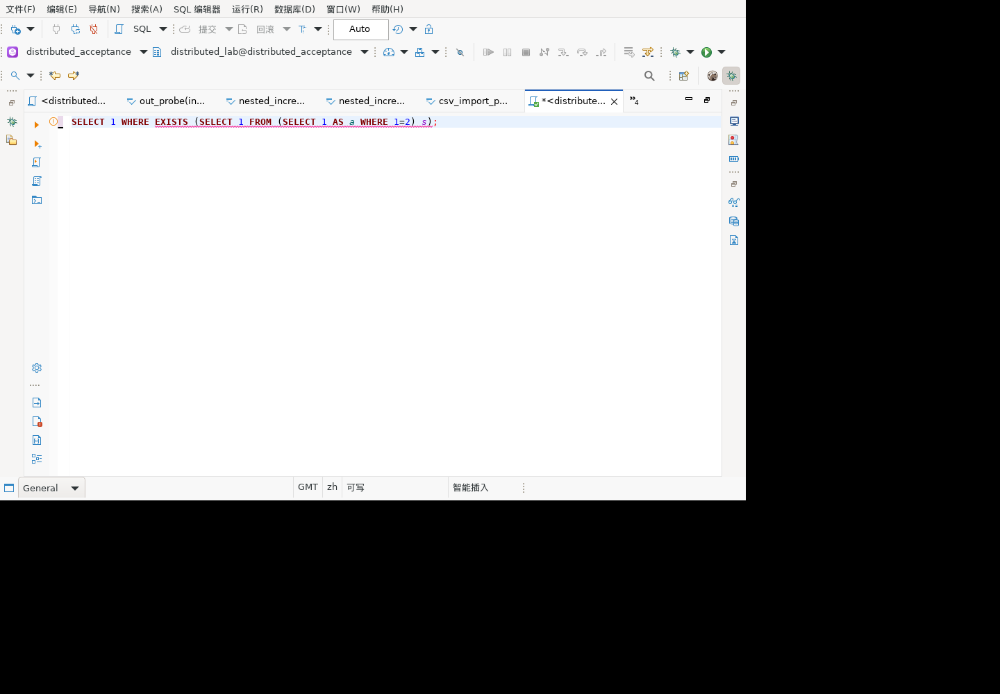

# EXISTS 筛选条件检查与验证

对应历史清单 5.2「EXISTS 需 WHERE」。无 WHERE 的 EXISTS 是合法 SQL；本功能只提示审查意图，不阻止执行、不改写 SQL，也不承诺存在性能问题。

## 实现

共享 SQL 语义识别器遍历 EXISTS 的查询，分别检查顶层 SELECT（包括 UNION 各分支）的自身 WHERE。内层派生表的 WHERE 不算外层 SELECT 的条件；嵌套 EXISTS 独立检查。同一个 EXISTS 即使多个分支缺少 WHERE，也只产生一条 WARNING。沿用编辑器现有语义诊断通道，提供中英文提示及源码范围。

## 自动测试

`SQLQueryQualityDiagnosticTest` 新增 17 项参数化场景：普通 EXISTS、NOT EXISTS、无 FROM、注释/字符串中的 WHERE、派生表作用域、UNION 左右分支、嵌套 EXISTS，以及对应有条件的反例。断言提示数量、WARNING 等级和合法源码范围。

完整新鲜回归 `run-pqjUxd`：1,819 项，1,796 通过，23 跳过，0 失败、0 错误。跳过不计通过。脱敏结果见 [自动测试结果](exists-results-20260924.json)。

## GaussDB 507 对照

集中式与分布式均执行以下只读语句，结果都是 `t|f|f|t`：

```sql
SELECT EXISTS (SELECT 1),
       EXISTS (SELECT 1 WHERE 1=2),
       EXISTS (SELECT 1 FROM (SELECT 1 AS a WHERE 1=2) s),
       EXISTS (SELECT 1 WHERE 1=2 UNION SELECT 1);
```

这验证数据库语义，不代替客户端诊断断言。未创建或修改数据库对象。

## 麒麟 V10 x86_64 图形客户端

验收副本加载 `model.sql 1.0.175.202609240502`，真实 SWT 编辑器读取已生成的语义标记，不调用解析器制造标记。

1. 输入 `SELECT 1 WHERE EXISTS (SELECT 1 FROM (SELECT 1 AS a WHERE 1=2) s);`。
2. 等待后台语义分析。队列 1252 观察到一条中文 WARNING，offset=15、length=50，准确覆盖 EXISTS 谓词。内层 WHERE 没有掩盖外层缺失。
3. 改为 `SELECT 1 WHERE EXISTS (SELECT 1 FROM (SELECT 1 AS a) s WHERE a=1);`。
4. 队列 1254 读取到 0 条语义标记，旧提示已清除。

实际快照验证器 `verify-exists-diagnostic-gui.mjs` 两状态通过。验证器本身 6 项正反例通过，独立计数，不加入 JUnit 总数。其初稿夹具长度误写 47，测试发现后修正为真实长度 50；未放宽范围断言。



GUI 本轮只编辑文本，没有执行 SQL。英文界面、鼠标悬停、其他方言以及交付整包另行验证。

## 边界

- 只检查语法结构，不证明条件有效或选择性良好；`WHERE true` 仍有 WHERE。
- VALUES-only 子查询、语法不完整编辑、其他方言扩展尚未专项验收。
- 不是历史静态检查 251 项的完整替代；NOT IN 可空性等其他规则仍需继续覆盖。
