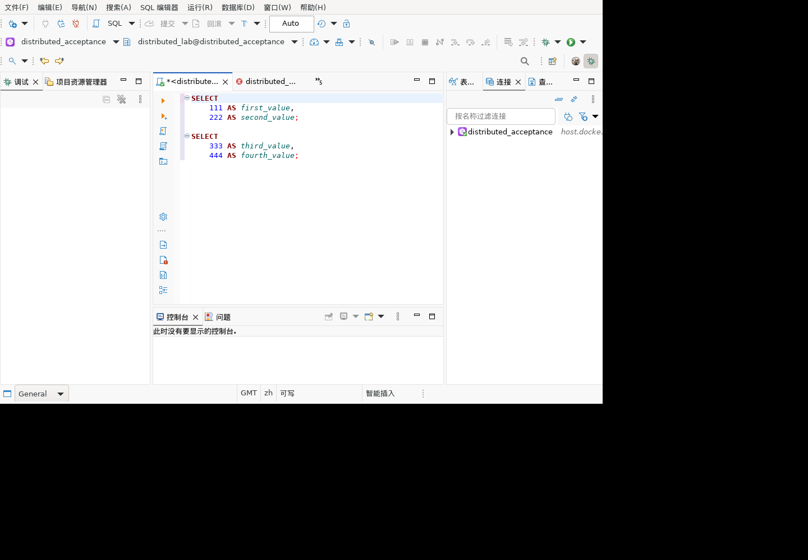
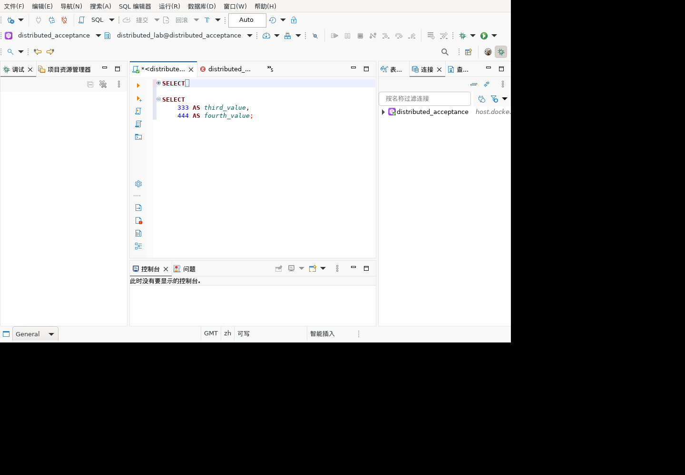

# SQL 编辑器折叠区域版本一致性回归

对应历史清单 6.1/6.2 的 SQL 编辑与解析，以及桌面交互并发场景。

## 实际问题

Linux 客户端日志观察到后台折叠计算抛出 `BadLocationException: Offset > length: 1228 > 393`。后台解析取得旧文本位置后，直接对可能已改变的活动文档读取行号和字符。即使替换前后长度相同，不报越界也可能把旧解析结果应用到新文本。

## 修复

`SQLReconcilingStrategy` 在解析前记录文档对象、修改版本和文本快照。解析返回后验证版本及全部位置；折叠长度、行数统一基于该快照计算；更新注解前再次检查版本。过期或越界结果整批丢弃，不修改现有折叠缓存，不以捕获所有异常代替正确性检查。未知修改版本的文档退回文本比较。

## 确定性测试

测试类：`SQLFoldingRevisionTest`。调用实际生产折叠策略，模拟编辑器解析期间的文档修改；不依赖等待时间或屏幕坐标。

| 场景 | 断言 | 结果 |
|---|---|---|
| 长文档被缩短 | 无越界异常，注解模型未收到更新 | 通过 |
| 文本等长替换 | 拒绝旧解析，注解模型未更新 | 通过 |
| 文档对象替换但内容相同 | 不向新文档发布旧对象的解析 | 通过 |
| 编辑后恢复原文 | 通过修改版本发现变化，不仅比较内容 | 通过 |
| 正常多行语句 | 生成一个完整且正确的折叠位置 | 通过 |
| 正常位置混入整数溢出风险的越界位置 | 整批拒绝，无部分更新 | 通过 |

红绿验证：旧代码 run-qdrwSz 的前三个测试均失败；初始修复 run-s7dRbg 三个通过；扩充正向及边界场景后 run-mJkx7Z 六个全部通过。

完整回归：1012 项，988 通过，24 跳过，0 失败/错误。结构化结果见 `test-results-20260923-sql-folding-revision.json`。原始运行日志仅本地保存，避免包含连接凭据。

## 验证边界

确定性交错测试和下述界面验证不是长期 UI 压力测试。测试未证明所有拼写检查或发布瞬间的并发行为均已覆盖。新安装包回归仍待进行。24 项跳过不计通过，本报告不表示整份历史清单已完成。

## Linux 图形界面补充验证

正常退出旧实例后更新隔离副本，保留旧 jar 和 bundles.info 备份。实际登记 SQL 编辑器版本 `1.0.185.202609231515`，主机产物和容器安装文件 SHA256 均为 `408212fe0a3532ebd64fd0f3bdf5bdbe1aa6bc3bf9cc71310db87b2143b7224c`。以原测试工作区、中文、`-clean` 启动；没有覆盖客户安装包。

| 场景 | 操作与独立断言 | 结果 |
|---|---|---|
| 正常多语句折叠 | 两条三行 SELECT，共113字符；实际注解为offset=0/57、length均56、collapsed=false | 通过 |
| 反复长短替换 | 20次多行/单行交替替换编辑器文本，最后为SELECT 1；后台完成后注解数量0 | 通过 |
| 恢复多行文本 | 再次替换成原两条SELECT，注解恢复到0/57、长度56 | 通过 |
| 鼠标折叠 | 实际点击第一处折叠图标，首条SQL只显示首行；注解collapsed=true，第二处仍false | 通过 |
| 鼠标展开 | 再次点击，首条注解恢复false，两处位置与长度不变 | 通过 |

操作证据队列489–503；只读`folding`诊断读取实际projection模型，不触发解析、不构造注解。最初尝试xdotool因未安装失败，未计成功，随后使用X11原生鼠标事件并核对界面及模型。

本次启动会话（15:19:04）日志无SQL折叠越界，仍有既有`navigate/goTo`菜单扩展警告，不能宣称客户端无任何日志问题。这里只编辑专用Script-1测试文本，未执行SQL、未改数据库数据。关闭前保留最终多行测试文本，后续不得当作业务脚本执行。

恢复后的真实界面：

点击第一处折叠后：

