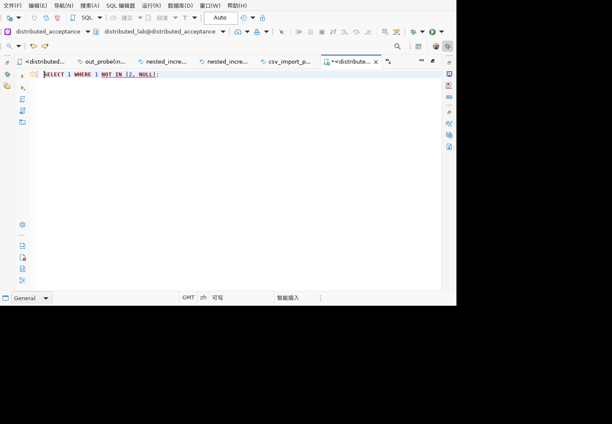

# NOT IN 显式 NULL 风险检查

对应历史清单 5.2「NOT IN 子查询非 NULL」的第一阶段。**不代表已完成列可空性推导或该规则全部验收。**

## 已实现范围

SQL 语义识别器检查 NOT IN 列表和子查询投影中的直接 NULL（含括号、别名、UNION 分支），生成中英文 WARNING。不将 WHERE 内的 NULL、派生表内未输出的 NULL、COALESCE/CASE 内的 NULL 当作已证实的结果 NULL。不阻止执行、不自动改写 SQL。

文案明确“若实际返回 NULL，未匹配比较可能得到 UNKNOWN 而非 TRUE”。不会声称所有 NOT IN(NULL) 都返回 UNKNOWN：匹配值可产生 FALSE，空子查询可产生 TRUE。

## 组件测试

`SQLQueryQualityDiagnosticTest` 新增 20 个正反例（9 正向、11 反向）：列表、括号、注释、子查询别名、UNION、过滤条件、普通 IN、普通非空列表、未知列、派生表、COALESCE、CASE、字符串和注释伪 SQL。

`run-QOF6Io` 完整新鲜回归：1,839 项，1,816 通过、23 跳过、0 失败、0 错误。见 [脱敏结果](not-in-null-results-20260924.json)。未执行和跳过不计通过。

## GaussDB 507 只读对照

集中式与分布式执行：

```sql
SELECT (1 NOT IN (2,NULL)) IS NULL,
       1 NOT IN (SELECT NULL::integer WHERE 1=2),
       1 NOT IN (COALESCE(NULL,2)),
       1 NOT IN (SELECT 2 FROM (SELECT NULL::integer AS a) s),
       1 NOT IN (1,NULL);
```

两者均返回 `t|t|t|t|f`。只读，未创建对象。CAST 用于真库确定子查询类型，当前客户端专项测试覆盖直接 NULL，不将 CAST 推导算作已覆盖。

## 麒麟 V10 x86_64 GUI 验证

验收副本已加载 `model.sql 1.0.175.202609240508`。真实 SWT 编辑器输入 `SELECT 1 WHERE 1 NOT IN (2, NULL);` 后，队列 1261 读取到一条中文 WARNING，offset=17、length=16，准确覆盖 `NOT IN (2, NULL)`，提示保留“若实际返回 NULL”和“可能得到 UNKNOWN”的条件说明。

修改为 `SELECT 1 WHERE 1 NOT IN (2, COALESCE(NULL, 3));` 后，1263 读取到 0 条语义标记，旧提示清除。这只验证该反例没有误报，不宣称实现了通用 COALESCE 类型或可空性推导。

两份实际快照由 `verify-not-in-diagnostic-gui.mjs` 验证通过；验证器自身 6 项正反例通过，单独计数，不加入 JUnit 总数。读取的是编辑器已生成的标记，没有调用解析器制造标记。本轮只编辑，未在 GUI 执行 SQL。



## 待补范围

- 列元数据的 nullable、外连接引入 NULL、函数/CASE/CAST 等表达式可空性传播。
- 有无 IS NOT NULL 条件、条件作用域及逻辑蕴含的消除分析。
- 子查询投影及更多表达式的 GUI 验证、英文界面与鼠标悬停。
- 更多方言与完整交付包验证。

当前无提示仅表示未命中显式 NULL 规则，不保证 NOT IN 安全。不能用元数据列 NOT NULL 直接证明外连接或复合表达式的最终结果非空。
