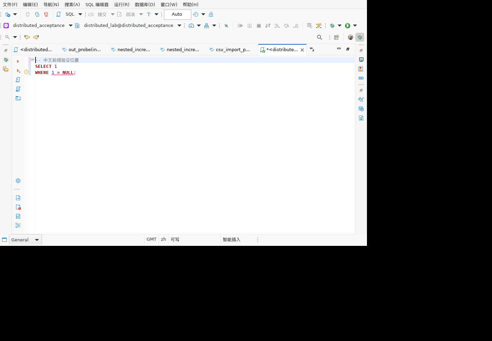

# NULL 直接比较静态告警

对应历史清单 5.2 `NullShouldNotBeComparedDirectly`。本次补齐语义诊断，不把 SQL 解析成功或服务端返回结果等同静态规则通过。

## 实现与使用

SQL 编辑器启用语义分析时，`SQLQueryModelRecognizer` 遍历已识别的语法树，对 `= / <> / != / < / > / <= / >=` 两侧的直接 NULL 字面量产生 WARNING。普通括号和注释不会遮蔽直接 NULL。提示建议使用 `IS NULL` 或 `IS NOT NULL`，提供英文和简体中文资源；不重写、不阻止执行 SQL，也不宣称每个数据库设置下都必然返回 UNKNOWN。

告警接入现有 `SQLBackgroundParsingJob` → `SQLDocumentScriptItemSyntaxContext` → `SQLEditorSemanticMarkersManager`，保留谓词源码区间。此处说明源码链路，实际 GUI 标记、悬停及语言切换仍需另验。实现位于共享 SQL 模型，因此不限于 GaussDB；只有语义解析器实际识别的结构参与诊断。

## 自动化场景

`SQLNullComparisonDiagnosticTest` 使用生产解析器和识别上下文，没有数据库连接或正则模拟 SQL 解析：

- 13 个正例：七种运算符、左右 NULL、括号、注释、小写 NULL、CASE、嵌套 EXISTS、UPDATE/DELETE；每例断言恰好一条目标告警、WARNING 级别及有效源码范围。
- 12 个反例：IS NULL/IS NOT NULL、字符串、注释、带引号 NULL 标识符、普通列比较、COALESCE/NULLIF 参数、标量子查询及 IN 列表；断言不产生本规则告警。

首次 `run-bZKDmQ` 失败：测试直接访问未导出的消息类，且标准解析器未完整识别无 FROM 的 WHERE 查询。改用消息中的共同 SQL 术语识别此规则，并以带 FROM 的合法标准语法验证实现。第二轮 `run-81brD2` 告警数断言通过，但13个源码范围断言因测试插件未声明 ANTLR 依赖报错；已补显式测试依赖。失败轮不算通过。

## 无 FROM 的 WHERE 补验与修复

标准语法的 `tableExpression` 原先必须以 FROM 开始，导致无 FROM 的 WHERE 未进入语义模型。现增加以 WHERE 开始的非空分支，保留原有 FROM 分支，不引入可匹配空文本的 tableExpression。

新增17项：12个无FROM正例覆盖七种比较符、括号/注释、嵌套EXISTS、ORDER BY/LIMIT及UNION；5个反例覆盖IS NULL、IS NOT NULL、字符串、COALESCE与嵌套正确空值判断。最终 `run-7ibMBk` 完整回归1710项、1687通过、23跳过、0失败/错误；新增项与原25项均通过，脱敏结果见 `sql-null-no-from-results-20260924.json`。这补上此前明确保留的无FROM WHERE边界，不代表所有无FROM子句组合已验。

集中式与分布式507分别通过gsql执行以下只读语句（未创建或修改数据库对象）：

```sql
SELECT 'null_is_unknown', (1 = NULL) IS NULL;
SELECT 'filtered_row' WHERE 1 = NULL;
SELECT 'is_not_null_row' WHERE 1 IS NOT NULL;
SELECT 'nested_row' WHERE EXISTS (SELECT 1 WHERE 1 IS NOT NULL);
```

两套环境均正常退出，结果依次为 `null_is_unknown|t`、零行、`is_not_null_row`、`nested_row`。这证明测试SQL在现有服务器有效及其结果，不替代客户端JDBC、GUI标记或其他金融版本验收。

## 明确保留的边界

### 麒麟 Linux GUI 补验

隔离麒麟V10 x86_64客户端安装 model.lsm 1.0.80、model.sql 1.0.175、model 2.0.45（均为202609240410构建），正常退出旧进程后启动，连接现有507分布式验收库。

1. 队列1201输入 `SELECT 1 WHERE 1 = NULL;`。首次1202尚未完成后台分析，1203实际编辑器annotation模型出现一条中文WARNING，offset=15、length=8，恰好指向 `1 = NULL`。
2. 1204改为 `SELECT 1 WHERE 1 IS NOT NULL;`，1205/1206诊断数变为0，没有遗留原告警。
3. 1207改为中文注释、SELECT和WHERE三行脚本，1208告警offset=27、length=8，仍准确覆盖 `1 = NULL`。截图实际第三行有告警图标和下划线。



测试专用 `diagnostics` 命令只读取已存在的编辑器标记，不调用解析器或构造标记，不进入产品包。`verify-null-diagnostic-gui.mjs` 对三份实际输出和原SQL验证通过，其5项正反例验证通过（单独计数，不加入1710项JUnit）。本轮编辑器仅改验收脚本文本，未执行这些SQL或改业务数据；服务端只读验证见上节。

这证明现有GaussDB连接下的编辑器告警文本、级别、位置及编辑后清除。鼠标悬停操作、英文界面、更多复杂语法和交付整包仍另验。

最终完整回归 `run-6LRM2D`：1693 项，1670 通过、23 跳过、0 失败/错误。上述25个新增执行全部通过。脱敏机器结果见 `sql-null-diagnostic-results-20260924.json`；仅记录实际完成的组件断言，不扩大为 GUI 通过。

- 无FROM的WHERE边界已按上节修复与补验；仅GROUP BY/HAVING/ORDER BY/LIMIT而不带WHERE的无FROM组合不在本轮结论内。
- CAST(NULL AS …)、复合表达式的空值传播、元数据可空性分析与 NOT IN 子查询规则未由此实现。
- 其他静态质量规则仍需逐条接入与验证；本项不代表全部251条历史静态测试迁移完成。
- GaussDB连接下上述GUI场景已有单独证据；客户金融版本、其他界面语言及完整交付包尚未以此证明。
