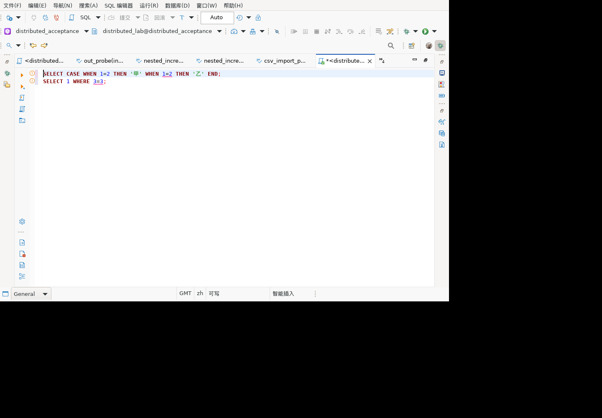

# 重复 CASE 分支与相同比较操作数检查

对应历史清单5.2的重复WHEN条件及二元表达式检查。本次二元表达式覆盖比较运算符，不代表所有算术、逻辑二元运算均完成。

## 实现

- 在每个simpleCase/searchedCase内单独记录直接WHEN条件的语法文本；后续重复条件产生WARNING，定位在重复条件而非整个CASE。嵌套CASE独立检查，不与父CASE或其他投影中的CASE混合。
- 比较运算 `= <> != < > <= >=` 左右操作数语法文本完全相同时提示WARNING，范围为比较谓词。
- 比较token序列，忽略注释或token间空白，但保留词法边界、字符串及带引号标识符的内容和大小写。当前不进行代数化简、括号归一或不带引号标识符大小写归一。
- 中英文提示只建议核对意图，不断言比较恒真/恒假，也不称含函数的重复WHEN必然不可达。不同次求值及NULL语义可能改变结果；不改写或阻止SQL执行。

## 场景与证据

新增31个解析/诊断执行：CASE正反例各6个，含简单/搜索CASE、中文、空白/注释、函数、内嵌CASE和不同CASE隔离；比较正例11个及反例8个，含七种运算符、复合表达式、函数、中文、不同限定名/带引号大小写、字符串和注释。检查目标告警数量、WARNING及有效源码区间。

集中式和分布式507只读执行：

```sql
SELECT CASE WHEN 1=1 THEN 'first' WHEN 1=1 THEN 'second' END,
       (NULL::integer = NULL::integer) IS NULL,
       1=1, 1<>1;
```

两者均返回 `first|t|t|f`。该结果用于核对告警文案的语义边界，不证明所有表达式等价判断，也不替代DBeaver界面验收。

## 未完成边界

### 词法边界误报修复

修复后完整回归 `run-onr3O1`：1802项、1779通过、23跳过、0失败/错误；三个误报反例与既有正反例通过，脱敏结果见 `sql-expression-token-results-20260924.json`。GUI副本尚未更新本轮规则，不宣称界面验证已完成。

`run-s8CdIs` 新增三个反例，均复现原实现误报：`a AND b`与`aANDb`、`a IS NULL`与`aISNULL`、`NOT a`与`NOTa`。原先比较 `getText()`，隐藏空白被去掉后不同token边界丢失。现改成有序token列表，同步用于CASE条件和比较操作数；遍历采用显式栈，不增加递归调用。既有空白/注释不同但真实相同的表达式测试继续保留。

集中式、分布式507执行以下只读查询均返回 `2|2|2`，证明这些第二分支可以执行，不是语义重复：

```sql
SELECT CASE WHEN a AND b THEN 1 WHEN aANDb THEN 2 END,
       CASE WHEN a IS NULL THEN 1 WHEN aISNULL THEN 2 END,
       CASE WHEN NOT a THEN 1 WHEN NOTa THEN 2 END
FROM (SELECT true AS a, false AS b,
             true AS aANDb, true AS aISNULL, true AS NOTa) t;
```

最终完整回归 `run-KaRkN3`：1799项、1776通过、23跳过、0失败/错误；新增31项全部通过。脱敏结果为 `sql-repeated-expression-results-20260924.json`。本轮未将新插件安装到GUI副本。

### 麒麟 Linux GUI 补验

正常退出隔离麒麟V10 x86_64客户端，更新model.sql至1.0.175.202609240450后重启。1237输入两个语句：重复 `WHEN 1=2` 的CASE及 `SELECT 1 WHERE 3=3`。1239实际编辑器annotation模型显示两条中文WARNING：offset35/length3指向第二个 `1=2`，offset68/length3指向 `3=3`。截图显示两处定位，而不是高亮第一个WHEN。



1240改第二WHEN为 `1=3`、比较为 `3=4`，1241/1242均无告警。1243输入上节三个词法边界反例组成的完整SELECT，1244/1245仍为0。`verify-repeated-expression-gui.mjs` 对三份真实输出与源SQL验证通过，验证器6项正反例通过（不加入JUnit）。本轮只编辑文本，没有执行SQL或修改数据；服务端结果见上节独立只读验证。

上述中文GUI多告警共存、分支定位、修正后清除及词法边界反例已补验。英文界面、鼠标悬停、算术/逻辑二元表达式、规范化等价识别及更多方言仍需补测。历史静态检查组仍不是全部完成。
