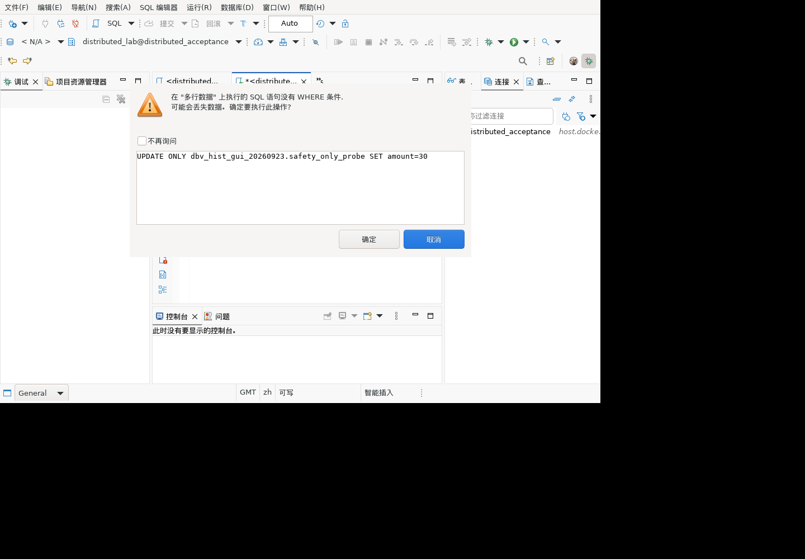

# SQL 静态检查迁移：执行安全检查

## 弹窗修复与复验（518–529）

已修正confirmAction调用：单独传入截断长度受控的实际SQL预览，再传类型和目标名。完整解析失败时类型提示为通用`SQL`，不冒称取得完整语法树；目标未知时中文显示“多行数据”。正常解析仍显示UPDATE和实际表名。

构建及完整回归run-ArZXkO通过：1063总数、1039通过、24跳过、0失败/错误，无新增JUnit计数。隔离Linux安装SQL编辑器1.0.185.202609231537，SHA256主机/容器一致：`e9cd04bcc4a488b8984bcb74bfe330929f95d7264a2c7be37242f6f0100936ae`。模型仍1529。

真实普通用户界面验证：UPDATE ONLY和DELETE FROM ONLY都显示实际SQL原文及完整中文警告，不再出现UNKNOWN或missing argument；普通UPDATE显示“在safety_only_probe上执行的UPDATE语句没有WHERE条件”及SQL原文。三次均取消，独立查询最终数据仍(1,10)/(2,20)。专用表及临时回归角色已删除，编辑器恢复SELECT 1。没有勾选不再询问。此前确认执行路径的证据保留，本轮只复验修复影响的提示与取消。



结果明细见`test-results-20260923-sql-warning-ui.json`。该缺陷已修复，不代表偏好设置关闭警告、多语句全部确认、其余静态规则全部完成。

## Linux GUI确认与取消（504–517）

隔离客户端正常退出后安装模型插件2.0.45.202609231529；主机/容器SHA256一致：`83926ef550cc7c6d11fe56aafc5aba05a48df829758135576018212f60bda937`。保留原包和配置备份，原工作区-clean重启。当前SQL编辑器仍为1.0.185.202609231515。

管理员仅创建专用测试表safety_only_probe及两行(1,10)/(2,20)，对普通测试账号授予SELECT/UPDATE/DELETE；实际操作由客户端该普通账号完成。每次结果均由独立gsql连接查询核实。

| 操作 | UI及数据结果 | 状态 |
|---|---|---|
| UPDATE ONLY无WHERE→取消 | 出现危险查询弹窗；取消后仍(1,10)/(2,20) | 拦截/取消通过 |
| 同一UPDATE→确定 | 再次弹窗；确认后两行amount均30 | 确认执行通过 |
| DELETE FROM ONLY无WHERE→取消 | 出现弹窗；取消后仍有两行且amount均30 | 拦截/取消通过 |
| 同一DELETE→确定 | 再次弹窗；确认后独立计数0 | 确认执行通过 |

没有勾选“不再询问”。最后替换测试编辑器文本为SELECT 1，删除本轮专用表；系统目录计数0，专属对象授权随表删除。未改其他对象/数据。没有新增JUnit计数。

### 修复前发现的提示缺陷（已由518–529复验）

弹窗实际显示`UNKNOWN`以及`在 "<missing argument>" 上执行的 multiple rows 语句...`。拦截正确不代表提示正确。

源码`SQLEditor.createDangerousUpdateDeleteQueryConfirmationDialog`传入两个String时，重载解析把第一个当codeBlockText，剩余格式化参数不足，导致参数错位。此外ONLY语句完整解析失败，getType仍UNKNOWN。需修正SQL预览与提示参数，并为该回退提供准确或明确的类型提示；完成后重新GUI验证。当前不得宣称危险操作提示已全部验收通过。

## 修复后结果

当前生产代码在完整解析失败时，使用同一解析器的词法token进行外层UPDATE/DELETE、WHERE识别。括号内子查询、注释和引用字符串不能代替外层WHERE；支持WITH外层DML。该回退不改写执行文本，也不证明SQL语法合法。词法错误或超时仍不能确定语句类型，不宣称这是完整的安全审计机制。

新增9个ONLY组合边界及9个回退/原文不变测试后，本类51项全通过。最终run-rAR5u0：1063总数、1039通过、24跳过、0失败/错误，见`test-results-20260923-sql-safety-green.json`。保留下面红灯证据，不能把修复前的失败记录删除成全程成功。

### GaussDB 507真实语法验证

使用独立gsql本地管理员会话，集中式和分布式各执行同一临时表脚本：BEGIN→建临时表→插入2行→UPDATE ONLY无WHERE，返回UPDATE 2且目标值计数2→DELETE FROM ONLY无WHERE，返回DELETE 2且剩余0→ROLLBACK。会话结束后两实例目录中该测试表均为0。证明漏报涉及实际可执行的全表修改语法，不是无效SQL。脚本在测试仓`fixtures/sql-safety-only.sql`。

第一次分布式准备使用ON COMMIT DROP被服务端拒绝，未执行DML；最终脚本移除该非必要选项，依靠显式回滚及会话临时表清理，两环境重新通过。此验证不是普通用户权限测试，也不是JDBC/UI确认链路；相关GUI验收仍待补。临时回归grantee角色已删除。

对应历史清单5.1。测试调用SQL编辑器实际使用的`SQLQuery.isDeleteUpdateDangerous()`和`isDropDangerous()`，不是在测试代码中另写一个检查器。

新增`GaussDBSQLSafetyTest`共33个参数化场景：12个缺失外层WHERE、12个存在外层WHERE或不属于该规则的语句、6个DROP、3个注释/字符串中出现DROP。

## 修复前结果：发现缺陷

run-y1bSnO中31个新增场景通过，2个失败：

```sql
UPDATE ONLY public.t SET amount=1;
DELETE FROM ONLY public.t;
```

两条语句都没有限制行范围，却得到`isDeleteUpdateDangerous()==false`。修复前`SQLQuery`解析失败时statement为null，危险检查直接返回false。保留原预期true，通过上述生产修复恢复检查，没有跳过或降低断言。

本轮完整结果以`test-results-20260923-sql-safety-red.json`为准；上一轮1012项无失败不代表本轮新增检查通过。这里只解析SQL，没有执行上述UPDATE/DELETE/DROP，真实数据库回归仍使用隔离测试对象，临时授权角色已清理。

## 已证明的范围与未证明的范围

- 外层WHERE和子查询WHERE不同；仅子查询含WHERE仍应触发确认。本次场景通过。
- 注释或字符串中的WHERE不能代替实际WHERE。本次场景通过。
- `WHERE 1=1`当前不会触发此规则：这是“是否有WHERE”检查，不是“是否安全”证明，不能宣传为全表操作检测完整覆盖。
- DROP识别与UPDATE/DELETE确认是不同规则，测试分别断言。
- GUI确认弹窗、用户取消后是否不执行、偏好设置开关尚需界面验证。
- 清单5.2的INSERT显式列名、ORDER BY列名、LIKE前导通配符、NULL直接比较、重复表达式、SELECT星号、EXISTS的WHERE、重复CASE条件、NOT IN可空子查询仍需逐项核对并补覆盖。不能把语法解析成功或本报告的执行确认当成这些规则已实现；也不能直接将它们标为不适用。
