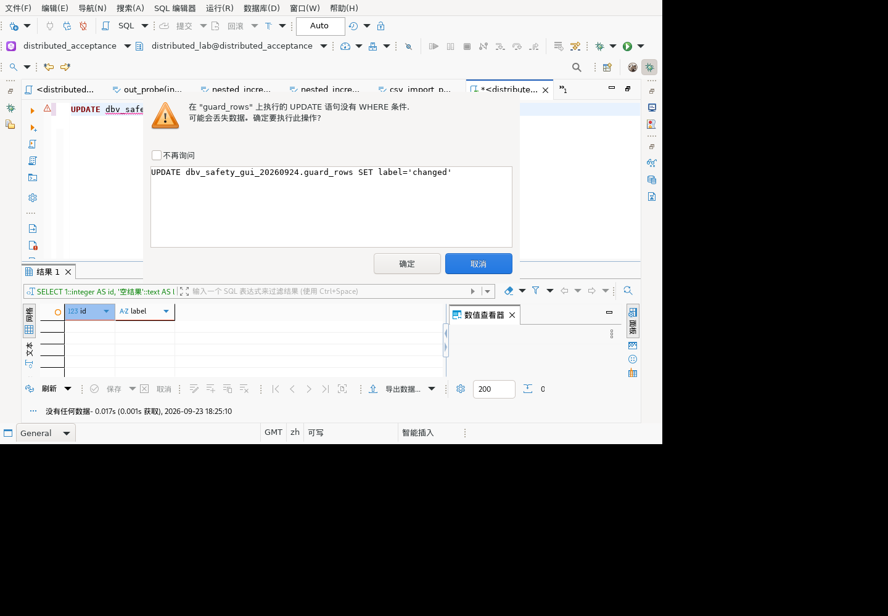
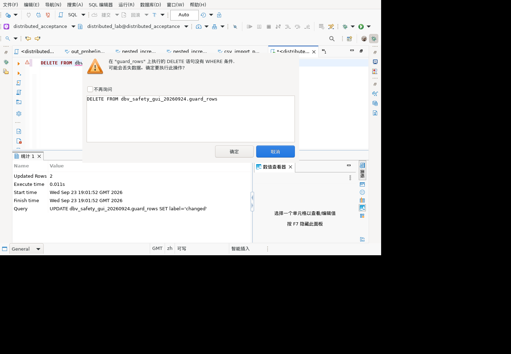
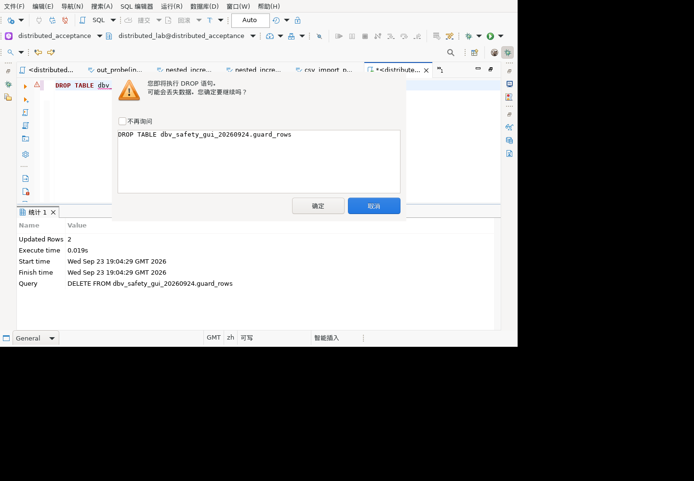
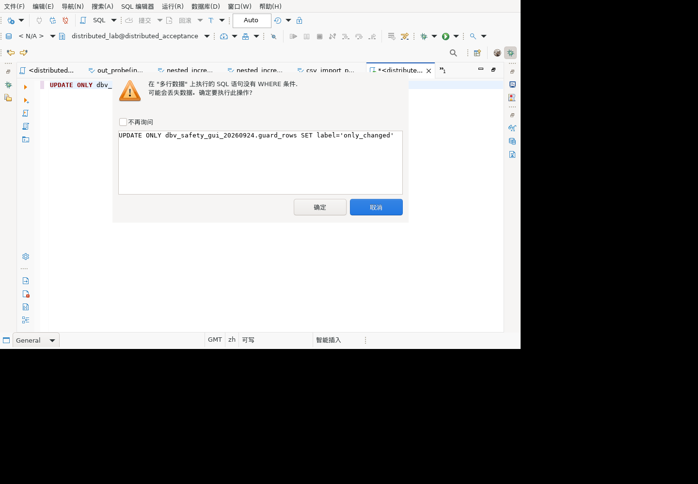

# SQL 执行安全确认：麒麟 GUI 验证

## 环境与范围

麒麟 V10 x86_64 隔离客户端，GaussDB 507 分布式 ORA 库 distributed_acceptance，客户端使用普通账号 distributed_lab。通过 SWTBot 操作实际菜单/按钮，另用独立 gsql 连接核对数据；没有直接调用确认框内部方法。

本次已加载 model 2.0.45.202609231613、model.sql 1.0.175.202609220932、SQL 编辑器 1.0.185.202609231537。因此不能用本次结果证明后续源码修复（包括 ONLY 回退及最近过滤/凭据改动）已经在 GUI 验证。

## 操作及结果

1. 创建独立 schema `dbv_safety_gui_20260924` 和表 guard_rows，id 为 1/2，label 均为 original，表归普通测试账号所有。首次 SET ROLE 被服务端拒绝，未继续执行建表；改由测试管理员创建表并明确变更 owner，未更改普通账号权限或密码。
2. 在真实 SQL 编辑器输入 `UPDATE dbv_safety_gui_20260924.guard_rows SET label='changed';`，点击“执行 SQL 语句”。出现中文“执行危险查询”对话框，说明没有 WHERE，SQL 预览只读，确定和取消可用（命令 629–631）。
3. 点击取消（632）。独立连接查询 count=2、original_rows=2，证明没有更新数据。
4. 再次从执行菜单发起相同语句（633–635），仍出现确认框；没有勾选“不再询问”。点击确定（636）。独立连接 count=2、changed_rows=2，证明确认后实际执行并提交。
5. 结束后编辑器改为只读 SELECT 文本，删除本次唯一测试表和 schema（没有 CASCADE），目录查询 remaining_schemas=0。删除的是可重建测试数据，不涉及用户对象。

## 历史静态检查清单的区别

源码 `SQLQuery.isDeleteUpdateDangerous` 及 `SQLEditor` 执行确认提供的是 UPDATE/DELETE 外层 WHERE 存在性检查；`isDropDangerous` 是另一条 DROP 确认。`SQLRuleManager`、`LspSQLRuleManager` 的词法规则不等于 TPDSS 静态质量规则。

本轮没有找到以下规则在已检查 SQL 模型/编辑器路径中的独立质量诊断实现，仍记录为能力待确认/覆盖缺口，不算测试通过，也不擅自称为不适用：INSERT 显式列清单、ORDER BY 不用序号、LIKE 禁止前导通配符、NULL 禁止直接比较、二元两侧相同、SELECT 禁止星号、EXISTS 子查询要求 WHERE、CASE 重复 WHEN、NOT IN 子查询非 NULL。解析成功、生成 SQL 含列名、执行结果正确都不能替代对应告警验收。

多个危险语句、手动事务模式下取消后的事务状态、ONLY 新修复以及持久化“不再询问”选项仍待 GUI 补验。JUnit 数量不因本次手动 GUI 场景增加。

## DELETE 与 DROP 补验（命令 639–656）

同一隔离客户端和 bundle 版本，重新创建上述专用 schema/table，2 行 original，普通测试账号为表 owner，自动提交模式。

| 操作 | 界面证据 | 独立 gsql 结果 |
| --- | --- | --- |
| DELETE 无 WHERE 后取消 | 中文危险查询提示明确 DELETE 没有 WHERE，SQL 预览只读，取消可用 | rows_after_cancel=2 |
| 再次 DELETE 后确定 | 再次提示，点击确定；不勾选“不再询问” | rows_after_confirm=0 |
| DROP TABLE 后取消 | 单独“执行 DROP 查询”中文提示及只读 SQL 预览 | pg_class/pg_namespace 精确查表 tables_after_cancel=1 |
| 再次 DROP 后确定 | 同一 DROP 确认再次出现，点击确定 | tables_after_confirm=0 |

完成后仅删除已空的专用 schema（未使用 CASCADE），remaining_schemas=0。可重建测试表已通过实际客户端 DROP 删除；无用户数据被删除。编辑器恢复 SELECT 文本，确认偏好未改动。本轮未改变源码，不增加 JUnit 数量，不代表最新 model.sql 的 ONLY 修复已完成 GUI 验收。

## 更新 SQL 模型后的 ONLY 补验（657–671）

正常通过“退出”菜单关闭客户端并确认进程消失后，保留 bundles.info.before-sql1858 备份，仅将 model.sql 更新为 `1.0.175.202609231858`，再以原隔离 workspace 重启。新插件 SHA-256 为 `a4319ab1ea01a9452b67941fbe556081d15f7c9d7394512c589f87db2ed4b5cd`，宿主构建产物与容器文件一致。其他插件版本未同步，不把此次运行当作全部最新变更验收。

重新创建同名独立 schema/table 两行 original，依次在真实编辑器执行：

- `UPDATE ONLY dbv_safety_gui_20260924.guard_rows SET label='only_changed';`：出现危险查询确认，SQL 预览正确且只读；取消后独立连接 count=2、original_rows=2。
- `DELETE FROM ONLY dbv_safety_gui_20260924.guard_rows;`：同样确认，取消后独立连接 rows_after_delete_only_cancel=2。

这两个回退路径的提示为“多行数据／SQL”，没有显示准确表名及 UPDATE/DELETE 类型，记录为展示限制；不妨碍无 WHERE 确认。未点击 ONLY 的确定执行，本轮仅证明新模型的提示与取消保护，不代替 JDBC 执行或完整 UI 正向验证。测试结束精确删除专用表/schema且目录计数0，编辑器恢复 SELECT，不再询问未勾选。
