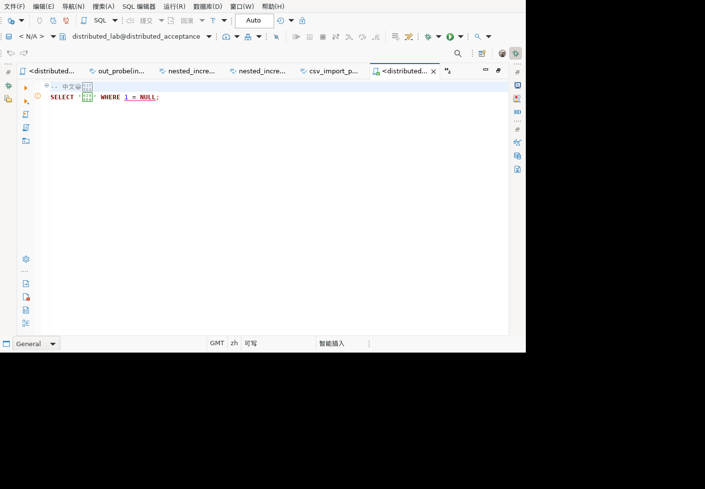

# SQL Unicode 源码定位修复

覆盖历史清单的 SQL 解析、字符编码及编辑器错误定位边界。

## 问题及修复

新增 6 项真实语义识别器测试，检查中文、单个/多个补充平面字符、块注释、CRLF 行注释、组合字符之后的 NULL 比较告警。断言起点等于 Java 原文 `indexOf`，并从原文截取范围，严格等于 `1 = NULL`。

首次回归 `run-Z87Dnj`：新增场景中 5 项失败。每个表情字符让定位偏移少算 1，例如期望 18 实际 17、期望 20 实际 18。

原因：`CharStreams` 按 Unicode 码点计数，Java String/Eclipse 文档按 UTF-16 单元计数。共享 STMSource 的字符串和 Reader 入口统一使用 UTF-16 `ANTLRInputStream`，使 token 和语法树范围与文档坐标一致。不修改原文，也不逐条给告警加偏移补丁。

此 API 在 ANTLR 中已废弃但当前依赖仍提供；代码明确说明选择它是为了保留 UTF-16 坐标契约。后续升级 ANTLR 必须保留该契约，或在所有源码范围消费者统一转换，不能仅替换回码点流。

## 回归结果

修复后 `run-b54PWn`：1,845 项执行，1,822 通过、23 跳过、0 失败、0 错误。上述 6 项全部通过。见 [脱敏结果](unicode-range-results-20260924.json)。

集中式及分布式 GaussDB 507 均以 gsql 执行只读对照：

```sql
SELECT '😀🧪' AS text_value,
       length('😀🧪') AS character_count,
       (1 = NULL) IS NULL AS unknown_result;
```

均得到 `😀🧪|2|t`。这验证服务端字符串与 SQL 语义，不代替客户端源码定位测试。

## 补充回归及 GUI 修复前后对照

新增 `SQLUnicodeSourceTest` 12 项：字符串及 Reader 各 6 项，覆盖空串、ASCII、中文、多个补充平面字符、CRLF/组合字符和引号标识符。逐 UTF-16 单元断言 size、index、LA、consume、lookbehind、getText、EOF 及 seek。另补 4 项实际语义诊断，包含表情标识符、转义单引号和扩展汉字。

完整回归 `run-Mb1T5q`：1,861 项执行、1,838 通过、23 跳过、0 失败错误，见 [补充结果](unicode-source-results-20260924.json)。

麒麟 V10 x86_64 验收副本使用同一份 SQL：

```sql
-- 中文😀🧪
SELECT '𠀀' WHERE 1 = NULL;
```

- 修复前 LSM 0431，队列 1266：offset=25、length=8，实际原文范围为 `RE 1 = N`，确认位置错误。
- 更新 LSM 为 `1.0.80.202609240527` 并重启，1271：offset=28、length=8，准确为 `1 = NULL`。
- 修改为 `1 IS NULL`，1273：语义标记为 0，旧标记清除。

实际三状态由 `verify-unicode-diagnostic-gui.mjs` 验证：旧范围应拒绝、新范围应通过、修正后应清空。验证器自身 6 项正反例通过，不加入 JUnit 数量。本轮 GUI 只编辑文本，未执行 SQL。



截图中部分补充平面字符显示为缺字方框，编辑器原文快照仍保留原字符，位置断言也使用原字符。该截图证明标记范围修复，不证明系统字体已完整覆盖所有字符。

## 尚待验证

- 跨 token 导航、其他语义规则的范围矩阵、无引号补充平面标识符仍需继续补充。
- 字体缺字及实际客户字体配置不能按源码定位结果宣称已解决。
- 该修复影响共享解析器，不能只凭 GaussDB 真库结果宣称全部方言通过。
