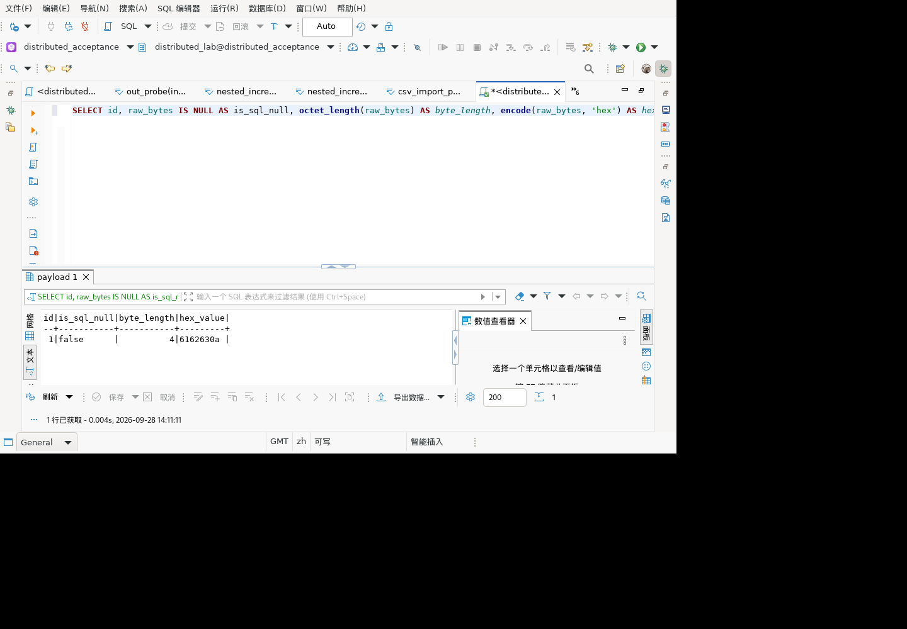
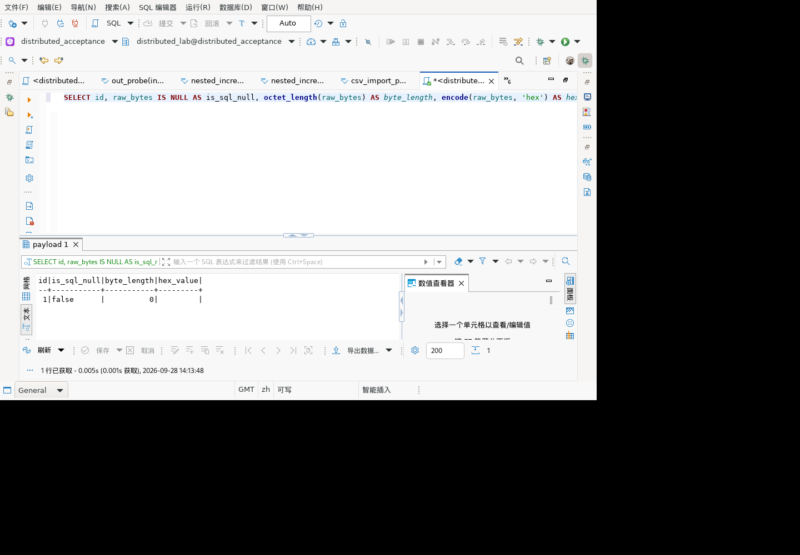
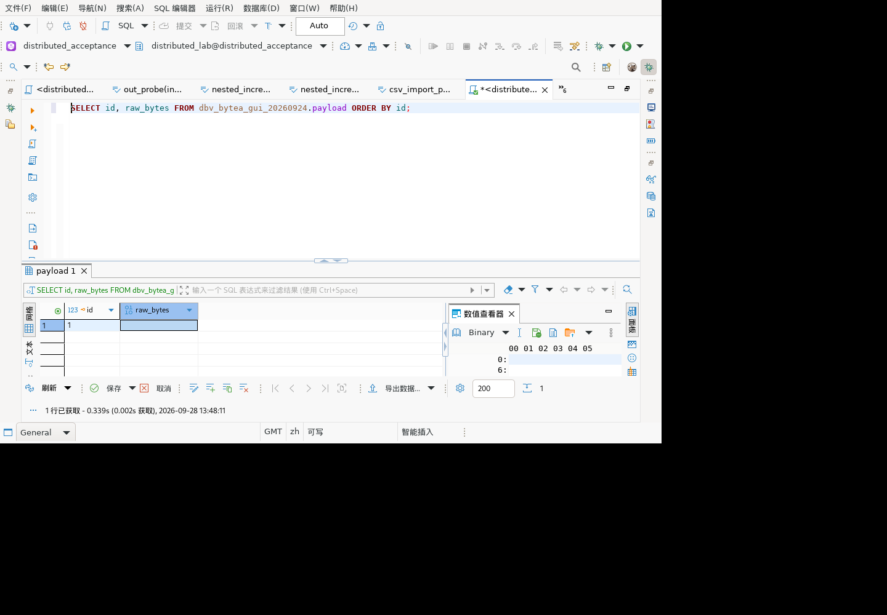

# 文本值文件导入：生命周期、编码与失败重试

日期：2026-09-28。关联历史清单9.1导入、9.8值编辑、11.1字符类型。本记录分别列出组件及限定环境下的界面/数据库验收，不代表完整产品验收。

## 导入后变为只读：保存拒绝与后续处置

新增4项组件测试，分别为文本/二进制 × 放弃修改/恢复可写后重试。通过实际输入层导入文件，再使值控制器返回只读，调用实际 `updateContentFromFile` 必须抛出DBException；文本控制器没有更新调用，真实JDBCContentBytes没有内容更新且原字节保持，二进制待发布标志仍为true。

随后分两条路径验证：直接release仍不发布，或恢复可写后保存一次完整替换、二进制待发布标志清除。两条路径均检查源文件及原始外部文件不被删除/改写。测试覆盖保存时重新检查只读状态，而不是仅验证导入时状态或UI按钮外观。

显式编译当前生产类后，导入联合专项40/40、0失败/跳过、退出0（`/tmp/hex-readonly-20260928.log`），包含此前36项；无生产修改。本轮采用模拟控制器状态，不能代表真实数据库GRANT/REVOKE、只读连接配置界面、最终产品打包或真正的并发撤权测试。新增4项仍属于独立UI组件夹具，未宣称已纳入正式Tycho UI模块。

## 读取中断、旧值保护与重试

正式 `JDBCContentBytesReadTest` 新增3项：构造257字节输入流，分别在读取0、1、128字节后抛出同一个IOException。调用实际生产 `updateContents`，断言错误cause身份、实际已读字节数、流已关闭、原值完整保留；同一对象换用合法输入重试后逐字节一致，`resetContents` 又恢复原始值。测试不是简单让mock直接抛错，而是让标准 `readNBytes` 经过分段读取后遇到错误。

本轮无生产修改。共享专项714/714、导入专项36/36均无失败或跳过；真实OSGi平台14类282/282、逐类门控通过，其中读取类9/9。日志分别为 `/tmp/shared-bytes-readfailure-20260928.log`、`/tmp/hex-bytes-readfailure-20260928.log`、`/tmp/platform-bytes-readfailure-20260928.log`，OSGi报告位于 `/tmp/gauss-existing-osgi-3IcLyO/reports/`。这些批次包含同一组测试，不相加。

范围：确定性组件故障注入，不证明真实磁盘损坏、网络中断、GUI错误提示或最终安装包。辅助只读审核在初始化日志写入时被运行环境拒绝并退出1，本轮没有独立审核报告，不计审核通过。

## 正式测试接入：JDBC完整读取回归

将独立导入夹具中6项无UI依赖的读取场景迁入正式模块 `org.jkiss.dbeaver.test.platform` 的 `JDBCContentBytesReadTest`，原夹具删除相同方法，两个专项运行器共同引用正式源码，不复制第二套测试：分段1/7/64字节读取3项、提前EOF保留原值并重试1项、负长度及超过int上限拒绝2项。保持模型/UI分层，没有为这些场景增加SWT依赖。

验证结果：

- 共享运行器显式编译当前生产类和测试：711/711、0跳过，退出0；`/tmp/shared-bytes-formal-20260928.log`。
- 同批产物按所属bundle隔离并在真实Equinox环境执行平台14类：279/279、0失败/错误/跳过，逐类报告检查通过；`/tmp/platform-bytes-formal-20260928.log`，报告 `/tmp/gauss-existing-osgi-TKZ69n/verified-results.json`。
- 导入专项改引用正式类后仍33/33、0跳过；`/tmp/hex-bytes-formal-20260928.log`。以上批次重叠，不能相加，也不新增6项覆盖计数。
- 正式回归结果校验器新增该类为必需项，缺失/跳过/失败不能通过；校验器7项正反例全部通过。

平台模块的 `src/` 和现有 `*Test.java` 规则包含新类；本轮实际OSGi执行已验证，不仅检查配置。但仍复用既有解析依赖，不能称为最新完整Maven/Tycho构建。其余27项涉及编辑器/文件选择器的专项测试尚未全部进入正式UI测试模块，继续保留该缺口。

## 二进制显式保存与空文件覆盖通过

沿用下一节已核对的独立 Linux GUI 插件副本，普通账号、同一专用表 `dbv_bytea_gui_20260924.payload`。没有重新打完整产品包，也没有改变数据库模式或权限。

| 场景 | 实际操作与证据 | 结果 |
| --- | --- | --- |
| 空值导入非空文件并保存 | 201–205重新查询并打开值编辑器；206选择4字节文件，208显示 `61 62 63 0A`；209保存LOB后210结果集保存启用；211保存结果集后212保存禁用；213重新查询，215返回 `false / 4 / 6162630a` | 通过；对实际结果快照与源文件十六进制自动断言一致 |
| 非空值导入零字节文件并保存 | 216–220重新打开刚保存的4字节值；221选择实测大小0的文件，223编辑器内容清空；224保存LOB、225结果集待保存；226保存结果集、227保存禁用；228重新查询，230返回 `false / 0 / 空` | 通过；自动断言非NULL零字节，恢复本轮测试前基线 |

上述“false”是 `raw_bytes IS NULL` 的结果。两次读回均实际重新执行 SQL，但仍通过原编辑器连接，不声称重启、重连或独立物理连接验证。新增 GUI 证据不增加 JUnit 数，专项仍为33项；读取失败、其他内容实现、大文件和完整产品回归另验。





## 二进制导入后放弃修改通过

独立 Linux GUI 副本更新工具栏动作及其全部内部类后重启，data 插件 SHA-256 为 `1d5d574ddc2e4cabb24e7ada8a91e8ff64ea016d3b20815204ab9ba5aa5f18e3`；model.jdbc 保持下文的 `20df7446…9672582`。部署前组件复跑 33/33、0 跳过（`/tmp/binary-toolbar-deploy-20260928.log`）。这是历史产品副本上的指定插件补丁，不是最新完整安装包。

操作与结果：

1. 185–189 查询既有专用测试表，选择 `id=1` 的空二进制值，打开 Binary 编辑器；结果集保存按钮禁用。
2. 190 通过工具栏 Load from File 打开真实文件选择器，选取 4 字节文件 `abc\n`。192 稳定快照及屏幕显示 `61 62 63 0A`，编辑器有未保存标记，后台结果集保存仍禁用。
3. 193–195 关闭编辑器，在保存提示中选择“不要保存”。196 稳定快照显示结果集保存禁用、原值显示为空，不需要额外点击结果集“取消”。此前 172 的错误脏状态不再出现。
4. 197 重新执行只读查询，200 稳定结果为 `id=1 / is_sql_null=false / byte_length=0 / hex_value=空`。程序对实际快照断言保存禁用及数据库非 NULL、零字节，全部通过。此查询经原 SQL 编辑器连接执行，不声称另建物理连接。


本项只闭环该环境下的导入后放弃；显式保存与空文件覆盖的后续结果见顶部。其他内容实现、编码及完整产品回归仍需分别验收。下文保留此前失败与定位过程，不应作为最新修复仍失败的结论。

## 定位与修复：工具栏动作再次发布结果集

先做GUI对照：173放弃上一轮结果集待保存修改，174保存按钮禁用；175–178仅打开二进制编辑器、直接关闭、不导入，结果集保存仍禁用，没有保存提示。由此不能把问题笼统归为所有关闭编辑器都会改值。

源码确认ContentEditorContributor.FileImportAction在loadFromExternalFile返回后另行调用valueController.updateValue(editor.getValue(), true)，绕过输入层延迟发布。字符串原值相等时未显现，DBDContent仍会触发结果集修改状态。删除工具栏中的这次发布，仅保留setDirty(true)及编辑器内容刷新；结果集发布仍由显式保存负责。

新增工具栏真实run方法测试（反射取得私有动作，模拟文件选择和进度窗口，不创建真实SWT窗口）：选中文件时调用导入、标记编辑器、刷新，但不调用结果集更新；取消选择时三者均不发生。初期缺少Mockito静态模拟及DialogUtils平台初始化的两轮夹具失败不计产品缺陷；补齐后选中文件红测明确失败于多余updateValue，取消通过。修复后联合33/33、0跳过，日志 `/tmp/binary-toolbar-green-20260928.log`；使用仅限此运行器的inline mock配置，运行器显式编译当前Contributor。

该阶段尚未部署工具栏新补丁；后续部署与放弃路径复验结果见顶部“最新验收”。原待保存状态已通过173放弃，未执行数据库保存；不宣称所有关闭/回滚路径均通过。

## Linux二进制复验：关闭后结果集仍出现待保存状态

确认独立副本Java 21652退出后安装当前组件产物，data插件SHA-256为 `5e0cc088b40121ebb17be9c754b8eb195f282124d6458228e6b9e364173d7c8b`，model.jdbc为 `20df74463d36e403cebbbfb5008b8bf02263835b27aa671e76810b91c9672582`，本机/容器一致；重启同一独立workspace，原验收目录未覆盖。

160读取原bytea测试表，163结果集保存禁用。164打开二进制编辑器（165后台结果集保存仍禁用），166通过文件选择器导入4字节abc换行，稳定168实际十六进制为61 62 63 0A，后台结果集保存仍禁用，编辑器有未保存标记。169关闭、170保存提示、171明确选“不要保存”；172编辑器关闭后结果集保存按钮反而启用，截图中内容仍显示空白。**该GUI场景未通过：不能仅凭空白断言原字节及NULL状态正确，也不能认为导入延迟发布已完全解决界面状态。** 没有点击结果集保存，保留现场待排查关闭/面板刷新链路。



共享回归运行器新增显式编译当前JDBCContentBytes，同批原705项全部通过、0跳过，进程退出0，日志 `/tmp/shared-binary-regression-20260928.log`。与31项组件范围重叠，不累加，不替代上述GUI失败或完整构建。

## 组件验证：真实二进制值与分段读取修复

将三种长度的显式保存/失败重试测试升级为真实JDBCContentBytes（仅第一次保存注入拒绝），运行器显式编译当前生产类。验证导入前后及保存拒绝后原字节不变，重试成功后字节完整、零长度不是NULL，编辑器release后值仍完整，resetContents恢复原值。联合25项仍通过，不另计新增用例。

进一步新增257字节输入每次只返回1/7/64字节的三个场景，以及声明3字节实际只有1字节的提前EOF场景，四项均在原代码失败：单次read没有读满，剩余内容被零填充并接受；提前EOF也只警告并替换原值。JDBCContentBytes.updateContents改为readNBytes读取完整声明长度，提前EOF抛DBCException并保留原值，修正输入后同实例重试成功。负长度及超过Integer.MAX_VALUE另两项验证明确失败、关闭流、不发起读取、不替换原值，不分配巨型数组。

联合31/31通过、0跳过，日志 `/tmp/binary-short-read-green-20260928.log`。此为生产值对象加受控分段流验证，不是网络故障或2GB实际数据测试。新model.jdbc修复和之前二进制导入补丁尚未部署GUI/真库；此前字符串GUI证据不得推广为本轮通过。

## 组件修复：二进制导入也延迟发布

对DBDContent分支补0/4/65537字节三个取消隔离测试，真实临时文件、模拟值对象。首次测试因未初始化workbench夹具出现OSGi空指针，不计产品缺陷；补齐夹具后三个测试均明确失败于导入时调用updateContents。此前“不要保存”GUI通过仅适用于字符串，不能覆盖此问题。

ContentEditorInput新增待导入状态：导入验证文件后只替换编辑器文件路径，不调用DBDContent.updateContents；显式保存时发布所选ExternalContentStorage及编辑器编码，成功才清除待导入状态。不得复用原值的本地storage，否则会保存旧内容。缺失/目录导入、同文件和符号链接保护保留。

新增三种长度的显式保存失败/重试用例：第一次updateContents抛原DBException，路径和待保存数据保留；同实例重试取得全部原始字节，不读取旧getContents，release后外部文件和原值文件仍存在。将旧“导入时拒绝更新”场景移至显式保存阶段，避免继续要求错误的提前发布行为。联合25/25、0跳过通过（包含原组件项，不能与20累加），日志 `/tmp/binary-discard-green-20260928.log`。

本次未部署二进制补丁、未完成其GUI/真库回归，不证明任意DBDContent实现部分失败回滚、外部文件并发替换或直接编辑共享本地文件的取消隔离。此前字符串GUI证据对应dd590cff补丁，不能当成本次二进制改动验收。

## GUI复验：字符串延迟发布补丁的显式保存通过

沿用SHA-256 `dd590cff5f3ac7d45a6a37f096701a321441fbaf7ed108ae801a3afd667da8fe` 的独立Linux副本，139重新查询NULL基线，141–144从结果集打开可写文本编辑器。145–147选择UTF-8文件，稳定147显示中文、引号、反斜杠与换行。148执行编辑器保存后关闭编辑页，149结果集保存按钮启用；150执行结果集保存，151保存按钮禁用。

152重新执行服务端值查询，154切换文本结果，is_sql_null=false、utf8_hex=`e4b8ade69687e5afbce585a52771756f74655c656e640a`。复制实际154快照到本机，自动断言非NULL且返回十六进制与源文件实际字节一致，通过。截图和组件测试分别作为证据，不增加JUnit计数，也不宣称独立物理连接或完整新产品构建通过。


最新字符串补丁的“不要保存”与UTF-8显式保存均有GUI证据。UTF-16LE/GB18030界面编码选择、空文本在此最新补丁上的复跑、读取异常GUI、DBDContent放弃修改和完整产品回归仍待；不沿用旧补丁结果替代新补丁专项结论。专用表当前保存此中文文本，保留供后续测试。

## GUI复验：字符串导入后不保存保持原值

停止独立副本Java 20910并确认退出，替换data插件为本轮20项组件编译得到的ContentEditorInput，SHA-256 `dd590cff5f3ac7d45a6a37f096701a321441fbaf7ed108ae801a3afd667da8fe`，本机和容器校验一致。重启Java 21652，未替换原始验收目录。初始元数据未完整加载导致编辑按钮禁用，刷新连接、重新查询后恢复可写，未调整数据库权限。

118–128确认NULL基线、打开文本编辑器；129–131导入同一UTF-8文件，稳定快照456 StyledText显示中文/引号/反斜杠/换行及未保存标记。132关闭，133出现保存提示，134选“不要保存”。135原结果集仍显示NULL，保存变更按钮禁用，没有额外点击结果集放弃修改。136重新执行数据库查询，138文本结果id=1、is_sql_null=true，验证原数据库值保持。此项字符串放弃修改GUI通过，未扩大为DBDContent或完整产品验收。


最新补丁的显式保存GUI回归、其他编码/异常路径仍待，不沿用旧补丁的保存结果作为新补丁证据。Hermes本轮进程已结束，初始化因无法写入其日志文件失败，无有效审核结论。

## 发现与修复历史：导入后选择不保存仍修改结果集

97–102重新查询当前NULL基线并打开文本编辑器；103–105导入UTF-8文件，可见完整中文文本及未保存标记。106关闭编辑器，107弹出“保存资源”，108明确选择“不要保存”。109编辑器虽关闭，但结果集note单元格仍显示导入中文，保存变更按钮启用，截图确认。未点击结果集保存，不能据此声称数据库已写入；**放弃编辑器修改未能隔离结果集，本项GUI失败**。


新增组件测试要求导入和release均不得调用控制器updateValue，旧生产代码20项中19通过、1失败，明确定位updateStringValueFromFile提前发布。修复字符串导入仅更新编辑器StringStorage，保留updateContentFromFile显式保存时的发布。同步将编码/读取失败测试改为验证导入不发布，控制器拒绝测试移动到真正的显式保存阶段，确认待保存文本保留且同实例重试成功。一次测试夹具误用不存在的VoidProgressMonitor.INSTANCE造成编译失败，改为实例化后联合20/20、0跳过通过，日志 `/tmp/text-discard-green-20260928.log`。

该修复仅覆盖字符串路径，不声明DBDContent二进制/大对象放弃编辑已解决。尚未部署GUI补丁，截图对应修复前版本，不能用组件通过替代此失败的GUI复验。独立测试类仍未进入完整Tycho门控。

旧版本测试现场收尾：110另行点击结果集“取消/放弃变更”，111保存按钮禁用；112重新执行数据库查询，114文本结果确认id=1、is_sql_null=true。此结果证明额外放弃结果集修改后基线保持，并不证明原先编辑器“不要保存”已生效。

## 取消文件选择、空文本保存与ORA语义

沿用上述独立Linux补丁副本和专用测试表，没有修改原验收进程。83快照确认文本编辑器显示已保存的中文内容且无未保存标记；84打开文件选择器并点击Cancel，85确认原文本保持、编辑页仍无未保存标记。此项只证明文件选择器取消，不等同导入后的放弃修改，也未另做取消后的独立数据库查询。

86重新打开文件选择器，选择实际0字节的 `/tmp/gui-empty-bytea.bin`。稳定88快照可见文本控件506内容为空、编辑页有未保存标记，旧中文内容未残留。89执行LOB编辑器保存，90执行结果集保存；91结果集保存按钮禁用。92重新查询数据库，94切换文本展示，返回id=1、is_sql_null=true、length和hex均NULL。

为区分客户端丢值与服务器空字符串语义，95执行只读对照：

```sql
SELECT current_setting('sql_compatibility') AS compatibility,
       ''::varchar IS NULL AS literal_is_null,
       length(''::varchar) AS literal_length;
```

96实际结果为ORA、true、NULL。空文本已成功清除旧值，落库结果与该服务端空字符串字面量语义一致；**不将此项记为非NULL空字符串保留，也不推广到其他兼容模式**。与此前bytea的非NULL零长度结果分别记录。


本次新增GUI证据，不增加JUnit用例计数。仍待编码切换、导入后的放弃修改、读取失败、已释放控件和最新完整产品验收。专用测试schema保留供后续补验，最终需清理。下方各“仍待”表述属于对应批次历史记录，以本节为准。

## 最新结果：UTF-8文本导入、显示、保存、读回通过

安装下节补丁并重启后，64快照重新查询专用表仍是original，证明此前没有把失败界面的未保存导入写入数据库。通过结果集“编辑单元格”→“打开编辑器”→“Load from File”，选取同一UTF-8文件。稳定71快照可见506 StyledText准确显示 `中文导入'quote\end` 加换行，旧original已替换。

聚焦文本页后菜单保存（72），再点击结果集保存变更（73）；查询管理器记录UPDATE成功影响1行，保存按钮恢复禁用。随后重新执行服务端查询并切换结果为文本（75/76），is_sql_null=false，`encode(convert_to(note,'UTF8'),'hex')` 为 `e4b8ade69687e5afbce585a52771756f74655c656e640a`。将76实际快照复制到本机，与源文件实际字节作十六进制断言，相等且非NULL，断言通过。不是依赖编辑缓存或只看窗口关闭，也未声称使用独立物理JDBC连接。


附加观测：当前连接server_encoding和client_encoding均为UTF8（77）；该环境length、char_length、octet_length对此值均返回23（78）。本轮通过标准是显示文本及UTF-8字节完整往返，**不把23宣称为Unicode字符数**，长度函数语义需后续按兼容模式另核。74命令使用失效控件编号，在执行source前类型检查失败；75用新编号执行只读查询成功，不计产品问题。

本轮闭环仅限上述UTF-8正常路径。空文本/编码切换、取消、读取失败与已释放控件的GUI验收、最新完整产品构建仍未通过；组件覆盖和GUI覆盖分开记录。专用schema/table保留供后续场景使用，最终需清理。下方旧未通过记录保留为修复历史。

## 文本页刷新修复与文档组件回归

TextEditorPart现实现IRefreshablePart，在UI线程对仍存活的文本控件重载文档。使用现有document provider的resetDocument，保留文档对象和关联的监听器；未连接的文档返回IGNORED。通过检查IDocumentProviderExtension状态，识别AbstractDocumentProvider内部捕获但未重新抛出的读取错误，返回CANCELED而不是虚假成功。

新增TextEditorContentReloadTest：接口断言1项，空/普通/中文引号反斜杠换行3个参数场景。使用真实FileRefDocumentProvider连接真实StringStorage，验证文档对象身份不变、内容完整更新；注入IStorage读取失败后旧文档不变、失败状态正确、恢复后同提供器重试成功，disconnect后返回IGNORED。模拟TextEditorPart仅绕过SWT构造，反射调用生产重载方法，不证明UI线程/已释放控件的实际行为。

加入测试但未实现前4项失败，其中3项因尚无重载方法、1项因没有刷新接口，并非4个独立产品缺陷。实现后联合19/19、0跳过通过，包含既有15项。日志 `/tmp/text-refresh-green-20260928.log`。检查现有Eclipse字节码确认resetDocument会将CoreException保存为状态，测试覆盖了该失败模式。

独立Linux副本已停止旧20388进程并确认退出、原18377保留；安装data补丁SHA-256 `d1deb0e2127a645392d52f198c4b59d7da153591247ffb01f58bcd59b0062e52`，容器内外一致，再次启动。上一轮未保存的测试导入随独立副本退出丢弃。GUI复验尚在进行，以下旧失败仍不能提前改为通过。

## 最新Linux界面验证：文本页刷新未通过

独立副本 `/opt/hex-refresh-gui-20260928` 停止旧Java进程19940后确认退出，原始验收进程18377保留。data插件安装当前ContentEditorInput补丁，SHA-256 `06f3b02863897639c7d46f5b0b4f49dd79c4d47f2195b07a6f7f9326c075ab83` 在容器内外一致，重新启动成功；不是完整产品构建。

普通测试账号对旧二进制schema没有CREATE权限，首次建表被服务端拒绝，未绕过授权。只读权限查询确认账号有建schema权限后，通过客户端新建 `dbv_text_import_20260928.payload(id integer PRIMARY KEY, note varchar(100))`，插入 `(1,'original')` 并查询确认。新schema初始元数据缓存未刷新时，值编辑器只读，Load from File禁用；刷新连接、重新执行SELECT、关闭旧值编辑器后再打开，进入可写编辑器。

通过真实文件选择器导入UTF-8文本文件，内容为 `中文导入'quote\end` 加一个换行。导入后没有空指针错误、出现未保存星号，但等待异步更新后的 `refresh-queue/61.cmd.result` 中可见462 StyledText仍为 `original`，截图亦一致。**文本页刷新未通过，组件15项通过不能代替此界面结果。** 本轮没有保存该导入，不确认数据库最终值发生变更。专用测试表保留以便后续复验，完成后需要清理。


源码线索：`ContentEditorInput.refreshContentParts` 及 `ContentPagePart` 仅向实现IRefreshablePart的编辑页转发；实际文本页 `TextEditorPart` 继承BaseTextEditor，两者均未实现该接口，FileRefDocumentProvider文档没有重载。本轮只定位并记录，尚未修改文本页刷新实现。需要补源码修复、文档重新加载测试、可写/只读/空文本及保存读回GUI验证。

测试驱动47（把TreeItem作为键盘Control）和50（把CTabItem作为Shell关闭）失败，未算产品缺陷；之后按实际Tree控制及编辑器焦点/菜单操作继续。首次启动更新提示打断的建表操作，通过目录查询确认计数0后才重试，未盲目重复DDL。

完整构建重试：run-HSaZEP误用系统Java11，在Tycho类版本加载处失败；指定JDK25的run-yCiwsC在 `.m2/repository/.meta/p2-artifacts.properties.tycholock` 获取锁10000ms超时处失败。两次均没有新的JUnit验收结果。独立组件测试仍未纳入正式Tycho模块，不记为完整门控通过。

## 后续：二进制导入失败保护

同一生产导入入口新增5项二进制场景，首次全部失败：缺失路径/目录仍被安装成惰性ExternalContentStorage；更新抛错时旧临时文件已删除；选择旧文件本身或者指向它的符号链接也删除了实际数据。不是二进制显示控件的加载测试，而是其上游输入替换问题。

修复为先检查常规文件并实际打开/读取一个字节验证可读性，预先识别同一文件，再调用内容更新；成功后才释放旧输入。相同文件或别名不得在释放阶段删除源文件。外部文件仍由调用者持有，编辑器释放不删除它。

真实临时文件和符号链接、模拟DBDContent的5项测试验证：

- 缺失/目录在更新前拒绝，旧文件逐字节不变、路径和所有权状态不变；同输入换有效文件后成功。
- DBDContent在更新前抛DBException时旧文件保留；再次导入成功才删除编辑器拥有的旧临时文件。
- 原路径与符号链接导入均保留原文件，实际从交给DBDContent的storage读出的字节正确；编辑器释放后文件仍存在。

测试临时注入模拟workbench提供platform，并在finally恢复；不执行数据库或实际SWT构造。联合最新 **15/15通过、0跳过**（新增5项、既有文本6项和二进制加载4项），日志 `/tmp/binary-import-green-20260928.log`，红测 `/tmp/binary-import-red-20260928.log`。只属于组件验收，尚未部署GUI。

边界：预读不是整个文件的原子快照，文件在检查后被外部删除/改写、DBDContent先产生副作用再抛错、内容更新成功但视图刷新失败、操作系统权限变化仍需额外验证，不宣称全部导入失败可回滚。旧临时文件删除失败仍沿用既有日志告警行为。本节优先于下文此前“二进制分支未改”的历史记录。

## 已复现的问题

生产 `ContentEditorInput.loadFromExternalFile` 在区分二进制与字符串值前调用 `release()`，该方法把 `stringStorage` 置空。随后字符串导入调用 `stringStorage.setString` 触发空指针；读取文件失败时也已丢失原字符串存储。此外原 `FileReader` 使用平台默认编码，而非编辑器选择的编码。

新增6项场景的首轮运行全部未通过，其中1项是夹具错误（向不声明受检异常的接口模拟DBException）。将其改为运行时拒绝更新后重新运行：6项仍全部失败，均为生产行为/状态断言失败。既有二进制加载4项保持通过。

## 修复

- 字符串分支不再释放已有存储，保持编辑器输入身份。
- 按 `fileCharset` 读取文件，先完整读取并关闭Reader，再通知控制器，成功后更新字符串存储。
- 读取失败或者控制器在更新前抛错，不改原存储、文本与输入路径。
- 二进制分支的导入/释放顺序本轮未改；其底层更新失败时保留旧文件的能力不能套用本次字符串结论，仍需独立补验。

## 测试方法及结果

独立测试仓 `fixtures/java/ContentEditorFileImportTest.java`，由 `node scripts/run-hex-content-focused.mjs` 与既有BinaryEditor测试联合执行。脚本显式编译当前生产ContentEditorInput、BinaryEditor、BinaryContent，目标Java21；真实临时文件、真实字符串存储、模拟值控制器，直接调用生产导入方法。输入对象绕过构造期SWT初始化，编辑页数组为空，故不验证实际窗口刷新。

| 场景 | 数量 | 断言 | 结果 |
| --- | ---: | --- | --- |
| UTF-8、UTF-16LE、GB18030 | 3 | 中文、引号、反斜杠及换行完整导入；同输入再导入空文件；存储身份保持，源文件字节不变，释放后外部文件仍存在 | 通过 |
| 不存在路径、目录 | 2 | 抛CoreException，原存储/文本/路径/长度不变，未调用控制器更新；换有效文件后同实例成功 | 通过 |
| 控制器拒绝更新 | 1 | 原字符串保持，之后同实例重试成功且完整文本一致 | 通过 |

最新联合10/10通过、0失败/跳过；其中6项新增，4项为此前二进制加载测试，不与其他专项计数累加。日志 `/tmp/content-import-final-20260928.log`；有效红测 `/tmp/content-import-red-fixed-fixture-20260928.log`。

仍待：Linux实际文本编辑器导入及编码选择、取消/保存效果、数据库读回、最新整包构建。控制器若先产生副作用再抛错，本测试不证明副作用回滚；大型文本内存上限、文件读取中途变化及二进制导入失败亦未验收。

本机辅助审查本轮在初始化日志目录时权限拒绝退出，没有生成审查报告，不计为已审核。
