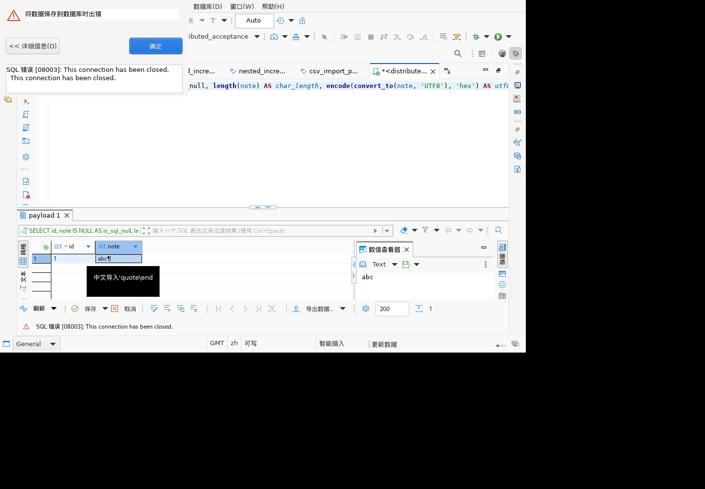

# 文本导入保存与重连：未闭环记录

## 结论

2026-09-28 恢复访问独立麒麟 Linux 图形验收副本后，确认此前编辑器保存动作已完成，但结果集保存失败。手动重连后再次保存仍报 `08003: This connection has been closed.`。此项为实际未通过路径，不计入通过项。

当前证据证明：失败后待保存文本仍可见，保存按钮保持可用，独立数据库连接读回的原值未变。尚未证明重连后可继续保存，也未确定最初连接关闭的原因。

## 环境与步骤

- GUI：`dbeaver-kylin-x86_64`，独立目录 `/opt/hex-refresh-gui-20260928`，专用 workspace 与 `refresh-queue`；没有操作原客户端副本。
- 输入层补丁版本沿用 `TEXT_FILE_IMPORT_20260928.md` 顶部 SHA-256 `6d22648480affa541cf5a032c457e6f235aa95f5f4cad2fa78d317654d9b7e97`。这不是包含全部后续组件修复的最新完整安装包。
- 数据库：本机 GaussDB 507 分布式测试库 `distributed_acceptance`。
- 仅操作专用表 `dbv_text_import_20260928.payload` 的 `id=1`。

| 操作证据 | 观察 |
|---|---|
| 读取已有 264.cmd.done/result | 编辑器保存已执行；没有重放之前的导入或保存命令 |
| 265 稳定快照 | 结果集有待保存修改，保存/取消按钮可用 |
| 266 点击结果集保存；269 后续快照 | 数据错误弹框：08003，保存失败；随后查询被待保存确认阻挡，没有当成已成功执行 |
| 270 关闭错误、取消待保存确认 | 待保存修改保留，没有选放弃 |
| 271 工具栏重连，272 快照 | 待保存文本 `abc\n` 可见，保存仍可用 |
| 273 再次保存，274 快照 | 同样 08003 错误 |
| 275 关闭错误，明确聚焦 SQL 编辑器，通过菜单重连 | 后续日志确认重连阶段执行，而非仅凭按钮点击返回成功 |
| 276 稳定快照，277 再次保存，278 快照 | 再次 08003；保存/取消仍可用，待保存文本保留 |
| 279 关闭错误提示 | 保留现场，未丢弃修改，未直接用 SQL 改写目标值 |



## 独立数据库核对

通过容器内新建 gsql 连接执行只读查询（不是 GUI 原连接）：

```sql
SELECT id, note IS NULL, length(note),
       encode(convert_to(note, 'UTF8'), 'hex')
FROM dbv_text_import_20260928.payload WHERE id=1;
```

保存失败及重连重试后均返回：

```text
1|f|23|e4b8ade69687e5afbce585a52771756f74655c656e640a
```

仍是测试前的中文、引号、反斜杠及换行原文，不是待保存的 `6162630a`。不将 `length` 输出额外解释为 Unicode 字符数。

## 定位证据与后续

工作区日志显示 `Main <distributed_acceptance>`、`Metadata <distributed_acceptance>` 的 BEFORE/INVALIDATE/AFTER 阶段，并记录 `Connections reopened: 2 (of 2)`；保存错误栈来自 `ResultSetPersister.DataUpdaterJob` → `ExecuteBatchImpl` → `JDBCTable.prepareStatement` → JDBC `PgConnection.checkClosed`。查询管理日志同时出现 `SQLEditor <Script-3.sql>` 会话不在缓存的警告。

当前源码 `InvalidateJob.invalidateInstances` 遍历可用实例及其所有执行上下文；`SQLEditor.getExecutionContext` 优先返回独立连接或指定 provider。需要进一步确认编辑器持有上下文与实例登记列表的生命周期，以及运行副本与当前源码差异。以上只是定位线索，不能据此直接断言唯一根因或采用自动重放 DML 的修复。

下一步应建立可重复的关闭/刷新/重连场景，验证编辑器上下文登记和恢复；同时保持失败修改、事务边界与未知提交结果不自动重放的安全约束。最终必须通过 GUI 保存以及独立数据库查询联合复验。
