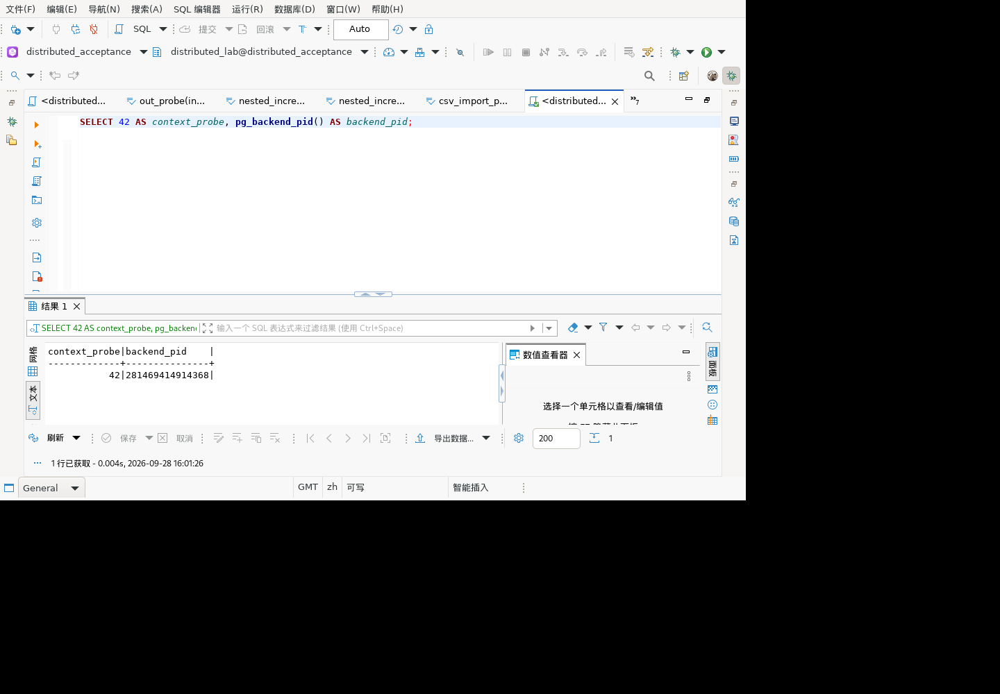

# 文本导入保存与重连：未闭环记录

## 结论

### 2026-09-29 Linux GUI：纯 SELECT 恢复路径通过

修复 `1d91968695` 已装入独立验收副本并完成 SELECT 对照复验。旧失败证据仍保留在下文；本次尚未重新验证带待保存行修改的恢复、显式保存和事务边界，不将整个问题或最终产品标为全部验收。

部署前通过正常退出流程停止旧 Java 23261（退出确认后，对专用测试结果修改选“否”，未写库）。已记录的未保存 `abc\n` 被放弃；独立 gsql 核对数据库仍是原中文值。原始两个插件备份为验收目录下 `context-recovery-model.original.jar`、`context-recovery-sql.original.jar`，可回退。本次只覆盖 simpleconfigurator 实际引用的插件：

| 插件 | SHA-256（本机和容器一致） |
|---|---|
| model 2.0.45.202609240410，更新 DBExecUtils 及其内部类 | `132da3922e9ac6a7cc5865074a38c4a67bdd905d98c5d9f2d3a7bf3733d7cd2f` |
| ui.editors.sql 1.0.185.202609240326，更新 SQLEditor 及其内部类 | `cc59cd09440b7716423c4d2511c53619c55c8856275c64710b5434e024bff7c5` |

源码取自已通过组件验证的 `/tmp/shared-focused-ezCqR1`，不是完整新产品。以 `-clean` 重启后新 Java 24227，独立 queue 不变。客户端使用 GMT，以下日志 2026-09-28 16:01 对应北京时间 2026-09-29 00:01。

| 操作 | 实际证据 |
|---|---|
| 308 执行 SELECT，309 观察 | 返回 42，首次查询成功 |
| 310 导航，311 对连接 F5 刷新 | 日志关闭上下文 0/1/2，重开主/元数据 3/4，随后明确创建 Script-4 独立上下文 5；与旧版继续使用上下文 2 不同 |
| 313 再次执行，314 观察 | 返回 42，后端编号 281469414914368 |
| 独立 gsql 验证并故障注入 | 确认该会话为测试库、distributed_lab、idle、最后语句 SELECT 42；以这些联合条件终止该唯一会话，返回 t，无业务写入 |
| 315 再执行，316 观察 | 可见结果区出现 57P01，证明故障命中目标连接 |
| 317 手动重连，318 观察 | 日志包含 Main、Metadata、SQLEditor 三者全部 BEFORE/INVALIDATE/AFTER 阶段，最终 `Connections reopened: 3 (of 3)` |
| 319 再执行，320 稳定观察 | 新查询时间 16:01:26，返回 42，结果区没有可见 08003；对实际快照做程序断言通过 |



恢复后后端编号数值仍为 281469414914368，服务器存在编号复用，**不使用编号变化作为恢复断言**。证据是已出现终止错误、编辑器被纳入三条连接重连、随后新的成功查询。核对专用文本表仍返回 `1|f|23|e4b8ade69687e5afbce585a52771756f74655c656e640a`，本轮没有数据写入。

启动仍有历史类型分类 O 的警告，未将其计为本补丁新失败或整体兼容性通过；本项仅证明上述连接恢复路径。后续需覆盖编辑中的未保存行、保存后独立读回、事务和重复刷新/并发，以及完整产品回归。

### 当前源码修复进度

后续已增加实例替换识别并接入 `SQLEditor.updateExecutionContext`：在数据源对象未变、但独立编辑器所属数据库实例被同名新实例替换时，释放旧编辑器上下文，通过现有 OpenContextJob 在新实例创建独立上下文。明确选择同名实例，不回退到当前默认数据库，不主动执行原 SQL 或重放 DML。

`DBExecUtils.findReplacementInstance` 只读取已知实例，不执行 SQL：原实例仍在登记列表（即使暂时断开）时返回无替换，空列表/缺失目标/同名歧义/不同数据源/空上下文均不猜测。新增正式平台测试 `ExecutionContextReplacementTest` 9 项；普通共享回归 794/794、实际 OSGi 平台 21 类 362/362，均 0 失败错误跳过；必需类门控自测 7/7。初次测试编译缺少 close() 的受检异常声明，修正测试声明后通过，不计为生产缺陷。

测试工具仓命令：

```sh
node scripts/run-shared-focused.mjs --sql-editor
node scripts/run-existing-osgi.mjs <编译输出目录> --module=org.jkiss.dbeaver.test.platform --all-module
node --test scripts/verify-regression-results.test.mjs
```

本次编译目录 `/tmp/shared-focused-ezCqR1`，日志 `/tmp/context-replacement-green-20260928.log` 和 `/tmp/context-replacement-osgi-20260928.log`。`--sql-editor` 显式编译当前 SQLEditor 源码，不将旧编译类当作新代码；测试断言目前覆盖生产替换判断方法，尚未驱动实际 OpenContextJob 或窗口生命周期。运行中的 Linux GUI 尚未安装这次 model/SQL 编辑器修复，**上面的组件通过不代表 08003 GUI 问题已闭环**。下一步必须安装独立验收副本并重跑下文复现，随后复验待保存修改及数据库结果。

2026-09-28 恢复访问独立麒麟 Linux 图形验收副本后，确认此前编辑器保存动作已完成，但结果集保存失败。手动重连后再次保存仍报 `08003: This connection has been closed.`。此项为实际未通过路径，不计入通过项。

当前证据证明：失败后待保存文本仍可见，保存按钮保持可用，独立数据库连接读回的原值未变。尚未证明重连后可继续保存，也未确定最初连接关闭的原因。

## 环境与步骤

- GUI：`dbeaver-kylin-x86_64`，独立目录 `/opt/hex-refresh-gui-20260928`，专用 workspace 与 `refresh-queue`；没有操作原客户端副本。
- 输入层补丁版本沿用 `TEXT_FILE_IMPORT_20260928.md` 顶部 SHA-256 `6d22648480affa541cf5a032c457e6f235aa95f5f4cad2fa78d317654d9b7e97`。这不是包含全部后续组件修复的最新完整安装包。
- 数据库：本机 GaussDB 507 分布式测试库 `distributed_acceptance`。
- 仅操作专用表 `dbv_text_import_20260928.payload` 的 `id=1`。

| 操作证据 | 观察 |
|---|---|
| 读取已有 264.cmd.done/result | 编辑器保存已执行；没有重放之前的导入或保存命令 |
| 265 稳定快照 | 结果集有待保存修改，保存/取消按钮可用 |
| 266 点击结果集保存；269 后续快照 | 数据错误弹框：08003，保存失败；随后查询被待保存确认阻挡，没有当成已成功执行 |
| 270 关闭错误、取消待保存确认 | 待保存修改保留，没有选放弃 |
| 271 工具栏重连，272 快照 | 待保存文本 `abc\n` 可见，保存仍可用 |
| 273 再次保存，274 快照 | 同样 08003 错误 |
| 275 关闭错误，明确聚焦 SQL 编辑器，通过菜单重连 | 后续日志确认重连阶段执行，而非仅凭按钮点击返回成功 |
| 276 稳定快照，277 再次保存，278 快照 | 再次 08003；保存/取消仍可用，待保存文本保留 |
| 279 关闭错误提示 | 保留现场，未丢弃修改，未直接用 SQL 改写目标值 |


## 独立数据库核对

通过容器内新建 gsql 连接执行只读查询（不是 GUI 原连接）：

```sql
SELECT id, note IS NULL, length(note),
       encode(convert_to(note, 'UTF8'), 'hex')
FROM dbv_text_import_20260928.payload WHERE id=1;
```

保存失败及重连重试后均返回：

```text
1|f|23|e4b8ade69687e5afbce585a52771756f74655c656e640a
```

仍是测试前的中文、引号、反斜杠及换行原文，不是待保存的 `6162630a`。不将 `length` 输出额外解释为 Unicode 字符数。

## 定位证据与后续

### 纯 SELECT 对照复现（后续补验）

为排除文件导入、待保存值和 UPDATE 执行的影响，另建 Script-4 编辑器，原 Script-3 未保存修改保持不动。执行：

```sql
SELECT 42 AS context_probe, pg_backend_pid() AS backend_pid;
```

1. 281 新建编辑器，283 查询，285 文本结果为 `42 / 281469788207424`，成功。
2. 286 展开数据库导航，287 选择目标连接按 F5 刷新。日志 15:48:13 明确关闭上下文 3、4、7（7 为 Script-4），创建新主/元数据上下文 8、9，随后另有 10、11 创建记录。
3. 289 再次查询，290 结果为 `42 / 281469100341568`，成功，但日志已经出现 Script-4 上下文 7 不在查询管理缓存的警告。
4. 291 手动重连，日志 15:49:06 显示 `Connections reopened: 2 (of 2)`；294 仍取得 `42 / 281469100341568`，后端编号未变。293 使用的控件索引不是预期编辑器文本索引，不单独视为键盘焦点正确的证据；这里只记录 294 实际新查询时间及结果。
5. 使用独立 gsql 查询 `pg_stat_activity`，确认该编号当时对应 `distributed_acceptance / distributed_lab / idle`，最后语句是上述 `SELECT 42`。用同时限制编号、库、用户、空闲状态和 SQL 前缀的条件调用 `pg_terminate_backend`，返回 `t`。没有终止其他客户端或数据库服务。
6. 295 在编辑器执行 SELECT，296 可见结果区报 `57P01: terminating connection due to administrator command`，证明本次故障命中了目标连接。
7. 297 再次手动重连，日志 15:50:37 再显示重开两条连接。298 重新观察编辑器文本控件后，299 正确聚焦并执行相同 SELECT，300 **可见**结果区报 `08003: This connection has been closed.`，没有返回新查询结果。

因此该运行副本具有可重复的“连接刷新 → 独立编辑器继续使用旧上下文 → 会话失效后无法通过数据源重连恢复”路径；不依赖文件导入或写操作。不是说刷新后的第一次 SELECT 必定失败。两条手动重连日志只枚举主/元数据上下文，未枚举该编辑器。

注意：本环境的后端编号可能被复用。故障后的查询发现 `281469100341568` 已对应核对用的 gausscore 查询自身；不能把编号仍存在理解成原会话未终止，更不能重复终止同一编号。本轮只进行一次带身份/状态/语句保护的终止。

初始旧编辑器问题也有时间线佐证：14:35:36 创建 Script-3 上下文 2，14:36:59 的导航刷新关闭 0/1/2 并创建新主/元数据上下文，14:37 后原上下文 2 的缓存缺失警告持续出现。这与本次干净 SELECT 对照一致。生产源码 `PostgreDataSource.refreshObject` 会 shutdown 并替换数据库实例缓存，而 `SQLEditor.updateExecutionContext` 主要比较数据源对象身份；这是后续需用自动化验证的具体生命周期缺口，不是已完成的修复。

现场：Script-4 保留 SELECT 失败结果；Script-3 仍保留待保存 `abc\n`；没有直接 SQL 修改原表。此补验没有新增通过的 JUnit 数量，也没有发布生产补丁。

工作区日志显示 `Main <distributed_acceptance>`、`Metadata <distributed_acceptance>` 的 BEFORE/INVALIDATE/AFTER 阶段，并记录 `Connections reopened: 2 (of 2)`；保存错误栈来自 `ResultSetPersister.DataUpdaterJob` → `ExecuteBatchImpl` → `JDBCTable.prepareStatement` → JDBC `PgConnection.checkClosed`。查询管理日志同时出现 `SQLEditor <Script-3.sql>` 会话不在缓存的警告。

当前源码 `InvalidateJob.invalidateInstances` 遍历可用实例及其所有执行上下文；`SQLEditor.getExecutionContext` 优先返回独立连接或指定 provider。需要进一步确认编辑器持有上下文与实例登记列表的生命周期，以及运行副本与当前源码差异。以上只是定位线索，不能据此直接断言唯一根因或采用自动重放 DML 的修复。

下一步应建立可重复的关闭/刷新/重连场景，验证编辑器上下文登记和恢复；同时保持失败修改、事务边界与未知提交结果不自动重放的安全约束。最终必须通过 GUI 保存以及独立数据库查询联合复验。
