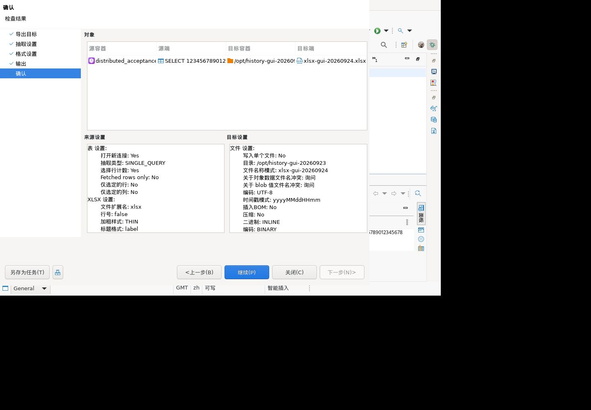
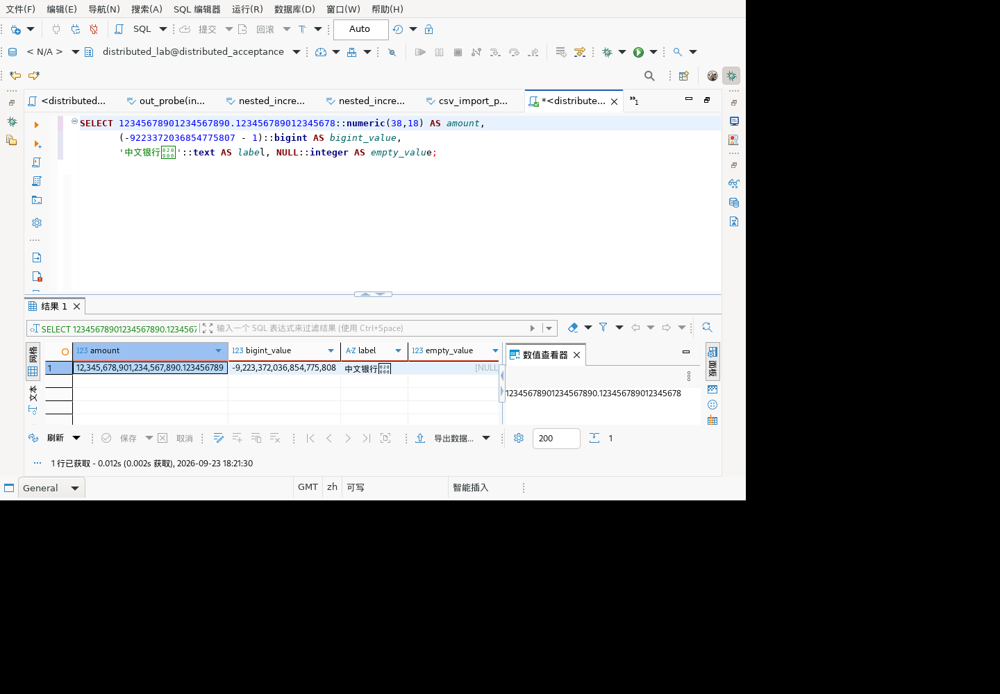

# XLSX 导出场景验证

## 范围与方法

对应历史清单 9.2 Excel 导出、多数据类型、行列数与结果导出。测试类为 `GaussDBExcelExportTest`，共 25 项参数化展开后的测试。使用生产 `DataExporterXLSX` 的 init、exportHeader、exportRow、exportFooter、dispose 完整链路，将 XLSX 写入内存流，再用 Apache POI 重新打开文件逐格验证。只模拟导出站点、列元数据和会话，不模拟工作簿或单元格。

本轮是导出器文件往返验证，不是数据库 JDBC 取数、导出向导 GUI、Microsoft Excel/国产办公软件界面或客户麒麟桌面云验收。没有移植内网原始测试源码，不把新增用例数等同于历史原始用例数。

## 场景与结果

| 场景 | 测试方法及断言 | 结果 |
| --- | --- | --- |
| 中文及特殊字符串，7 项 | 中文/扩展汉字、引号与换行、以 `=`/`+`/`@` 开头的公式样式文本、前导零、空字符串；读回必须是 STRING 且逐字符相等，不执行为公式；中文表头、2 行 1 列计数 | 通过 |
| NULL、字面 NULL、空字符串 | 指定 `<空>` 为 NULL 标签；三种值读回分别核对 | 通过 |
| 布尔值 | 默认 BOOLEAN 的 true/false；指定“是/否”后为相应文本 | 通过 |
| 精确数值边界，7 项 | Long 上下界对应十进制值、38 位整数和高精度金额、16 位有效数字小数、`1E-400`、`1E400`；读回 STRING 且与原 BigDecimal.toString 完全相等 | 修复后通过 |
| 普通数值，5 项 | 0、123.45、-12.3400、15 位整数、1E-38；仍为 NUMERIC，读回十进制数值相等（不承诺显示尺度不变） | 通过 |
| JDBC Long/BigInteger 实际 Java 类型 | Long.MIN/MAX 与 38 位 BigInteger，逐个读回完整字符串 | 通过 |
| 关闭表头 | 两条数据占第 0/1 行，无首行丢失 | 通过 |
| 按行数拆分 | 限额 3（包含表头），3 条数据拆为两张 Sheet，行数 3/2；第二张表头重复，数据顺序完整 | 通过 |
| 去空格及超长文本 | 默认保留两端空格，启用选项才 trim；32,768 个中文字符被限制为 32,767 个 | 通过（截断是现有明确限制，不是无损导出） |

## 修复与兼容性影响

原实现对所有 Number 调用 doubleValue，7 个边界测试复现失败：精确数字会失真/下溢，极大值产生 ERROR 单元格。

修改共享 Office 导出器：对于 BigDecimal、BigInteger、Long，若超出 15 位有效数字、double 有限正规范围，或 double 的十进制往返值不同，则写入文本单元格，保留原始数字字符串；其余继续写数值单元格。非精确的 Float/Double 行为不变。

这是所有数据库共用的导出器行为变化：高精度列可能出现文本单元格，避免静默丢数；在电子表格中计算前应明确处理数值精度，不能把转为文本理解为无限精度 Excel 数值运算。未新增客户配置项。

## 回归证据

- `run-djsmdS`：测试装配编译失败，修正当前分支 VoidProgressMonitor 构造方式，无产品结论。
- `run-VoOFmZ`：新测试 7 项失败，复现上述精度缺陷。
- `run-2cP8aw`：修复及补充测试后，完整已配置回归 **1,290 项，1,266 通过，24 跳过，0 失败/错误**。包含本轮 25 项 XLSX 测试与既有集中式/分布式 507 历史场景。跳过不计通过；本轮未开启额外 review/native 配置。
- [脱敏结果](test-results-20260924-xlsx.json)仅包含用例标识及结果，不含凭据、连接属性或原始 JDBC 日志。
- 临时 grantee 已删除。

## 后续边界

追加现有工作簿、按列分 Sheet、日期时区、二进制/LOB、空结果、导出失败与资源清理、GUI 导出器选项仍需扩展。旧 `.xls` 不能仅依据 XLSX 验证宣称支持。真实 JDBC 数值取出→XLSX 和客户办公软件打开仍应独立验收。

## 追加已有工作簿补充

增加两项实际文件导入/追加测试：先创建只有一个 Sheet、包含“原始表头/旧数据”的 XLSX；调用生产 importData 后分别选择“使用已有 Sheet”和“创建新 Sheet”，再追加两行并重新打开输出。

- 使用已有 Sheet：期望仍为 1 张 Sheet，原两行不变，新两行位于第 2/3 行，不重复插入表头。
- 创建新 Sheet：期望 2 张 Sheet，旧 Sheet 不变，新 Sheet 含中文表头与两条新增行。
- 输入文件与输出流分离，另核对读取前后输入文件字节不变；不代表生产向导同路径覆盖的完整验收。

`run-FlET8c` 在第一项复现 `Sheet index (1) is out of range (0..0)`。生产 footer 把已复用 Sheet 的数量当作索引，越界访问下一张表。已改为遍历 `[0, sheetIndex)` 范围内真正复用的 Sheet；新 Sheet 策略不受影响。

修复后 `run-f0FJvz` 完整回归 **1,292 项，1,268 通过，24 跳过，0 失败/错误**，包括本类累计 27 项。[脱敏结果](test-results-20260924-xlsx-append.json)。临时 grantee 已删除。尚未覆盖含稀疏行/公式/多 Sheet 的既有文件、同路径覆盖与 GUI 追加向导，不能将两项通过扩大为全部追加场景。

## 稀疏行、空 Sheet 与多个已有 Sheet

再补 4 项文件读回测试：

- 2 项稀疏文件：只有第 0 行和第 5/100 行，追加后旧行不变、空行仍不存在、新值严格位于第 6/101 行，物理行数为 3。
- 1 项多个已有 Sheet：两张 Sheet 各有旧表头/旧数据，行数上限为 3；追加两条记录后分别位于两张表的第 2 行，表数仍为 2，旧数据逐格不变。
- 1 项空 Sheet：导入已有空 Sheet 后，中文表头位于第 0 行、首条数据位于第 1 行，不增加 Sheet。

`run-dDuEPC` 复现两项稀疏文件失败：生产代码使用物理行数 2 作为新增行号，SXSSF 拒绝向已导入的 `[0,5]` / `[0,100]` 范围写入。已修复为取原始 Sheet 的最后行号加 1，空 Sheet 则从 0 开始。多个连续 Sheet 的测试在修复前即通过。

修复后 `run-jwlnvs` 完整回归 **1,296 项，1,272 通过，24 跳过，0 失败/错误**，本类累计 31 项。[脱敏结果](test-results-20260924-xlsx-sparse.json)。临时 grantee 已删除。仍需覆盖已有公式、文件达到行数上限、按列拆分、日期/LOB、同路径覆盖以及 GUI 导出；上述文件往返不代表客户办公软件验收。

## 日期、类型 NULL 与行号选项

追加 8 项测试，均通过生产导出器写出 XLSX 后重新打开断言：

- 日期 3 项：1900-01-01、2000 闰年 2 月 29 日、含毫秒的时间戳，单元格为 NUMERIC，设置的 `yyyy-mm-dd hh:mm:ss.000` 格式原样保留，读回 LocalDateTime 与输入相等。
- 历史日期 1 项：1899-12-31 12:34:56 以明确指定的 Java 日期格式回退到 STRING，文本完全相等。
- 数值/布尔 NULL 2 项：默认写出空文本，不变为 0 或 false。
- 行号 2 项：有表头/无表头时，行号列占第 0 列，数据位于第 1 列；中文数据和表头无覆盖，逐行校验行数与列数。明确当前行号是 Sheet 行索引：带表头从 1 开始，无表头从 0 开始，未改变该行为，也未声称行号是数值类型。

此组不覆盖跨时区、夏令时、亚毫秒精度、客户办公软件格式化，也没有验证空白/缺失 dateFormat 配置或真实 JDBC 取数路径。

`run-RKbqWt` 完整回归 **1,304 项，1,280 通过，24 跳过，0 失败/错误**，本类累计 39 项。[脱敏结果](test-results-20260924-xlsx-date.json)。本批无生产代码修改，临时 grantee 已删除。

## 日期格式默认值与空白配置

补充 4 项：空字符串、纯空格、默认属性、显式 null。使用 1899-12-31 验证早期日期回退文本；前两项还验证现代日期单元格默认格式及本地日期时间不变。

`run-T01Wi2` 复现前三项失败：默认属性返回空格式，历史日期被写成空字符串或纯空格。修复共享导出器的默认属性为与 plugin.xml 一致的 `MM/dd/yy`，并在 init 中将纯空白格式回退到默认值。显式非空格式保持原行为。

默认显示格式只包含日期和两位年份，这是原界面已声明的格式，并非完整时间戳文本。需要历史日期的完整年份和时间时仍应显式选择相应格式；此修复保证不因空配置整格丢失，不承诺所有格式下时间信息都显示。

修复后 `run-Etbjwr` 完整回归 **1,308 项，1,284 通过，24 跳过，0 失败/错误**，本类累计 43 项。[脱敏结果](test-results-20260924-xlsx-date-default.json)。临时 grantee 已删除。该默认值修复作用于共享导出器，不限 GaussDB；GUI 与真实 JDBC 取数仍需独立验证。

## 大对象与读取异常

新增 5 项，生产导出器配合模拟 DBDContent/Storage；文本成功路径使用真实 StringReader，写出后重新打开 XLSX 断言：

- 中文、扩展汉字、换行、引号组成超过读取缓冲区的文本，分块读取后逐字符相等；Reader 关闭一次，内容对象 release 一次，不打开二进制流。
- 二进制内容仅输出 `[BINARY]` 文本，不打开 Reader 或二进制流，并释放内容对象。此项验证现有占位策略，不是二进制无损导出。
- 非 NULL 内容对象但 storage 缺失，输出 DBConstants.NULL_VALUE_LABEL 并释放。
- Reader.read 抛 IOException，原异常对象向上传播，Reader 关闭且内容对象释放。
- getContentReader 抛 IOException，原异常向上传播，内容对象仍释放。

`run-hTYMBb` 有 1 项测试装配异常：spy 的 StringReader 内部 lock 为 null；改为真实 StringReader 子类记录 close 次数，其余 4 项原本通过。未据此修改生产代码。上述释放是导出器层的接口调用断言，不代表真实 JDBC LOB 生命周期、磁盘写失败或 GUI 取消已经验收。

`run-QfJhtG` 完整回归 **1,313 项，1,289 通过，24 跳过，0 失败/错误**，本类累计 48 项。[脱敏结果](test-results-20260924-xlsx-content.json)。临时 grantee 已删除。

## 输出流失败后的清理

新增 2 项故障注入：输出流在第 0/512 字节后抛 IOException。调用生产 init、exportHeader、exportRow、dispose；要求 IOException 向上传播、工作簿引用清空、Sheet 映射清空，再次 dispose 不报错且不继续写入半成品输出。

`run-cPnfVE` 两项复现失败，write 抛异常后跳过 wb.close 和后续清理，工作簿引用仍存在。改用 try-with-resources 写出并关闭工作簿，在 finally 清理 Sheet 引用；先移除实例中的工作簿引用，避免重复 dispose 重写不完整文件。

此处是输出流故障模拟与引用清理断言，不是真实磁盘空间耗尽、操作系统句柄统计或临时文件残留检查。输出失败会留下不完整输出，本修复不把它当作成功文件，也不自动删除调用方管理的输出路径。

修复后 `run-hcvL7P` 完整回归 **1,315 项，1,291 通过，24 跳过，0 失败/错误**，本类累计 50 项。[脱敏结果](test-results-20260924-xlsx-output-failure.json)。临时 grantee 已删除。

## 真实 JDBC 取数到 XLSX

`GaussDBHistoricalJdbcLiveTest` 增加集中式/分布式各一项：

1. 在随机隔离 schema 创建 xlsx_values，使用 PreparedStatement 写入 numeric(38,18)、bigint、text、整数 NULL。
2. 数据分别为 `12345678901234567890.123456789012345678`、Long.MIN_VALUE、含中文/扩展汉字/引号/换行的文本及 NULL。
3. 通过真实厂商 JDBC ResultSet.getObject 取出，先与输入逐值断言，再不改写地交给生产 DataExporterXLSX。列名来自真实 JDBC 元数据；DBDAttributeBinding 和导出站点仍是测试适配对象。
4. 完成写出后重新打开 XLSX，逐格检查四列标题、2 行/4 列、单元格类型及文本值。高精度数值依照修复后的策略为精确文本；NULL 为默认空文本。
5. 使用既有隔离框架清理测试 schema，不修改业务数据。

这两项打通数据库写入→厂商驱动读取→生产导出器→XLSX 文件读回，但不包含数据传输向导/实际数据库接收器、真实绑定模型发现或客户办公软件界面。

`run-ECvtcg` 两个 507 环境均通过，完整回归 **1,317 项，1,293 通过，24 跳过，0 失败/错误**。[脱敏结果](test-results-20260924-xlsx-jdbc.json)。本批无生产修改；两库目录复查 xlsx_values 测试表残留均为 0，临时 grantee 已删除。

## 空结果与附带 SQL 文本

新增 4 项生产导出器文件往返：空结果分别启用/禁用表头；附带 SQL 分别整段保存/按换行拆分。后两项要求 SQL 使用独立 Sheet、中文和换行内容准确、数据 Sheet 不变。

`run-l9DfHU` 两项空结果失败：带表头文件有 2 行而非 1 行，不带表头有 1 行而非 0 行。原 footer 调用 exportRow 合成全 NULL 行。修复为只初始化工作表/表头，不写入数据行，避免把 0 行结果与真实全 NULL 记录混淆。已有真实 NULL 行测试继续保留；SQL 两种保存策略修复前已经通过。

这是共享导出器空结果行数的行为修正，不影响真实 NULL 记录的输出。导出向导、附带超长 SQL、包含多种换行风格的 SQL 仍需单独验证。

修复后 `run-jxjvAh` 完整回归 **1,321 项，1,297 通过，24 跳过，0 失败/错误**，本类累计 54 项，另有 2 项 JDBC→XLSX 真库测试。[脱敏结果](test-results-20260924-xlsx-empty.json)。临时 grantee 已删除。

## Linux 图形界面：实际导出向导

在已有隔离 Linux x86_64/Xvfb 测试客户端中验收（SWTBot 命令 603–618），不是客户桌面云实机验收。原测试安装未含 Office 扩展，本轮正常退出后保留 bundles.info 备份，安装最新 Office bundle 和 POI/commons-compress/lang3 依赖；重新启动后 XLSX 出现在导出目标中。未修改客户发布包。

Office bundle：`1.1.223.202609231817`，SHA-256 `770b13df044d54a8c0497bcf7376e4c93f096ffef352c53069617350bb426227`。

环境读取结果为 Kylin Linux Advanced Server V10 (Lance)，x86_64；运行于本机 Docker 的仿真测试环境。输出文件 SHA-256 为 `24096b9302cf7f826138524cc5619e9e5ab6ccc3cb21926ee69e406609e0cf9c`。

操作路径：SQL 编辑器执行下列只读查询 → 结果面板“导出数据” → 目标 XLSX → 保持默认格式 → 指定隔离输出目录/新文件名 → 确认 → 继续。

```sql
SELECT 12345678901234567890.123456789012345678::numeric(38,18) AS amount,
       (-9223372036854775807 - 1)::bigint AS bigint_value,
       '中文银行𠀀'::text AS label, NULL::integer AS empty_value;
```

使用分布式 507 的普通测试账号。确认页显示 SINGLE_QUERY、打开新连接、不是仅使用已获取行；因此覆盖实际向导和数据库抽取，不仅是前述模拟站点。



完成后向导关闭，独立使用 ZIP/XML 读取实际生成的 `xlsx-gui-20260924.xlsx`：1 张数据表、2 行（含表头）、4 列。表头 amount/bigint_value/label/empty_value；数据逐格为精确数值字符串、`-9223372036854775808`、`中文银行𠀀`、空字符串，均为 inlineStr，断言通过。只执行 SELECT，没有创建或修改数据库对象。



限制：截图中扩展汉字“𠀀”显示缺字框，文件 XML 中字符完整正确。数据编码通过不能等价于字体显示通过。此轮没有验空结果/追加/取消/错误的 GUI 流程，也未验证 Excel/WPS 打开文件；发布包仍需包含并验证扩展依赖。命令 609 曾使用重启前的控件编号而定位失败，610 按新 dump 纠正，未将该测试操作错误记为产品缺陷。
